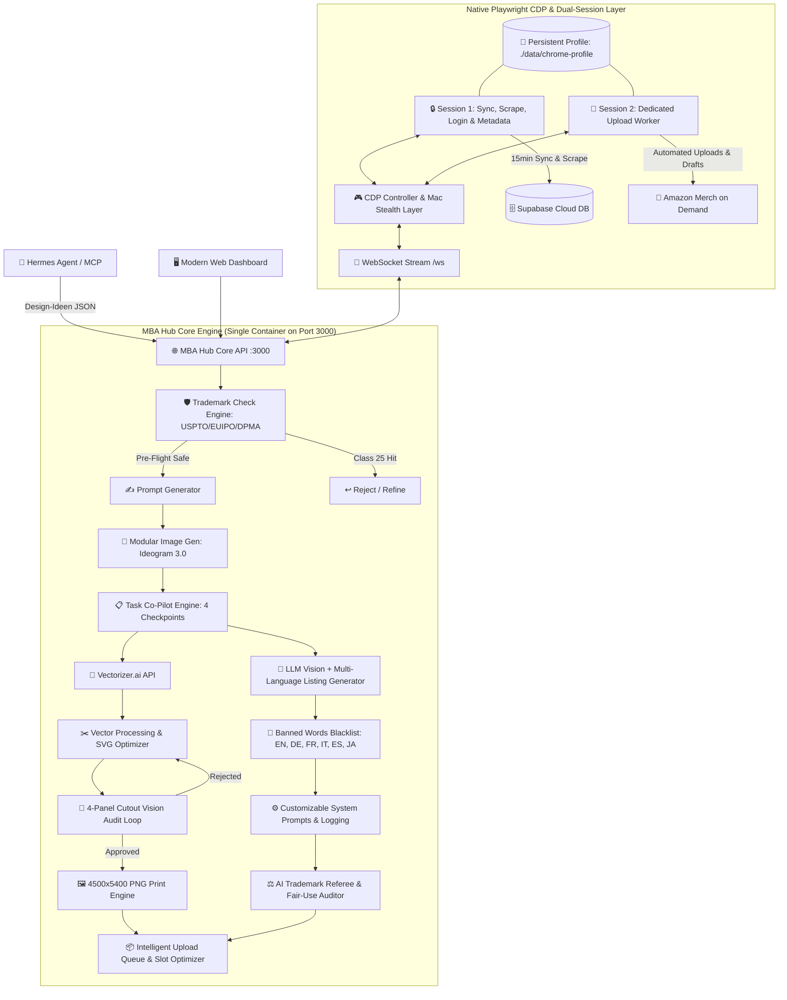

# 🧠 MBA HUB — Master-Architektur & Projekt-Brain

> **Status:** Phase 1 bis Phase 6 vollständig implementiert, verifiziert & im Produktivbetrieb 🚀  
> **Projekt:** MBA Hub (Merch By Amazon Automation & Hub Platform)  
> **Ziel-Umgebung:** TerraMaster NAS (TOS 6.0) unter Docker / Port `3000`  
> **Repository:** `https://github.com/aljan92/hub.git` (Branch: `main`)  
> **Deployment & Update:** Live-Betrieb auf dem NAS. Updates werden nach jedem Schritt automatisch per `git push origin main` auf GitHub veröffentlicht. 1-Click Update im Web-Dashboard (automatischer Tarball-Download & 10s Server-Neustart).  
> **Workflow-Regel:** Nach jedem Feature/Fix führt der AI-Agent **automatisch** `npm run build` und `git push origin main` aus!  
> **Projekt-Gedächtnis:** Diese `brain.md` dient als zentraler Master-Notizzettel und wird bei jedem Schritt fortlaufend gepflegt.  
> **Letzte Aktualisierung:** 26. August 2026  

---

## 1. 🎯 Projekt-Vision & Kernziele
Der **MBA Hub** ist eine All-in-One Plattform zur vollständigen Steuerung, Generierung, Vektorisierung, Validierung, Optimierung und Veröffentlichung von Designs für **Merch by Amazon (MBA)**. Er ersetzt und fusioniert:
1. **MBA Manager** (Swift-Desktop-App: Prompt-Generator, Vectorizer.ai-Anbindung, Vektor-Editor, LLM-Listing-Erstellung, Upload-Script).
2. **mba-supabase-sync** (Chrome-Extension: 24/7 Live-Sync der MBA-Produktdaten, Sales & Royalties in Supabase).
3. **Listing Optimizer** (Chrome-Extension: Multi-Produkt Resize, Mug-Brush-Tool für schwarze Tassen, Banned-Words-Listen, Trademark-Scans).
4. **Productor Integration** (API-Schnittstellen für USPTO, EUIPO, DPMA Trademark-Checks, Ratelimiter & Tier-Abfragen).

---

## 2. 🏛️ Gesamtsystem-Architektur (Goldstandard: Native CDP Engine)



---

## 3. 🚀 Modul-Übersicht & Implementierte Phasen

### ✅ Phase 1: Core Dashboard & Health Engine
* **Interaktives Architektur-Schema (`ConnectorTopology`):** 3-Spalten-Netzwerk-Matrix mit Live-Puls, Ping und Klick-Drawer zum Verbindungstest.
* **Header & Navigation:** Feste Sidebar (`Sidebar.tsx`), `h-screen overflow-hidden` Layout, Live Tier-Level Badge (aus `ratelimiter/metadata`), 1-Click Update-Button mit automatischer GitHub-Tarball-Installation und 10s Neustart.
* **Live Kosten- & Budget-Statistik (`Header.tsx`, `costTrackingService.ts`, `SettingsView.tsx`):**
  * **Header Badges:** `Total Costs` ($ Gesamtausgaben) und `Ø/Design` ($ Kosten pro aktivem Design).
  * **Berechnungslogik:** $\text{Total Costs} = \text{OpenRouter} + (\text{Ideogram Bilder} \times \text{Kosten/Bild}) + (\text{Vectorizer} \times \text{Kosten/Vektorisierung})$.
  * **Durchschnittskosten:** $\text{Cost per Design} = \frac{\text{Total Costs}}{\text{Warteschlange} + \text{Hochgeladen}}$.
  * **Settings Card 8:** Konfiguration von `costPerImage` (z.B. `$0.08`), `costPerVectorization` (z.B. `$0.05`) und 1-Click Reset-Funktion (`POST /api/v1/stats/costs/reset`).
* **Settings:** Persistente Speicherung aller API-Keys und Parameter in `./data/settings.json`.

---

### ✅ Phase 2: Supabase Sync & Mac Stealth Dual-Session CDP
* **Supabase Live-Sync (`syncEngine.ts`):** 
  * Amazon Coral RPC Protocol (`FindListingsRequest`, PageSize 500) im Browser-Kontext von `Session 1`.
  * HTTP 429 Resilience mit 10-fach Exponential Backoff.
  * Child-ASIN Resolution Engine für die 12 echten Variations-Produkte (Journals, Mugs, Cases, PopSockets, Hats, Pillows, Totes, Tumbler).
  * 15-Minuten Scheduler & 1-Minuten ASIN-Queue-Worker überstehen Server-Neustarts (`autoSyncEnabled: true`).
* **Mac Stealth Dual-Session Engine (`browserSessionService.ts`):**
  * 100% VNC-frei via WebSocket (`/ws`) und Canvas Stream auf Port 3000.
  * Mac-Fingerprint (macOS Intel, Apple M2 Metal WebGL, kein `navigator.webdriver`).
  * **Session 1 (Sync & Metadata):** Login, 2FA, 15min Produktsync, Ratelimiter-Abfragen.
  * **Session 2 (Upload Worker):** Teilt sich Session-Cookies/Tokens und ist exklusiv für Playwright-Uploads zuständig.

---

### ✅ Phase 3: Vectorizer.ai Engine
* **Vectorizer.ai API (`vectorizerService.ts`):** Umschaltung `test` vs. `production`, Farbbegrenzung (`max_colors`), Cutouts für Textildruck (`shape_stacking: cutouts`), Rauschfilterung und Speicherung unter `./data/designs/`.

---

### ✅ Phase 4: Human-in-the-Loop Task Co-Pilot & 4-Panel Cutout Audit
* **4 Checkpoints (`taskLogService.ts`, `TasksView.tsx`):**
  1. `AWAITING_DESIGN_APPROVAL`: Bildkontrolle & Quote-Prüfung.
  2. `AWAITING_DESIGN_REVIEW`: Fragenkatalog (Quote, Zielgruppe, Farbvermeidung, Hintergrund, Farbanzahl) ➔ 1-Click *„Listing generieren“*, *„Bild neu generieren“* oder *„Task abbrechen“*.
  3. `AWAITING_TM_REVIEW`: Multi-Language Listing (EN, DE, FR, IT, ES, JA) mit Live-Trademark-Scan (USPTO, EUIPO, DPMA) und Nizza-Klasse 25 Prüfung.
  4. `AWAITING_SVG_REVIEW`: Interaktiver SVG-Editor + **Automatischer 4-Panel Vision Cutout Audit Loop** (Testbild auf Weiß, Schwarz, Rot, Dunkelgrau; Vision-LLM erkennt Schnittfehler; bei `APPROVED` automatisches Rendern der finalen **4500x5400px Print-PNG**).
  5. `COMPLETED`: Automatische Übergabe an die Upload-Queue.
* **Banned Words Filter (`bannedWordsService.ts`):** Multi-Language Sperrwort-Listen (Claims, Werbesprache, Materialhinweise) mit Prompt-Injektion.
* **Prompt Log & Step-Targeted Retry (`PromptLogView.tsx`):** Re-Push Button zur erneuten Einreihung in die Upload-Queue für verifizierte Master-PNG Tasks.

---

### ✅ Phase 4.5: Dynamische MBA Produktdatenbank & DOM-Scanner
* **100% Dynamischer Live-Katalog (`productCatalogService.ts`, `./data/product_catalog.json`):**
  * Erkennt alle Produkte, Marktplätze (1 Slot pro Marktplatz = aktuell 106 Slots Basis), Fit-Types und Farb-Swatches / Color-Picker.
* **CDP DOM-Scanner in Session 1 (`productScannerService.ts`):**
  * Lädt im Hintergrund ein Mock-Design hoch, extrahiert die komplette Produkt-Matrix und schließt die Seite.
  * 12-18h Jitter-Scheduler verhindert Bot-Patterns.

---

### ✅ Phase 5: Intelligente Upload Queue, Balancing & Status-Visualisierung
* **4-Status Lifecycle & 3 Tabs (`QueueView.tsx`, `queueService.ts`):**
  * **Tab 1: Warteschlange:** Aktive Warteliste mit Drag & Drop Priorisierung. *(Sidebar-Badge reflektiert exklusiv die Anzahl aktiver Warteschlangen-Elemente `WAITING` / `UPLOADING`)*.
  * **Tab 2: Hochgeladen (`COMPLETED`):** Historie mit Re-Enqueue Option.
  * **Tab 3: Fehler (`ERROR`):** Fehlgeschlagene Uploads mit 1-Click *„Wieder einreihen“* (`POST /api/v1/queue/item/:id/retry`) und Lösch-Modal.
* **Transparente Master-PNG Thumbnails & 1s Hover Zoom Popover:**
  * Backend `/api/v1/designs/image/:taskId` priorisiert automatisch die finale, hintergrundfreie **4500x5400px Master-PNG** (`_mba.png`).
  * Alle Thumbnails sind auf einem edlen dunklen **Schachbrett-/Transparenzgitter** (`object-contain`) eingebettet.
  * **1-Sekunden Hover Zoom:** Beim Verweilen mit der Maus über einem Thumbnail poppt nach exakt 1 Sekunde eine hochauflösende Großansicht mit Gitterhintergrund, Task-ID, Master-PNG Badge und Listing-Details auf.
* **Draft Mode vs. Live Mode:**
  * **Live Mode:** Mathematisches Slot-Balancing gegen verbleibende freie Tages-Slots. US-Marktplätze (.com) bleiben 100% geschützt; Non-US Slots werden nach Priorität gekürzt ($\mathbf{JP} \rightarrow \mathbf{ES} \rightarrow \mathbf{IT} \rightarrow \mathbf{FR} \rightarrow \mathbf{DE} \rightarrow \mathbf{GB}$). Hero-Designs (`🔒`) behalten 100% aller Slots.
  * **Draft Mode:** Draft-Uploads belasten kein tägliches Kontingent. Neuer Stepper **„Produkte pro Design“** (Bereich: $\text{Max} - \text{Toleranz}$ bis $\text{Max}$, z. B. 89 bis 106) für persistente Produktanzahl pro Design.
* **Einzeldesign-Pause Button (`⏸️ / ▶`):**
  * Ganz links zwischen Drag-Handle und Thumbnail.
  * Pausierte Designs (`isPaused`) erhalten einen orangenen Rahmen und werden von Balancing und Upload ausgeschlossen (`0 Slots`).
* **Farbige Status-Rahmen (Glow & Border):**
  * 🟢 **Grün (`border-emerald-500`):** Heute eingeplant / zum Upload bereit.
  * 🟡 **Gelb (`border-amber-300`):** Wartend, aber heute wegen Slot-Limit nicht dran (Folgetage).
  * 🟠 **Orange (`border-amber-500`):** Pausiert (`isPaused`).
  * 🟣 **Lila (`border-purple-500`):** Aktiver Upload (`UPLOADING`).
  * 🟢 **Mint-Grün / Slate (`border-teal-500`):** Hochgeladen (`COMPLETED`).
  * 🔴 **Rot (`border-rose-500`):** Fehler (`ERROR`).
* **Kompaktes Single-Row Control Panel & 3 Metrik-Karten:**
  * Kachel 1 (Amazon Tages-Uploads): `used / total` verbraucht, freie Slots.
  * Kachel 2 (Geplante Slots): Live Mode `scheduled / free` Slots belegt; Draft Mode `X Produkte geplant` (ohne Limit).
  * Kachel 3 (Warteschlange): Anzahl Designs + Kürzungs-Puffer / Draft-Einstellung.
  * Single-Row Leiste mit `Upload Startzeit`, `Max. Kürzungs-Toleranz`, `Produkte pro Design` und quadratischem `🔄` Rebalance-Icon Button.

---

### ✅ Phase 6: Playwright Upload Worker (`uploadWorkerService.ts`)
* **Session-Trennung:** Session 1 liest Ratelimiter/Metadaten; Session 2 führt den Upload aus.
* **Automatisierter Upload-Ablauf:**
  1. Start auf `https://merch.amazon.com/designs/new` in Session 2.
  2. Master-PNG Upload & Asset-Render-Verifikation.
  3. Intelligenter Marktplatz-Abgleich im *Select Products* Modal gegen `activeProductsMap`.
  4. Sequenzielle Produktkonfiguration: Fit-Types (`Men, Women, Youth, Girls, Adult Unisex`), produktspezifische Farbausschlüsse (Soccer/Basketball Jerseys, Raglan, Trucker Hats, Visors) und Sketch Hex-Color-Picker mit Preset-Swatch-Triggering und nativer Input-Setter Simulation.
  5. Auto-Translate auf `NO` und sequenzielles Eintragen aller Sprach-Listings (EN, DE, FR, IT, ES, JA).
  6. Save Draft / Live Publish mit Formular-Validierungsprüfung.
  7. Nach erfolgreichem Draft-Save Rücknavigation auf `https://merch.amazon.com/dashboard` und automatischer Slot-Refresh über Session 1.

---

### ✅ Phase 6.1: Hermes Agent & MCP Integration (`mcpSchemaService.ts`, `trademarkService.ts`)
* **Auth & Security:** Header `x-mba-api-key: <key>` oder `Authorization: Bearer <key>`.
* **1. Design Ingestion (`POST /api/v1/design`, `/design`, `/api/v1/hermes/design`):**
  * Akzeptiert Nischen- & Design-Attribute (`niche1`, `niche2`, `quote`, `style`, `feelings`, `backgroundcolor`, `fontcolor`, `custominstruction`) oder Voll-Prompts.
  * Startet Pre-Flight TM-Check, LLM Prompt-Generierung, Ideogram 3.0 Generation und leitet Task (`#001-H`) durch den Co-Pilot.
* **2. Live Trademark-Check (`POST /api/v1/mcp/trademark/check`, `/api/v1/trademark/check`, `/api/v1/trademark`):**
  * Unterstützt direkte Übergabe von `quote`, `phrase`, `text`, `terms: string[]` oder verschachtelten `fields`.
  * Multi-Office Abfrage: USPTO, EUIPO, DPMA.
  * **Exklusiv LIVE-Treffer:** Strikte Filterung von DEAD/PENDING/CANCELLED Rechten.
  * **Detaillierte Analyse:** Liefert `exactPhraseHits`, `keywordHits`, `affectedClasses` (z.B. `["25", "9"]`), `hasInfringementClass25`, `safe`, `blockedProducts` und lesbares `verdict` zurück.

### ✅ Phase 6.2: Listing Update Pipeline & Amazon Merch API Inspector (`amazonInspectService.ts`, `QueueView.tsx`, `PromptLogView.tsx`)
* **Amazon Merch API Inspector (`/api/v1/debug/amazon-inspect`):**
  * Live-Abfrage im Browser-Kontext von **Session 1** anhand der Merch-Design-ID (UUID z. B. `495f452e-8245-42be-96e3-a1d3dcc752d9`).
  * Getrennte Abfrage & JSON-Ausgabe für `productconfiguration/get` (Listing-Texte, Brand, Bullets, Farben) und `FindListings` Coral RPC (Live-Status pro Variante, ASINs, Marktplätze).
  * 1-Click Copy to Clipboard für sofortige Datenanalyse.
  * **Vollständige API-Dokumentation & TypeScript Schemata (lokal):** Siehe [AMAZON_PRODUCT_CONFIG_API.md](file:///Users/alexanderjanssen/Desktop/MBA%20HUB/AMAZON_PRODUCT_CONFIG_API.md) und [AMAZON_FIND_LISTINGS_API.md](file:///Users/alexanderjanssen/Desktop/MBA%20HUB/AMAZON_FIND_LISTINGS_API.md).
* **Queue-Umbau mit 5-Tab Lifecycle:**
  * **Tab 1: Warteschlange:** Aktive, unpausierte Upload-Kandidaten (`!isPaused`).
  * **Tab 2: Pausiert (`Paused`):** Alle pausierten Designs (`isPaused: true`). Reaktivierung (`▶`) hängt das Design automatisch ganz unten ans Ende der Warteschlange an.
  * **Tab 3: Update:** Dedizierter Bereich für Listing-Updates mit Vorhalte-Mengen-Stepper (1 bis 50 Designs, persistent in `settings.json`) und Slot-Ersparnis-Visualisierung (bereits veröffentlichte Produkte = 0 Slot-Verbrauch).
  * **Tab 4: Hochgeladen (`COMPLETED`)**
  * **Tab 5: Fehler (`ERROR`)**
* **Prompt Log & Task Typen:**
  * Neuer Task-Typ `UPDATE` (`#xxx-U`) mit Suffix `U` (`TaskLogService.getSuffixForSource`).
  * **1-Click Rohdaten-Task-Erstellung (`POST /api/v1/debug/amazon-create-update-task`):**
    * Inspector-Button `3. ➕ Create Task (#xxx-U)`.
    * Kombiniert `productconfiguration/get` und `FindListings` automatisch zu einem aggregierten Rohdaten-Payload.
    * Dediziertes Highlight-Banner im Prompt Log mit direktem Link zu `merch.amazon.com/designs/{id}/edit`.
  * **Master-Artwork Download Engine (`POST /api/v1/debug/amazon-download-artwork`):**
    * Öffnet einen isolierten Tab (`session.context.newPage()`) in **Session 1** (verhindert Kollisionen mit laufenden Katalog-Syncs im Hauptfenster).
    * Extrahiert die unkomprimierte Original-PNG-Grafik (4500 × 5400 px) durch Bereinigung der Amazon-Downscaling-Modifikatoren aus dem DOM (`img[alt$=".png"]`).
    * Speichert die Datei lokal unter `data/designs/{cleanTaskId}.png` ab und registriert sie im Task (`localImagePath`, `mbaPngUrl`).
    * Triggert automatisch bei Task-Erstellung und kann manuell via `[ 🔄 Original-Design erneut laden ]` wiederholt/überschrieben werden.
    * Prominente Darstellung im Prompt Log (Banner-Preview & Timeline-Event `Original-Design heruntergeladen`).

---

## 4. 🗺️ Nächste Roadmap-Phasen

### 🔜 Phase 6.5: Canvas Mug Brush & Multi-Produkt-Resize Engine
* **Maßgeschneiderte Asset-Generierung vor Upload-Injektion:**
  * PopSockets (`1200 × 1200 px`).
  * Phone Cases (`1800 × 3200 px`).
  * Throw Pillows & Tote Bags (`2925 × 2925 px`).
  * Black Ceramic Mug (`brush_tip.png` Canvas-Layering für nahtlosen Druck).
  * Automatischer Austausch der optimierten Grafiken im Playwright Worker vor der Produkt-Konfiguration.

### 🔜 Phase 7: Automatisches Backfill aus bestehender MBA-Datenbank
* Zieht bei verbleibenden freien Slots am Tagesende bestehende Live-Designs aus der Supabase-Datenbank und publiziert ungenutzte Produkte/Marktplätze bis zu 100% Auslastung.

---

## 5. 🛠️ Build-, Git- & Deployment-Workflows

### Lokale Entwicklung & Git Push (auf dem Mac)
1. Änderungen unter `src/client` oder `src/server` vornehmen.
2. Build ausführen: `npm run build`
3. Commit & Push: `git add . && git commit -m "..." && git push origin main`

### Deployment auf dem TerraMaster NAS
* **Web-Dashboard (1-Click):** Im Header oben rechts auf **`Update`** ➔ **`Jetzt aktualisieren`** klicken (~10 Sekunden Neustart).
* **Terminal / SSH:**
  ```bash
  cd /Volume1/docker/mba-hub && curl -sL https://github.com/aljan92/hub/archive/refs/heads/main.tar.gz | tar -xz --strip-components=1 && docker-compose down && docker-compose up -d --build
  ```

---

## 6. 📂 Projekt- und Datei-Struktur

```text
MBA HUB/
├── dist/                          # Vorkompilierte Produktions-Assets
│   ├── client/                    # Vite Frontend Build (HTML/CSS/JS)
│   ├── server.cjs                 # Standalone Node.js Backend Bundle (Playwright included)
│   └── browsers.json              # Playwright Browser Manifest
├── data/                          # Persistentes Docker-Volume
│   ├── settings.json              # API-Keys, persistent autoSyncEnabled & Einstellungen
│   ├── product_catalog.json       # Dynamische Merch by Amazon Produktdatenbank & Slots
│   ├── upload_queue.json          # Intelligente Upload-Queue mit Slot-Balancing
│   ├── system_prompts.json        # Anpassbare System Prompts für LLM-Pipelines
│   ├── tasks_log.json             # Audit-Log und Tasks State Machine
│   ├── tasks_counter.json         # Persistenter Task-ID Zähler
│   ├── chrome-profile/            # Persistentes Chrome Profil (Cookies, 2FA, Amazon-Session)
│   ├── designs/                   # Gespeicherte PNG-Assets für Vision & Vektorisierung
│   └── uploads/                   # Temporäre Bild-, Test- & SVG-Verarbeitung
├── src/
│   ├── client/
│   │   ├── components/
│   │   │   ├── BrowserScreencast.tsx # Interaktives HTML5 Canvas Screencast UI
│   │   │   ├── ConnectorTopology.tsx # Interaktives 3-Spalten Architektur-Schema
│   │   │   ├── Header.tsx            # Header mit Tier-Badge & 1-Click Update
│   │   │   ├── Sidebar.tsx           # Feste Navigation
│   │   │   ├── SvgEditor.tsx         # Interaktiver SVG Vektor-Editor & Hintergrundentfernung
│   │   │   └── SystemPromptsModal.tsx# Modal zur Bearbeitung aller System-Prompts
│   │   └── views/
│   │       ├── DashboardView.tsx     # Hauptansicht mit Topologie & schlanken Metriken
│   │       ├── DatabaseView.tsx      # MBA Supabase Live-Design Viewer & Sync Controls
│   │       ├── DesignerView.tsx      # Prompt- & Image-Generator
│   │       ├── TasksView.tsx         # 4-Stufen Human-in-the-Loop Co-Pilot & TM-Workspace
│   │       ├── ProductsView.tsx      # MBA Produktdatenbank, Slot-Rechner & Farbmatrix
│   │       ├── PromptLogView.tsx     # Vollständiger Prompt- & LLM-Verlauf mit Re-Push Button
│   │       ├── QueueView.tsx         # Upload Queue, Slot-Optimizer, Stepper & Pause-Controls
│   │       ├── LogsView.tsx          # Dediziertes System- & Aktivitäts-Log Terminal
│   │       ├── SystemPromptsView.tsx # System-Prompts Editor mit Reset-Funktion
│   │       └── SettingsView.tsx      # API-Keys & Konfiguration
│   └── server/
│       ├── services/
│       │   ├── browserSessionService.ts # Playwright CDP Engine & Mac Stealth Controller
│       │   ├── uploadWorkerService.ts   # Playwright Session 2 Upload Engine mit doppelter Verifikation
│       │   ├── productCatalogService.ts # Dynamic Product Catalog Storage & Slot Engine
│       │   ├── productScannerService.ts # Session 1 CDP DOM Scanner & 12-18h Jitter Scheduler
│       │   ├── queueService.ts          # Upload Queue Management, Pause & Mathematical Slot Balancing
│       │   ├── supabaseService.ts       # Supabase REST & Query Client
│       │   ├── syncEngine.ts            # MBA Database Sync, Ratelimiter & Keep-Alive
│       │   ├── ideogramService.ts       # Ideogram 3.0 API Adapter
│       │   ├── vectorizerService.ts     # Vectorizer.ai API Adapter
│       │   ├── svgRenderService.ts      # Server-Side Headless Renderer (4500x5400 PNG & 4-Panel Testbild)
│       │   ├── taskLogService.ts        # Co-Pilot Task-Engine & State-Machine
│       │   ├── llmService.ts            # OpenRouter / Vision Listing Generator & Cutout Auditor
│       │   ├── systemPromptService.ts   # System-Prompt Manager & LLM-Audit Logging
│       │   ├── trademarkService.ts      # Multi-Office TM Scans (USPTO, EUIPO, DPMA)
│       │   ├── bannedWordsService.ts    # Multi-Language MBA Blacklist & Prompt Injection
│       │   └── settingsService.ts       # Einstellungen lesen/schreiben & Persistenz
│       └── index.ts                     # Express Server, WebSocket Server & REST Router
├── Dockerfile                     # Standalone Playwright Image (mcr.microsoft.com/playwright:v1.50.1-noble)
├── docker-compose.yml             # Single-Service Stack auf Port 3000
├── browsers.json                  # Root Playwright Browser Manifest
├── package.json                   # Dependencies & Build Scripts
├── brain.md                       # Projekt-Brain & Master-Architektur
└── Alex Todo.md                   # Aufgabenliste & Roadmap
```
