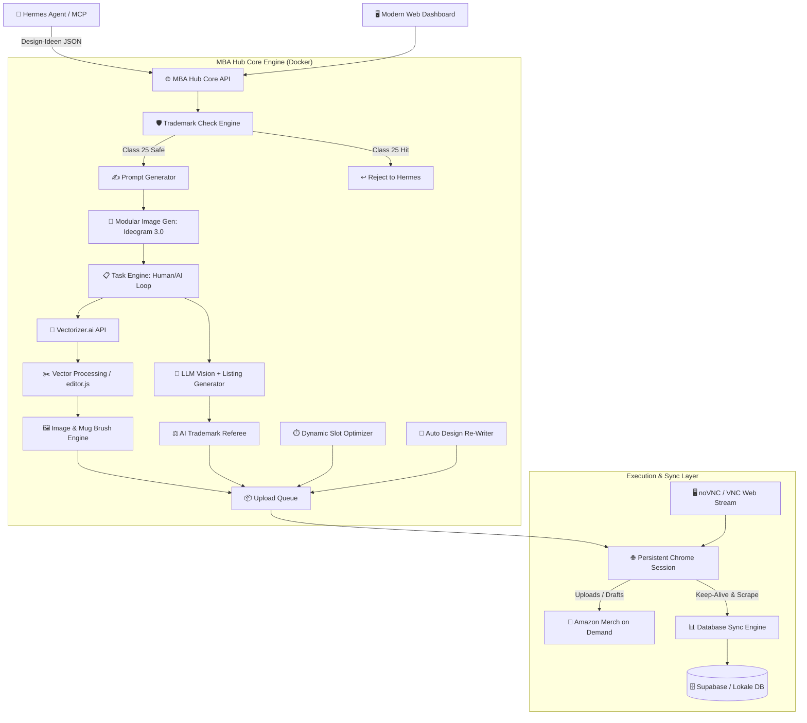

# 🧠 MBA HUB — Projekt-Brain & Master-Architektur

> **Status:** Konzeption abgeschlossen / Bereit für Phase 1  
> **Projekt:** MBA Hub (Merch By Amazon Automation & Hub Platform)  
> **Ziel-Umgebung:** Docker auf TerraMaster NAS (TOS 6.0) / Docker Compose  
> **Letzte Aktualisierung:** 2026-08-23

---

## 1. 🎯 Projekt-Vision & Kernziele
Der **MBA Hub** ist eine All-in-One Plattform zur vollständigen Steuerung, Generierung, Vektorisierung, Validierung, Optimierung und Veröffentlichung von Designs für **Merch by Amazon (MBA)**. Er ersetzt und fusioniert:
1. **MBA Manager** (Swift-Desktop-App: Prompt-Generator, Vectorizer.ai-Anbindung, Vektor-Editor, LLM-Listing-Erstellung, Upload-Script).
2. **mba-supabase-sync** (Chrome-Extension: 24/7 Live-Sync der MBA-Produktdaten, Sales & Royalties in Supabase).
3. **Listing Optimizer** (Chrome-Extension: General Resize für alle MBA-Produkte, Brush-Tool für schwarze Tassen, Trademark-Scans).
4. **Productor Integration** (API-Schnittstellen für USPTO, EUIPO, DPMA Trademark-Checks).

---

## 2. 🏛️ Gesamtsystem-Architektur



---

## 3. 🧩 Modul-Detaillierung & Analyse der Vorlagen

### A. Schnittstelle zu Hermes (Agenten & MCP)
* **Payload-Format:** JSON-Struktur analog zu `HermesTask` aus dem MBA Manager:
  ```json
  {
    "prompt": "Retro sunset with cat silhouette...",
    "niche1": "Cat Lovers",
    "niche2": "Retro 80s Vintage",
    "title": "...",
    "brand": "...",
    "bullet1": "...",
    "bullet2": "...",
    "description": "...",
    "keywords": "..."
  }
  ```
* **Pre-TM Check:** Quote/Keywords werden gegen Productor API (Klasse 25) geprüft:
  * **Treffer (Live Class 25):** Direkte Ablehnung an Hermes -> Hermes generiert autonom neuen Vorschlag.
  * **Sauber:** Übergabe an den Prompt-Generator.
* **Protokoll:** Bereitstellung als REST-Webhook (`/api/hermes/task`) und als nativer **MCP (Model Context Protocol) Server** für Hermes.

---

### B. Bildgenerierung & Vektorisierung
1. **Prompt Generator:**
   * Nimmt Hermes-Nischen & Rohideen und formuliert ultra-präzise Prompts für Ideogram 3.0 (oder modular OpenRouter/OpenAI/Midjourney).
   * Settings (Model, Style-Tags, Aspect Ratio) über UI konfigurierbar.
2. **Modularer Image-Provider:**
   * Adapter-Pattern (`BaseImageGenerator` -> `IdeogramGenerator`, `OpenAIGenerator`, etc.).
3. **Vectorizer.ai Anbindung:**
   * Erzeugt saubere Vektoren (SVGs) aus den Rasterbildern.
4. **Vektorbearbeitung (`editor.js` Engine):**
   * BFS-basierte, farbtolerante Flächenentfernung (`Remove Connected`, `Remove Color`, Toleranzschwellenwert ~25).
   * Geometrische AABB + Point-Cloud Kollisionserkennung.
   * Auto-Removal oben links oder manuelle Freistellung im UI.
   * Konvertierung zu druckfertiger High-Res PNG (4500 × 5400 px, 300 DPI, sRGB).

---

### C. Task-Management & Human-in-the-Loop (mit KI-Co-Pilot)
1. **Fragenkatalog bei Bildankunft:**
   * **Zielgruppe:** `Men`, `Women`, `Youth` -> steuert MBA Fit Types (`men-label`, `women-label`, `youth-label`).
   * **Vermeidende Produktfarben:** `Schwarz`, `Weiß`, `Keine` -> steuert Farbauswahl der Textilien und Mug-Background.
   * **Hintergrund-Wiederverwendung:** `Ja`, `Nein` -> steuert Auto-Freistellung vs. manuelle Maskierung.
2. **KI-Parallelbewertung (OpenRouter / OpenAI Vision in EINER Session):**
   * Vision-LLM beantwortet zeitgleich dieselben Fragen + erstellt optimiertes Listing (Titel, Brand, Bullet 1, Bullet 2, Description).
   * UI visualisiert KI-Vorschläge vs. menschliche Eingaben.
   * **Autonomie-Toggle:** Sobald Trefferquote 100% erreicht, kann der Human-Loop deaktiviert werden.

---

### D. Intelligentes Trademark-Management (Productor API)
* **Integrierte Endpoints (aus Listing Optimizer / Productor extrahiert):**
  * `https://uspto-tm-api2.productor.io/search-batch?classes=25,9,18,20,35,16,24,41,40,21`
  * `https://euipo-tm-api1.productor.io/search-batch?classes=25,9,16,41,21`
  * `https://dpma-tm-api2.productor.io/search-batch?classes=25,9,16,41,21`
* **Nizza-Klassen-Mapping:**
  * **Klasse 25 (Clothing / Textil):** Live-Treffer führt zu Reject der Design-Idee bzw. Sperre aller Textilien.
  * **Klasse 9:** Sperrt gezielt PopSockets & iPhone Cases.
  * **Klasse 6 / 16:** Sperrt Notizbücher/Hardcover.
  * **Klasse 8 / 18:** Sperrt Tote Bags.
  * **Klasse 20:** Sperrt Kissen (Throw Pillows).
  * **Klasse 21:** Sperrt Tassen & Tumbler (Mugs / Tumblers).
* **KI als Trademark-Schiedsrichter:**
  * Listing-Wörter werden geprüft.
  * LLM-Vision entscheidet im semantischen Kontext (z.B. "Vintage Apple" als Frucht vs. "Apple" als Tech-Marke) und formuliert Text nur bei echten Schutzrechtsverletzungen um.

---

### E. MBA Database Sync & Keep-Alive
* **Übernahme aus `mba-supabase-sync`:**
  * Scannen von `FindListings` (`com.amazon.merch.search#FindListingsRequest`) und Sales-Reports.
  * Pflege der Tabelle `public.mba_designs` (Design IDs, ASINs, Preise, Textdaten, Live-Produkte pro Marktplatz, 30d Sales/Royalties, All-Time Sales).
  * **Keep-Alive:** Natürlicher Rhythmus hält die Amazon-Session aktiv und verhindert Logouts/Session-Timeouts.

---

### F. Upload Queue, General Resize, Mug Brush & Slot-Optimierung
1. **General Resize & Mug Brush (nach Listing Optimizer Vorbild):**
   * Standard Apparel: 4500 × 5400 px.
   * PopSockets: 1200 × 1200 px (Margin 0.00).
   * iPhone Case: 1800 × 3200 px (Margin Top: 0.24, Right: 0.16, Bottom: 0.06, Left: 0.16).
   * Tote Bag / Throw Pillow: 2925 × 2925 px.
   * Black Mug Brush: Erzeugt Canvas mit schwarzem Brush-Tip (`assets/brush_tip.png`) hinter weißem Design.
2. **Upload-Automatisierung (Playwright + Persistent Chrome Session):**
   * Single-Page DOM-Automation (nach Vorbild `UploadScript.js`).
   * Robuste Eingaben mit simulierter Mensch-Interaktion, Color-Checkbox-Toggles und Hex-Color-Pickern.
   * Toggle: **Draft** (Entwurf prüfen) vs. **Live** (Direkt veröffentlichen).
   * **noVNC / VNC:** Live-Bildschirm im Dashboard zur MFA/2FA-Eingabe und Fehlerüberwachung.
3. **Slot-Optimierung & Scheduler:**
   * Zeitgesteuerter Lauf (z.B. 04:00 Uhr).
   * Prüft verbleibende Tages-Slots im Merch-Account.
   * **Dynamisches Slot-Filling:** Bei z.B. 100 Rest-Slots und einem Design mit 102 Produkten werden konfigurierte "Abwahl-Kandidaten" (z.B. Zip Hoodie EU-Marktplätze, US als letztes) präzise abgewählt, um die 100 Slots exakt auszunutzen.

---

### G. Automatisches Re-Design & Slot-Filling
* Sucht das älteste, am längsten unberührte Design aus der Datenbank.
* Prüft per MBA API auf Bearbeitbarkeit (kein `PENDING` / `TRANSLATING`).
* KI analysiert Quote -> TM-Check Klasse 25 -> Listing-Update -> Neue Produkte aktivieren -> In Queue einreihen.

---

## 4. 🎛️ Dashboard-Struktur (UI Menüs)
1. **Dashboard:**
   * Übersicht über Sales, Sync-Status, Konnektor-Gesundheit (Ideogram, Vectorizer, Productor, LLM, Chrome-Session, Supabase).
   * Live-Browser-Viewer (noVNC) für die Chrome-Session.
2. **Designer:**
   * Interaktiver Prompt-Generator (Nischen, Keywords, Style-Presets, Vorschau, manueller Generierungs-Start).
3. **Tasks:**
   * Human-in-the-Loop Übersicht: Offene Designs, Fragestellungen (Zielgruppe, Farben, Hintergrund), KI-Antworten-Vergleich, Vektor-Vorschau & Feinschliff-Editor.
4. **Queue:**
   * Fertige Designs mit konfigurierter Produktliste, Live/Draft Toggle, Zeitplaner, Manuell Starten, Slot-Optimizer Vorschau.
5. **Settings:**
   * API-Keys (Ideogram, Vectorizer, OpenRouter / OpenAI, Productor, Supabase).
   * MBA-Account Credentials & Session-Verwaltung.
   * Produkt-Presets, Marketplace-Preise, Fallback-Regeln für Slot-Filling.

---

## 5. 🐳 Docker & NAS/VPS Deployment-Strategie
* **Docker Multi-Container Setup:**
  1. `mba-hub-core`: Backend (Python FastAPI oder Node.js) + UI Frontend (Modern Responsive Webapp) + Task Queue.
  2. `mba-hub-browser`: Chromium/Playwright mit Xvfb & x11vnc/noVNC für den permanenten Amazon-Login.
  3. `mba-hub-db`: Lokales SQLite/PostgreSQL für Tasks/Queue + direkte Supabase-Anbindung für MBA-Daten.
* **Git-Workflow:**
  * Saubere Repository-Struktur (anonymisiert, keine Hardcoded Secrets).
  * Auto-Deploy / Pull-Script für NAS & VPS.
