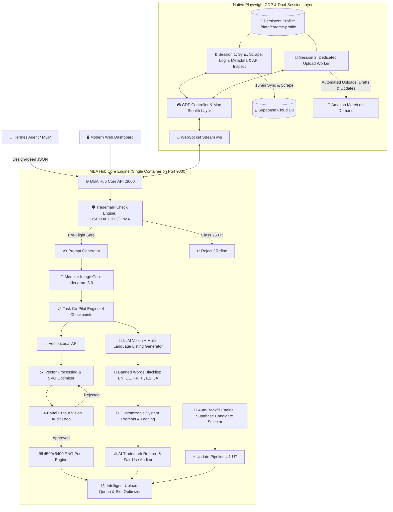

# 🧠 MBA HUB — Master-Architektur & Projekt-Brain

> **Status:** Phase 1 bis Phase 6 vollständig implementiert, verifiziert & im Produktivbetrieb 🚀  
> **Projekt:** MBA Hub (Merch By Amazon Automation & Hub Platform)  
> **Ziel-Umgebung:** TerraMaster NAS (TOS 6.0) unter Docker / Port `3000`  
> **Repository:** `https://github.com/aljan92/hub.git` (Branch: `main`)  
> **Deployment & Update:** Live-Betrieb auf dem NAS. Updates werden nach jedem Schritt automatisch per `git push origin main` auf GitHub veröffentlicht. 1-Click Update im Web-Dashboard (automatischer Tarball-Download & 10s Server-Neustart).  
> **Workflow-Regel:** Nach jedem Feature/Fix führt der AI-Agent **automatisch** `npm run build` und `git push origin main` aus!  
> **Projekt-Gedächtnis:** Diese `brain.md` dient als zentraler Master-Notizzettel und wird bei jedem Schritt fortlaufend > **Status:** Phase 1 bis Phase 7 vollständig implementiert, verifiziert & im Produktivbetrieb 🚀  
> **Projekt:** MBA Hub (Merch By Amazon Automation & Hub Platform)  
> **Ziel-Umgebung:** TerraMaster NAS (TOS 6.0) unter Docker / Port `3000`  
> **Repository:** `https://github.com/aljan92/hub.git` (Branch: `main`)  
> **Deployment & Update:** Live-Betrieb auf dem NAS. Updates werden nach jedem Schritt automatisch per `git push origin main` auf GitHub veröffentlicht. 1-Click Update im Web-Dashboard (automatischer Tarball-Download & 10s Server-Neustart).  
> **Workflow-Regel:** Nach jedem Feature/Fix führt der AI-Agent **automatisch** `npm run build` und `git push origin main` aus!  
> **Projekt-Gedächtnis:** Diese `brain.md` dient als zentraler Master-Notizzettel und wird bei jedem Schritt fortlaufend gepflegt.  
> **Letzte Aktualisierung:** 30. August 2026  

---

## 1. 🎯 Projekt-Vision & Kernziele
Der **MBA Hub** ist eine All-in-One Plattform zur vollständigen Steuerung, Generierung, Vektorisierung, Validierung, Optimierung und Veröffentlichung von Designs für **Merch by Amazon (MBA)**. Er ersetzt und fusioniert:
1. **MBA Manager** (Swift-Desktop-App: Prompt-Generator, Vectorizer.ai-Anbindung, Vektor-Editor, LLM-Listing-Erstellung, Upload-Script).
2. **mba-supabase-sync** (Chrome-Extension: 24/7 Live-Sync der MBA-Produktdaten, Sales & Royalties in Supabase).
3. **Listing Optimizer** (Chrome-Extension: Multi-Produkt Resize, Mug-Brush-Tool für schwarze Tassen, Banned-Words-Listen, Trademark-Scans).
4. **Productor Integration** (API-Schnittstellen für USPTO, EUIPO, DPMA Trademark-Checks, Ratelimiter & Tier-Abfragen).

---

## 2. 🏛️ Gesamtsystem-Architektur (Goldstandard: Native CDP Engine)



---

## 3. 🚀 Modul-Übersicht & Implementierte Phasen

### ✅ Phase 1: Core Dashboard & Health Engine
* **Interaktives Architektur-Schema (`ConnectorTopology`):** 3-Spalten-Netzwerk-Matrix mit Live-Puls, Ping und Klick-Drawer zum Verbindungstest.
* **Header & Navigation:** Feste Sidebar (`Sidebar.tsx`), `h-screen overflow-hidden` Layout, Live Tier-Level Badge (aus `ratelimiter/metadata`), 1-Click Update-Button mit automatischer GitHub-Tarball-Installation und 10s Neustart.
* **Live Kosten- & Budget-Statistik (`Header.tsx`, `costTrackingService.ts`, `SettingsView.tsx`):**
  * **Header Badges:** `Total Costs` ($ Gesamtausgaben) und `Ø/Design` ($ Kosten pro aktivem Design).
  * **Berechnungslogik:** $\text{Total Costs} = \text{OpenRouter} + (\text{Ideogram Bilder} \times \text{Kosten/Bild}) + (\text{Vectorizer} \times \text{Kosten/Vektorisierung})$.
  * **Durchschnittskosten:** $\text{Cost per Design} = \frac{\text{Total Costs}}{\text{Warteschlange} + \text{Hochgeladen}}$.
  * **Settings Card 8:** Konfiguration von `costPerImage` (z.B. `$0.08`), `costPerVectorization` (z.B. `$0.05`) und 1-Click Reset-Funktion (`POST /api/v1/stats/costs/reset`).
* **Settings:** Persistente Speicherung aller API-Keys und Parameter in `./data/settings.json`.
* **Globaler Schutzschild (`ErrorBoundary.tsx`):** Fängt alle UI- und Render-Fehler sauber ab und verhindert White/Black Screens bei defekten Daten.

---

### ✅ Phase 2: Supabase Sync & Mac Stealth Dual-Session CDP
* **Supabase Live-Sync (`syncEngine.ts`):** 
  * Amazon Coral RPC Protocol (`FindListingsRequest`, PageSize 500) im Browser-Kontext von `Session 1`.
  * HTTP 429 Resilience mit 10-fach Exponential Backoff.
  * Child-ASIN Resolution Engine für die 12 echten Variations-Produkte (Journals, Mugs, Cases, PopSockets, Hats, Pillows, Totes, Tumbler).
  * 15-Minuten Scheduler & 1-Minuten ASIN-Queue-Worker überstehen Server-Neustarts (`autoSyncEnabled: true`).
* **Mac Stealth Dual-Session Engine (`browserSessionService.ts`):**
  * 100% VNC-frei via WebSocket (`/ws`) und Canvas Stream auf Port 3000.
  * Mac-Fingerprint (macOS Intel, Apple M2 Metal WebGL, kein `navigator.webdriver`).
  * **Session 1 (Sync & Metadata):** Login, 2FA, 15min Produktsync, Ratelimiter-Abfragen, Merch-API Inspector.
  * **Session 2 (Upload Worker):** Teilt sich Session-Cookies/Tokens und ist exklusiv für Playwright-Uploads zuständig.

---

### ✅ Phase 3: Vectorizer.ai Engine
* **Vectorizer.ai API (`vectorizerService.ts`):** Umschaltung `test` vs. `production`, Farbbegrenzung (`max_colors`), Cutouts für Textildruck (`shape_stacking: cutouts`), Rauschfilterung und Speicherung unter `./data/designs/`.

---

### ✅ Phase 4: Human-in-the-Loop Task Co-Pilot & 4-Panel Cutout Audit
* **4 Checkpoints (`taskLogService.ts`, `TasksView.tsx`):**
  1. `AWAITING_DESIGN_APPROVAL`: Bildkontrolle & Quote-Prüfung.
  2. `AWAITING_DESIGN_REVIEW`: Fragenkatalog (Quote, Zielgruppe, Farbvermeidung, Hintergrund, Farbanzahl) ➔ 1-Click *„Listing generieren“*, *„Bild neu generieren“* oder *„Task abbrechen“*.
  3. `AWAITING_TM_REVIEW`: Multi-Language Listing (EN, DE, FR, IT, ES, JA) mit Live-Trademark-Scan (USPTO, EUIPO, DPMA) und Nizza-Klasse 25 Prüfung.
  4. `AWAITING_SVG_REVIEW`: Interaktiver SVG-Editor + **Automatischer 4-Panel Vision Cutout Audit Loop** (Testbild auf Weiß, Schwarz, Rot, Dunkelgrau; Vision-LLM erkennt Schnittfehler; bei `APPROVED` automatisches Rendern der finalen **4500x5400px Print-PNG**).
  5. `COMPLETED`: Automatische Übergabe an die Upload-Queue.
* **Banned Words Filter (`bannedWordsService.ts`):** Multi-Language Sperrwort-Listen (Claims, Werbesprache, Materialhinweise) mit Prompt-Injektion.
* **Prompt Log & Step-Targeted Retry (`PromptLogView.tsx`):** Re-Push Button zur erneuten Einreihung in die Upload-Queue für verifizierte Master-PNG Tasks.

---

### ✅ Phase 4.5: Dynamische MBA Produktdatenbank & DOM-Scanner
* **100% Dynamischer Live-Katalog (`productCatalogService.ts`, `./data/product_catalog.json`):**
  * Erkennt alle Produkte, Marktplätze (1 Slot pro Marktplatz = aktuell 106 Slots Basis), Fit-Types und Farb-Swatches / Color-Picker.
* **CDP DOM-Scanner in Session 1 (`productScannerService.ts`):**
  * Lädt im Hintergrund ein Mock-Design hoch, extrahiert die komplette Produkt-Matrix und schließt die Seite.
  * 12-18h Jitter-Scheduler verhindert Bot-Patterns.

---

### ✅ Phase 5: Intelligente Upload Queue, Balancing & Status-Visualisierung
* **5-Tab Lifecycle (`QueueView.tsx`, `queueService.ts`):**
  * **Tab 1: Warteschlange:** Aktive Upload-Kandidaten mit Drag & Drop Priorisierung.
  * **Tab 2: Pausiert (`Paused`):** Alle pausierten Designs (`isPaused: true`). Reaktivierung (`▶`) hängt das Design ans Ende der Warteschlange an.
  * **Tab 3: Update:** Dedizierter Bereich für Listing-Updates mit Vorhalte-Mengen-Stepper (1 bis 50 Designs), IST/SOLL Live-Badge und Sofort-Trigger.
  * **Tab 4: Hochgeladen (`COMPLETED`):** Historie mit Re-Enqueue Option.
  * **Tab 5: Fehler (`ERROR`):** Fehlgeschlagene Uploads mit 1-Click *„Wieder einreihen“* (`POST /api/v1/queue/item/:id/retry`) und Lösch-Modal.
* **Transparente Master-PNG Thumbnails & 1s Hover Zoom Popover:**
  * Backend `/api/v1/designs/image/:taskId` priorisiert automatisch die finale, hintergrundfreie **4500x5400px Master-PNG** (`_mba.png`).
  * Alle Thumbnails sind auf einem edlen dunklen **Schachbrett-/Transparenzgitter** (`object-contain`) eingebettet.
  * **1-Sekunden Hover Zoom:** Beim Verweilen mit der Maus über einem Thumbnail poppt nach exakt 1 Sekunde eine hochauflösende Großansicht mit Gitterhintergrund, Task-ID, Master-PNG Badge und Listing-Details auf.
* **Upload-Modi (Draft, Live, Draft-Hybrid):**
  * **Live Mode:** Mathematisches Slot-Balancing gegen verbleibende freie Tages-Slots. US-Marktplätze (.com) bleiben 100% geschützt; Non-US Slots werden nach Priorität gekürzt ($\mathbf{JP} \rightarrow \mathbf{ES} \rightarrow \mathbf{IT} \rightarrow \mathbf{FR} \rightarrow \mathbf{DE} \rightarrow \mathbf{GB}$). Hero-Designs (`🔒`) behalten 100% aller Slots.
  * **Draft Mode:** Draft-Uploads belasten kein tägliches Kontingent. Stepper **„Produkte pro Design“** für persistente Produktanzahl pro Design.
  * **Draft-Hybrid Mode:** Neue Designs werden als Draft hochgeladen (0 Slots), während Update-Designs live aktualisiert werden (verbrauchen nur die Netto-Slots für neu hinzugekommene Produkte/Marktplätze). Lila Badge und Rahmen zur klaren optischen Trennung.
* **Einzeldesign-Pause Button (`⏸️ / ▶`):** Pausierte Designs (`isPaused`) erhalten einen orangenen Rahmen und werden von Balancing und Upload ausgeschlossen (`0 Slots`).
* **Farbige Status-Rahmen (Glow & Border):**
  * 🟢 **Grün (`border-emerald-500`):** Heute eingeplant / zum Upload bereit.
  * 🟡 **Gelb (`border-amber-300`):** Wartend, aber heute wegen Slot-Limit nicht dran (Folgetage).
  * 🟠 **Orange (`border-amber-500`):** Pausiert (`isPaused`).
  * 🟣 **Lila (`border-purple-500`):** Aktiver Upload (`UPLOADING`) oder Update-Design im Hybrid-Modus.
  * 🟢 **Mint-Grün / Slate (`border-teal-500`):** Hochgeladen (`COMPLETED`).
  * 🔴 **Rot (`border-rose-500`):** Fehler (`ERROR`).

---

### ✅ Phase 6: Playwright Upload Worker (`uploadWorkerService.ts`)
* **Session-Trennung:** Session 1 liest Ratelimiter/Metadaten; Session 2 führt den Upload aus.
* **Automatisierter Upload-Ablauf:**
  1. Start auf `https://merch.amazon.com/designs/new` (oder `/designs/{id}/edit` für Updates) in Session 2.
  2. Master-PNG Upload & Asset-Render-Verifikation.
  3. Intelligenter Marktplatz-Abgleich im *Select Products* Modal gegen `activeProductsMap`.
  4. Sequenzielle Produktkonfiguration: Fit-Types (`Men, Women, Youth, Girls, Adult Unisex`), produktspezifische Farbausschlüsse (Soccer/Basketball Jerseys, Raglan, Trucker Hats, Visors) und Sketch Hex-Color-Picker mit Preset-Swatch-Triggering und nativer Input-Setter Simulation.
  5. Auto-Translate auf `NO` und sequenzielles Eintragen aller Sprach-Listings (EN, DE, FR, IT, ES, JA).
  6. Save Draft / Live Publish mit Formular-Validierungsprüfung.
  7. Nach erfolgreichem Upload Rücknavigation auf `https://merch.amazon.com/dashboard` und automatischer Slot-Refresh über Session 1.

---

### ✅ Phase 6.1: Hermes Agent & MCP Integration (`mcpSchemaService.ts`, `trademarkService.ts`)
* **Auth & Security:** Header `x-mba-api-key: <key>` oder `Authorization: Bearer <key>`.
* **1. Design Ingestion (`POST /api/v1/design`, `/design`, `/api/v1/hermes/design`):** Akzeptiert Nischen- & Design-Attribute oder Voll-Prompts. Startet Pre-Flight TM-Check, LLM Prompt-Generierung, Ideogram 3.0 Generation und leitet Task (`#001-H`) durch den Co-Pilot.
* **2. Live Trademark-Check (`POST /api/v1/mcp/trademark/check`, `/api/v1/trademark/check`, `/api/v1/trademark`):** Multi-Office Abfrage (USPTO, EUIPO, DPMA), strikte Filterung auf LIVE-Treffer, Nizza-Klasse 25 und lesbares `verdict`.

---

### ✅ Phase 7: Automatischer Update-Design Backfill & Pipeline (`updateBackfillService.ts`, `updatePipelineService.ts`)
* **Autoritativer Merch-API-Abruf:** 
  * Nutzt direkt `api/productconfiguration/get?id=${cleanId}` zur vollständigen Extraktion von Produkten, Swatches und Multi-Language-Listings.
  * Nicht limitiert auf die ersten 500 Einträge wie Coral RPC `FindListings`.
* **Kandidatenauswahl aus Supabase:** 
  * Filtert `mba_designs` nach `status='PUBLISHED'` und `not('published_products', 'is', null)`.
  * Überspringt leere/gelöschte Designs automatisch.
* **Vollautomatischer 7-Stufen Update-Workflow (U1–U7):**
  1. **U1:** Merch-API Datenabruf & Erstellung von Task `#xxx-U`.
  2. **U2:** Master-Artwork Download (4500x5400px Original-PNG).
  3. **U3:** Vision & Listing-Analyse (LLM prüft Farbvermeidung, Fit-Types und Listing-Qualität).
  4. **U4:** LLM Listing Rewrite (SEO & Banned Words bereinigt, falls U3 `rewriteNeeded: true`).
  5. **U5:** Live Trademark Scan (USPTO, EUIPO, DPMA).
  6. **U6:** Slot & Product Reconciliation (Erkennt bereits live geschaltete Produkte vs. neu hinzukommende Marktplatz-Slots).
  7. **U7:** Enqueue in den Update-Pool (Tab 3).
* **Exakte Slot-Berechnung pro Marktplatz:**
  * Jedes Produkt pro Marktplatz = 1 Slot (z.B. Comfort Colors auf 6 Marktplätzen = `+6 Slots`).
  * Detail-Matrix visualisiert `✓ Live (0 Slots)` vs. `✨ Neu ergänzen (+X Slots)`.
* **Live IST vs. SOLL Pool-Status & Deduplizierung:**
  * Live-Badge im UI zeigt `Pool-Bestand: IST: X / SOLL: Y`.
  * Eindeutige ID-Menge (`Set<string>`) verhindert Zwischensprünge während der Bearbeitung.
  * Hintergrund-Scheduler (10s Intervall) füllt den Pool bei `IST < SOLL` automatisch auf.

---

## 4. 🗺️ Nächste Roadmap-Phasen

### 🔜 Phase 7.5: System-Prompts & Vision-Optimierung (Alex Todo.md #6 & #7)
* Verfeinerung der System-Prompts für Vision-Analyse, Listing-Rewrite und TM-Scans.
* Feinjustierung der Kriterien für `rewriteNeeded` und Farbausschlüsse.

### 🔜 Phase 8: Canvas Mug Brush & Multi-Produkt-Resize Engine
* PopSockets (`1200 × 1200 px`), Phone Cases (`1800 × 3200 px`), Throw Pillows & Tote Bags (`2925 × 2925 px`), Black Ceramic Mug (`brush_tip.png` Layering).

---

## 5. 🛠️ Build-, Git- & Deployment-Workflowsaus bestehender MBA-Datenbank
* Zieht bei verbleibenden freien Slots am Tagesende bestehende Live-Designs aus der Supabase-Datenbank und publiziert ungenutzte Produkte/Marktplätze bis zu 100% Auslastung.

---

## 5. 🛠️ Build-, Git- & Deployment-Workflows

### Lokale Entwicklung & Git Push (auf dem Mac)
1. Änderungen unter `src/client` oder `src/server` vornehmen.
2. Build ausführen: `npm run build`
3. Commit & Push: `git add . && git commit -m "..." && git push origin main`

### Deployment auf dem TerraMaster NAS
* **Web-Dashboard (1-Click):** Im Header oben rechts auf **`Update`** ➔ **`Jetzt aktualisieren`** klicken (~10 Sekunden Neustart).
* **Terminal / SSH:**
  ```bash
  cd /Volume1/docker/mba-hub && curl -sL https://github.com/aljan92/hub/archive/refs/heads/main.tar.gz | tar -xz --strip-components=1 && docker-compose down && docker-compose up -d --build
  ```

---

## 6. 📂 Projekt- und Datei-Struktur

```text
MBA HUB/
├── dist/                          # Vorkompilierte Produktions-Assets
│   ├── client/                    # Vite Frontend Build (HTML/CSS/JS)
│   ├── server.cjs                 # Standalone Node.js Backend Bundle (Playwright included)
│   └── browsers.json              # Playwright Browser Manifest
├── data/                          # Persistentes Docker-Volume
│   ├── product_catalog.json       # 33 MBA-Produkte mit Nizza-Klassen (25, 18, 20, 21, 9, 16) & Drop-Prioritäten
│   ├── system_prompts.json        # 8 zentrale System-Prompts für alle Workflows
│   ├── banned_words.json          # Mehrsprachige Sperrwort-Listen
│   ├── settings.json              # API-Keys, Modelle & Kosten-Konfiguration
│   ├── queue.json                 # Upload-Warteschlange (Live, Paused, Update)
│   ├── tasks_log.json             # Audit-Log und Tasks State Machine
│   ├── tasks_counter.json         # Persistenter Task-ID Zähler
│   ├── chrome-profile/            # Persistentes Chrome Profil (Cookies, 2FA, Amazon-Session)
│   ├── designs/                   # Gespeicherte PNG-Assets für Vision & Vektorisierung
│   └── uploads/                   # Temporäre Bild-, Test- & SVG-Verarbeitung
├── src/
│   ├── client/
│   │   ├── components/
│   │   │   ├── BrowserScreencast.tsx # Interaktives HTML5 Canvas Screencast UI
│   │   │   ├── ConnectorTopology.tsx # Interaktives 3-Spalten Architektur-Schema
│   │   │   ├── ErrorBoundary.tsx     # Globaler Schutzschild gegen UI/Render-Crashes
│   │   │   ├── Header.tsx            # Header mit Tier-Badge & 1-Click Update
│   │   │   ├── Sidebar.tsx           # Feste Navigation
│   │   │   ├── SvgEditor.tsx         # Interaktiver SVG Vektor-Editor & Hintergrundentfernung
│   │   │   └── SystemPromptsModal.tsx# Modal zur Bearbeitung aller System-Prompts
│   │   └── views/
│   │       ├── DashboardView.tsx     # Hauptansicht mit Topologie & schlanken Metriken
│   │       ├── DatabaseView.tsx      # MBA Supabase Live-Design Viewer & Sync Controls
│   │       ├── DesignerView.tsx      # Prompt- & Image-Generator
│   │       ├── TasksView.tsx         # 4-Stufen Human-in-the-Loop Co-Pilot & TM-Workspace (Nischen-Matrix)
│   │       ├── ProductsView.tsx      # MBA Produktdatenbank mit Nizza-Klassen Badges & Slot-Rechner
│   │       ├── PromptLogView.tsx     # Vollständiger Prompt- & LLM-Verlauf mit Re-Push Button
│   │       ├── QueueView.tsx         # Upload Queue, Slot-Optimizer, Stepper & Pause-Controls
│   │       ├── LogsView.tsx          # Dediziertes System- & Aktivitäts-Log Terminal
│   │       ├── SystemPromptsView.tsx # System-Prompts Editor mit Reset-Funktion
│   │       └── SettingsView.tsx      # API-Keys & Konfiguration
│   └── server/
│       ├── services/
│       │   ├── browserSessionService.ts # Playwright CDP Engine & Mac Stealth Controller
│       │   ├── uploadWorkerService.ts   # Playwright Session 2 Upload Engine mit doppelter Verifikation
│       │   ├── productCatalogService.ts # Dynamic Product Catalog mit Nizza-Klassen (25, 9, 18, 20, 21, 16)
│       │   ├── productScannerService.ts # Session 1 CDP DOM Scanner & 12-18h Jitter Scheduler
│       │   ├── queueService.ts          # Upload Queue Management, Pause & Mathematical Slot Balancing
│       │   ├── updateBackfillService.ts # Automatischer Supabase Update-Kandidaten-Selector & Pool-Scheduler
│       │   ├── updatePipelineService.ts # 7-Stufen Update-Workflow (U1 bis U7) mit Master-Listing & TM Loop
│       │   ├── amazonInspectService.ts  # Autoritativer Merch-API Inspector & Artwork Downloader
│       │   ├── supabaseService.ts       # Supabase REST & Query Client
│       │   ├── syncEngine.ts            # MBA Database Sync, Ratelimiter & Keep-Alive
│       │   ├── ideogramService.ts       # Ideogram 3.0 API Adapter
│       │   ├── vectorizerService.ts     # Vectorizer.ai API Adapter
│       │   ├── svgRenderService.ts      # Server-Side Headless Renderer (4500x5400 PNG & 4-Panel Testbild)
│       │   ├── taskLogService.ts        # Co-Pilot Task-Engine & State-Machine (Nischen-Hierarchie & Sanitizer)
│       │   ├── llmService.ts            # Master English Listing Generator, TM Feedback Rewriter, SEO Translator
│       │   ├── systemPromptService.ts   # System-Prompt Manager & LLM-Audit Logging
│       │   ├── trademarkService.ts      # Multi-Office TM Scans (USPTO, EUIPO, DPMA) mit Nizza-Klassen Logik
│       │   ├── bannedWordsService.ts    # Multi-Language MBA Blacklist & Hard-Stripping Sanitizer
│       │   └── settingsService.ts       # Einstellungen lesen/schreiben & Persistenz
│       └── index.ts                     # Express Server, WebSocket Server & REST Router
├── Dockerfile                     # Standalone Playwright Image (mcr.microsoft.com/playwright:v1.50.1-noble)
├── docker-compose.yml             # Single-Service Stack auf Port 3000
├── browsers.json                  # Root Playwright Browser Manifest
├── package.json                   # Dependencies & Build Scripts
├── brain.md                       # Projekt-Brain & Master-Architektur
└── Alex Todo.md                   # Aufgabenliste & Roadmap
```

---

## 9. 🛡️ Unified Listing Engine, Nischen-Hierarchie & Nizza-Klassen TM-Loop

### 9.1 Nischen-Hierarchie (`niche1`, `niche2`, `subniche`, `keywords`)
1. **Nische 1 (`niche1`):** Das primäre Nischen-Hauptthema (z. B. `Horse`, `Dog`, `Nurse`, `Camping`).
2. **Nische 2 (`niche2`):** Optionale Cross-Nische / Zweit-Thema (z. B. `Coffee`, `Wine`, `Tacos`, `Book Reading`).
3. **Subnische (`subniche`):** Spezifische Rasse, Unterart, Typ (z. B. `Shetland Pony`, `Golden Retriever`, `ICU Nurse`).
4. **Such-Keywords (`keywords`):** Hermes liefert strukturierte SEO-Begriffe, die in der Question Phase ergänzt und an das LLM übergeben werden.

### 9.2 Master English Listing Engine (100% Token-Effizient)
- **English First:** Die Generierung und bis zu 3 Trademark-Refine-Loops erfolgen ausschließlich auf Englisch. Dadurch werden **~80% der LLM-Tokens gespart**.
- **Titel-Formel (50–60 Zeichen):** Start mit Nische/Style, Mitte mit Quote/Keywords, **Ende zwingend auf Subnische (bevorzugt) oder Nische**. Keine Satzzeichen am Ende, da Amazon automatisch den Produktsuffix anhängt (z. B. `... Shetland Pony` ➔ `... Shetland Pony T-Shirt`).
- **Brand-Formel (40–50 Zeichen):** Maximale Keyword-Dichte. Relevante Suchbegriffe wie `Apparel`, `Accessories`, `Collection`. Keine leeren Fluff-Wörter (`Studio`, `Co`, `Designs`).
- **Bullet 1 (230–256 Zeichen):** Zielgruppe, Leidenschaft, Lifestyle, Motiv-Bezug.
- **Bullet 2 (230–256 Zeichen):** Anlässe, Aktivitäten, Orte zum Tragen. 0% Geschenkbegriffe (`gift`, `present`, `birthday`).
- **Description (300–600 Zeichen):** Atmosphärische Kurzzusammenfassung.

### 9.3 Nizza-Klassen Trademark-Audit (33 MBA-Produkte)
- **Klasse 25 (Bekleidung & Kopfbedeckungen - 24 Produkte):** Standard/Premium/CC T-Shirts, Hoodies, Sweatshirts, Tank Tops, Jerseys, Caps, Visors etc.
  - *Hard Reject:* Ist die Quote, `niche1`, `niche2` oder `subniche` in Klasse 25 eingetragen ➔ Design wird sofort als `REJECTED` verworfen (Account-Schutz).
  - *Brand/Title Konflikt:* LLM ersetzt das Wort im Feedback-Loop durch ein anderes Nischen-Keyword.
- **Nebenklassen (Gezieltes Produkt-Blocking statt Design-Verwerfung):**
  - **Klasse 9 (Tech-Zubehör):** PopSockets, iPhone Cases.
  - **Klasse 18 (Taschen):** Sport Backpack, Tote Bag.
  - **Klasse 20 (Home Decor):** Throw Pillows.
  - **Klasse 21 (Drinkware):** Tumbler, Ceramic Mug, Water Bottle.
  - **Klasse 16 (Stationery):** Hardcover Journal.
  - Bei TM-Hits in Nebenklassen werden ausschließlich die betroffenen Produkte gesperrt (`blockedProducts`). Die Slot-Berechnung der Queue zieht gesperrte Produkte automatisch ab.

### 9.4 Post-Approval Lokalisierung & Hard Sanitizer
1. **Übersetzung:** Erst nach bestandenem Trademark-Check wird das Listing nach DE, FR, ES, IT, JA übersetzt. Zitate auf der Grafik bleiben englisch. Übersetzte Titel enden im Nominativ auf der Nische/Subnische.
2. **Hard Sanitizer Gatekeeper:**
   - Bereinigt typografische Sonderzeichen (`“`, `”`, `’`, `–`) zu standard ASCII (`"`, `'`, `-`).
   - Entfernt trailing Satzzeichen (`.`, `-`, `,`) am Ende des Titels.
   - Letzter Pass zur sicheren Entfernung versehentlicher MBA-Sperrwörter.

---

## 10. 🛡️ Trademark Whitelist Manager, Raw Prompt Logging & Pipeline Streamlining

### 10.1 Multi-Marketplace Trademark Whitelist (`/trademark`, `trademarkWhitelistService.ts`)
- **Dedizierte Trademark-Ansicht:** Registerkarten für **Global**, **USPTO (US)**, **EUIPO (EU)** und **DPMA (DE)**.
- **Automatischer Filter-Bypass:** Wörter wie *"girl"*, *"boys"*, *"queen"*, *"mama"* lösen bei Productor-Hits in Klasse 25 keine Blockierung mehr aus, wenn sie auf der Whitelist stehen.
- **Live-Sandbox Quick-Tester:** Ermöglicht das Testen beliebiger Phrasen gegen alle Ämter in Echtzeit.

### 10.2 Vollständige Raw Prompt Transparenz (`PromptLogView.tsx`)
- **Raw Request & Response Inspektor:** Zeigt die exakten an OpenRouter gesendeten System-Prompts, User-Messages sowie die Rohantworten an.
- **1-Click Kopieren:** Schnelles Kopieren von JSON, Prompt-Texten und Listings.

### 10.3 Question Phase: KI-Vision vs. Hermes-Payload Abgleich (`TasksView.tsx`)
- **Automatische Vorausfüllung:** `niche1`, `niche2`, `subniche` und Zielgruppen werden aus der KI-Vision-QA vorausgefüllt.
- **Vergleichs-Box mit 1-Click Übernahme:** Gegenüberstellung von Hermes-Payload vs. KI-Erkennung mit Buttons *„Von KI übernehmen“* und *„Von Hermes übernehmen“*.

### 10.4 Update-Pipeline & Queue Optimierung
- **Überspringen der Vektorisierung:** Update-Tasks (#xxx-U) überspringen nach Freigabe des Listings automatisch die Vektorisierung und wandern direkt in die Upload-Queue (Step U7).
- **Transparente Master-PNG Thumbnails:** Alle Thumbnails in der Queue nutzen die echte, freigestellte `_mba.png`.
### 10.5 ⚙️ Konfigurierbare LLM-Parameter & 25-Punkte Meister-SEO-Prompt
- **LLM Settings (`SettingsView.tsx`, `settingsService.ts`):** `Temperature` (Standard: 0.35), `Max Tokens` (Standard: 3000) und `Timeout (Sek.)` (Standard: 90s) sind direkt in den Einstellungen unter *OpenRouter / OpenAI LLM* einstellbar.
- **25-Punkte MBA Master-Prompt (`systemPromptService.ts`):** Standard-Listing-Prompt für beide Pipelines (Neu & Update) mit interner Nischen-Recherche, Insider-Terminologie, Cross-Field Deduplikation, Quote-Fallback in Bullet 1 bei Platzmangel und strikter Subnischen-Suffix-Titelformel (50–60 Zeichen).
- **Single Source of Truth bei Nischen-Feldern:** Explizites Respektieren leerer/gelöschter Felder (z.B. gelöschte Subnische wird als leer an den Listing-Generator übergeben).

### 10.6 👁️ 2x2 Grid Vision Optimizer, Design-Qualitätsaudit & Exklusive Task-Autonomie
- **2x2 Grid Vision Optimizer (`visionOptimizationService.ts`):** Rendert transparente Designs für die Vision-KI als 1024x1024 4-Farben-Grid auf den 4 Merch-Standardfarben:
  - **Oben Links:** Schwarz (`#111827`) — Kontrast für weiße Schriften & Erkennung von Kanten-Halos.
  - **Oben Rechts:** Weiß (`#ffffff`) — Kontrast für dunkle Typografie.
  - **Unten Links:** Rot / Cranberry (`#c53030`) — Erkennung von Farbkonflikten.
  - **Unten Rechts:** Asphalt (`#383E42`) — Prüfung von Zwischentönen und Bildartefakten.
- **Design-Qualitätsaudit (`DEFAULT_UPDATE_VISION_SYSTEM_PROMPT`):** Die Vision-KI bewertet die visuelle Qualität mit `design_quality: { quality_verdict: "APPROVED" | "DEFECTIVE", quality_issues }`.
- **Autonomie-Sicherheitsstopp bei Mängeln (`updatePipelineService.ts`, `TasksView.tsx`):** Ergibt der Qualitätsbefund `DEFECTIVE`, stoppt der Task zwingend in `Tasks & Review` mit roter Warnbox, selbst wenn die Update-Autonomie aktiv ist.
- **Exklusive Task-Autonomie:** Die Autonomie-Schalter für Design- und Update-Pipeline befinden sich exklusiv im Header von `Tasks & Review`.
### 10.7 📋 Einheitliches Question & Audit UI (`TasksView.tsx`)
- **Update-Pipeline (`activeTask.source === 'UPDATE'`):**
  - **Linke Spalte:** 2x2 Grid vs. Master-Artwork Preview (1024x1024 / 4500x5400px) & vollständige Darstellung des bestehenden Amazon-Listings (Brand, Title, Bullet 1, Bullet 2, Description).
  - **Rechte Spalte:** 1. Design Check (Quality Verdict & Text), 2. Listing-Rewrite Befund, 3. Zielgruppe (Fit Types mit Checkmarks), 4. Zu vermeidende Produktfarbe, 5. Nischen-Hierarchie & SEO-Keywords (Hermes vs LLM Direktvergleich, 3 Nischen-Felder, 1 SEO-Keywords-Feld).
- **Design-Creation-Pipeline (`activeTask.source !== 'UPDATE'`):**
  - **Linke Spalte:** Ideogram Artwork Preview (Aspect-Ratio, 1s Hover-Zoom & Download) & editierbare Prompt-Card (Ideogram 3.0).
  - **Rechte Spalte:** 1. Quote-Prüfung (Soll vs Erkannt mit EXAKT/ABWEICHUNG Badge), 2. Zielgruppe (Fit Types mit Checkmarks), 3. Zu vermeidende Produktfarbe, 4. Hintergrund entfernen (Automatisch/Manuell mit Checkmarks), 5. Maximale Farbanzahl (1-12 Vektorisierung), 6. Nischen-Hierarchie & SEO-Keywords (Hermes vs LLM Direktvergleich, 3 Nischen-Felder, 1 SEO-Keywords-Feld).

### 10.8 🏷️ Einheitliches Pipeline-Status-System & Farb-Mapping (`TaskStatusBadge.tsx`)
- **Pipeline-sensitive Status-Auflösung:**
  - Unterscheidet dynamisch zwischen Design-Creation (`-H`, `-T`, `-D`) und Update-Pipeline (`-U`).
  - Zeigt in Review-Checkpoints zuverlässig `Wartet: Update-Review` bzw. `Wartet: Design-Review` anstelle irreführender Statustexte (`Design bereit`).
- **Farbpalette der Step-Kategorien:**
  - **System / Download:** Teal (`bg-teal-500/15 text-teal-300 border-teal-500/30`)
  - **OpenRouter / Listing / Vision:** Sky / Cyan (`bg-sky-500/15 text-sky-300` / `bg-cyan-500/15 text-cyan-300`)
  - **Ideogram:** Purple (`bg-purple-500/15 text-purple-300 border-purple-500/30`)
  - **Trademark:** Amber / Purple (`bg-amber-500/15 text-amber-300` / `bg-purple-500/15 text-purple-300`)
  - **Vectorizer / SVG:** Pink (`bg-pink-500/15 text-pink-300 border-pink-500/30`)
  - **Queue / Completed:** Emerald (`bg-emerald-500/15 text-emerald-300 border-emerald-500/30`)
  - **Error / Rejected:** Rose (`bg-rose-500/15 text-rose-300 border-rose-500/30`)
- **Aktive Pulse-Animationen & Spinner:** Laufende API-Operationen (Download, Bildgenerierung, Vision-Audit, Listing-Rewrite, Trademark-Check, Übersetzung, Vektorisierung) pulsieren dezent mit rotierendem/animiertem Icon.

### 10.9 🚨 Full Workspace Reset & Purge (`POST /api/v1/system/purge-all-data`)
- **Gefahrenzone in Settings:** Befindet sich ganz unten in [SettingsView.tsx](file:///Users/alexanderjanssen/Desktop/MBA%20HUB/src/client/views/SettingsView.tsx) mit doppelter Sicherheitsabfrage (Eingabe des Worts `LÖSCHEN`).
- **Was bereinigt wird:**
  - `data/tasks_log.json` wird geleert (`[]`).
  - `data/tasks_counter.json` wird auf 0 zurückgesetzt (nächster Task beginnt bei `#001`).
  - `data/upload_queue.json` wird vollständig geleert (`[]`).
  - `data/designs/` wird vollständig von allen PNG-, SVG-, 4-Panel- und 2x2-Grid-Dateien befreit.
  - Temporäre Test-Assets im `data/`-Stammverzeichnis werden gelöscht.
  - Sendet Realtime-WebSocket-Events (`TASK_LOGS_CLEARED`, `TASKS_UPDATED`, `QUEUE_UPDATED`) an alle geöffneten Tabs.
- **Was unberührt bleibt:** API-Keys, Modelleinstellungen, System-Prompts, Marken-Whitelist und der Amazon-Produktkatalog bleiben 100% erhalten.

### 10.10 🛡️ Upload Prüfmodus: "Vor Publish pausieren" (`QueueView.tsx` & `UploadWorkerService`)
- **Ablauf im Prüfmodus:**
  - Der Bot führt alle Schritte automatisiert aus: Öffnet die Merch Edit/Create-Seite, wählt Produkte, stellt Fit Types und Farben ein, deaktiviert Auto-Translate, befüllt alle DE/EN/FR/ES/IT/JA Listings und scrollt nach unten.
  - **Stoppt bei 92 % vor dem Klick auf `Publish`:** Der Worker pausiert und schaltet in den Zustand `⏸️ PRÜFMODUS PAUSIERT`.
- **Interaktive Steuerung:**
  - **Button in Queue-Leiste:** Schneller 1-Click-Toggle `[ ⏸️ Vor Publish pausieren ]` (mit LocalStorage-Speicherung).
  - **Live-Aktionen im Banner:** Während der Pause erscheinen die Buttons `[ 🚀 Jetzt veröffentlichen (Publish) ]` (`POST /api/v1/upload/resume-publish`), `[ 🛑 Abbrechen ]` und `[ 📺 Live ansehen ]` (Live-Screencast).

### 10.11 🎨 Granulare 3-State Farbregeln im Produktkatalog (`avoidRule: 'none' | 'white' | 'black'`)
- **3-State Farbauswahl pro Produktfarbe:**
  - Jede Farbe jedes Produkts im Produktkatalog ([ProductsView.tsx](file:///Users/alexanderjanssen/Desktop/MBA%20HUB/src/client/views/ProductsView.tsx)) kann per Klick durchgeschaltet werden:
    - **Normal (`none`):** `Immer aktiv` – wird nie ausgelassen.
    - **Weiß meiden (`white`):** `⚪ Bei Weiß meiden` – wird ausgelassen, wenn `avoidColor === 'white'`.
    - **Schwarz meiden (`black`):** `⚫ Bei Schwarz meiden` – wird ausgelassen, wenn `avoidColor === 'black'`.
- **Persistenz & Scan-Schutz:**
  - Gespeichert in `data/product_catalog.json` unter `product.colors[].avoidRule`.
  - Bei automatischer oder manueller Katalog-Aktualisierung / MBA-Scans (`ProductScannerService` / `saveCatalog`) bleiben die manuell konfigurierten `avoidRule`-Werte 100% erhalten.
- **Upload Worker Integration:**
  - Der Upload-Bot gleicht jedes Farbfeld im Amazon-DOM mit der `avoidRule` der entsprechenden Farbe im Produktkatalog ab. Ist z. B. `avoidColor === 'white'` und die Farbe hat `avoidRule: 'white'`, wird sie gezielt abgewählt, während alle anderen Farben aktiv bleiben.

### 10.12 ⚡ Single Source of Truth & Live-Synchronisation für Amazon Upload Slots
- **Hintergrund & Problemstellung:**
  - Auf dem Dashboard und in der Queue wurden zuvor unterschiedliche Slot-Zahlen angezeigt, da `QueueService` nicht bei jedem Hintergrund-Sync mit den Live-Daten aus dem Amazon Ratelimiter/Dashboard synchronisiert wurde.
- **Lösung & Architektur:**
  - **Single Source of Truth:** `SyncEngine.fetchDashboardRatelimiter` aktualisiert bei jedem Durchlauf sowohl `dailySlotStats` als auch `QueueService.setDailySlots(free, used, total)` und löst sofort ein automatisches Rebalancing der Queue aus.
  - **Erweiterter Productor- & DOM-Parser:** Erkennt sowohl native Amazon Dashboard-Werte als auch Productor-Strukturen (`.media`, `.progress-bar.bg-productor`, `Uploaded 80 / 200`, `Published`, `Tier`).
  - **Schnellerer Cache:** Cache-TTL auf 10s verkürzt für maximale Aktualität.
  - **Manueller 1-Click Refresh:** In der Queue-Card (Tages-Uploads) befindet sich nun ein Refresh-Button (`POST /api/v1/queue/refresh-slots`), der sofort live die aktuellsten Slots von Amazon abruft.

### 10.14 🔍 DOM-basierte Live-Matrix-Inspektion, Rejection-Sicherheitsprüfung & Exakte Slot-Delta-Berechnung
- **Hintergrund & Problemstellung:**
  - Die Amazon API `productconfiguration/get` liefert oft nur den initialen Entwurfs- bzw. Preset-Zustand des Designs (z. B. Standard T-Shirt mit allen Marktplätzen vorgewählt), selbst wenn auf Amazon nur wenige Marktplätze publiziert wurden oder Produkte abgelehnt wurden.
- **Lösung & DOM-Inspektion beim Artwork-Download:**
  - **Ein kombinierter Aufruf:** Beim ohnehin stattfindenden Artwork-Download auf `merch.amazon.com/designs/{designId}/edit` öffnet der Bot via Playwright das Modal `#select-marketplace-button-original` („Select Products“).
  - **100% deterministischer DOM-Scan:**
    - Liest alle `<flowcheckbox formcontrolname="shouldPublish">` mit Klassen wie `STANDARD_TSHIRT-GB` aus.
    - Ist `span.readonly` oder `input[readonly]` vorhanden, ist das Produkt auf diesem Marktplatz **garantiert live auf Amazon** (`liveProductSummary[prodKey] = [countries...]`).
    - Ist eine Checkbox markiert (`sci-check-box`), aber **nicht** `readonly`, deutet dies auf ein unpubliziertes, beanstandetes oder abgelehntes Produkt hin.
  - **Umfassende DOM-Key-Normalisierung (`AmazonInspectService.normalizeProductKey`):**
    - Wandelt alle Amazon-DOM-Klassenbezeichnungen nahtlos in die Produkt-IDs des Katalogs um (z. B. `STANDARD_LONG_SLEEVE` ➔ `LONG_SLEEVE_TSHIRT`, `STANDARD_SWEATSHIRT` ➔ `SWEATSHIRT`, `STANDARD_PULLOVER_HOODIE` ➔ `PULLOVER_HOODIE`, `POP_SOCKET` ➔ `POPSOCKET`, `PHONE_CASE_APPLE_IPHONE` ➔ `IPHONE_CASE`, `VNECK` ➔ `VNECK_TSHIRT`, `VALUE_TSHIRT` ➔ `VALUE_GRAPHIC_TSHIRT` usw.).
  - **Exakte Netto-Slot-Delta-Kalkulation ohne Falsch-Annahmen:**
    - Beseitigung alter Heuristiken: Wenn ein Produkt im DOM nicht als `readonly` markiert ist, gilt `liveMps = []` (kein fälschlicher Rückgriff auf `['US']`).
    - Dadurch ergibt sich immer die mathematisch exakte Gleichung: **Live-Slots (z. B. 29) + Fehlende Ergänzungs-Slots (z. B. 80) = Gesamt-Katalogslots (z. B. 109)**.
  - **Robuste Timeout-Steuerung:**
    - 60s Page-Load, 45s Selector-Wartezeit auf den Angular-*Select Products*-Button und 35s für das Rendern der Modal-Tabelle.
  - **Rejection-Sicherheitsprüfung & Task-Stopp:**
    - Werden auf der Seite oder im Modal Rejection-Hinweise (z. B. Policy Violations, Error Banners, Rejections) festgestellt, setzt der Bot `hasRejection = true`.
    - **Manueller Stopp:** Der Task wird zwingend in den **Manual Task Review** (`needsManualReview: true`, `status: 'AWAITING_DESIGN_REVIEW'`) geschoben – selbst wenn der Trademark-Check grün ist.
    - Im Frontend wird ein gut sichtbares Warnbanner (`⚠️ Amazon Rejection / Policy-Warnung`) eingeblendet.
  - **Standalone DOM Live Inspector Tool (`PromptLogView.tsx`):**
    - Taste **`3. 🔍 DOM Live`** im Amazon Merch API Inspector führt eine isolierte Live-Inspektion der Edit-Page aus und zeigt Live-Slots, Rejection-Warnungen, Produkt-Chips mit Marktplätzen und vollständiges DOM-JSON an.
  - **Exakte zweifarbige Queue-Darstellung:**
    - Die Queue nutzt diese reale DOM-Matrix: Bereits live-geschaltete Marktplätze werden dunkelgrau/grün mit Häkchen (`US ✓`, `DE ✓`, `GB ✓`) angezeigt (0 Slots), während neu zu uploadende Marktplätze lila hervorgehoben (`+ FR`, `+ IT`, `+ ES`) mit dem echten Mehrbedarf kalkuliert werden.

### 10.15 🎯 Taxonomische Nischen- & Subnischen-Hierarchie (Strikter Buyer-Market & Keywords)
- **Hintergrund & Problemstellung:**
  - Bei Motiven mit Feiertagen oder mehreren Elementen (z. B. Weihnachtstruck mit Baum) neigte die Vision-KI dazu, `subniche = "Vintage Pickup Truck"` oder bei Backmotiven `subniche = "Christmas Baking"` zu erfinden.
  - Dadurch endete der generierte Titel fälschlicherweise auf die Subnische des sekundären Elements (z. B. `... Vintage Pickup Truck T-Shirt`) statt auf den primären Buyer-Market (`... Christmas T-Shirt`).
- **Lösung & Klassifikations-Architektur:**
  - **`niche1` (Primäre Hauptnische):** Bildet zwingend den primären Zielmarkt / Buyer Market ab (z. B. `Christmas`, `Dog`, `Nurse`, `Fishing`).
  - **`niche2` (Cross-Nische):** Sekundäres visuelles Element oder Cross-Thema (z. B. `Truck`, `Baking`, `Coffee`, `Cat`, sonst `none`).
  - **`subniche` (Strikte Taxonomie von `niche1`):**
    - Darf ausschließlich eine echte taxonomische / biologische / fachliche Unterart von `niche1` sein (z. B. `Dog -> Golden Retriever`, `Horse -> Shetland Pony`, `Nurse -> ICU Nurse`, `Fishing -> Bass Fishing`).
    - **Strikte Verbote:** Bei Events/Feiertagen (`Christmas`, `Halloween`, `Birthday` etc.) ist `subniche` zwingend `none`.
    - Verbot von Wortkombinationen (`Christmas Baking` ❌).
    - Verbot von Ableitungen aus `niche2` (`Vintage Pickup Truck` ❌).
  - **`keywords` (SEO & Motiv-Keywords):**
    - Beschreibende Begriffe und visuelle Details wandern in das `keywords`-Array (z. B. `["vintage pickup", "farmhouse christmas", "red truck", "christmas tree"]`).
  - **Frontend UI & Übernahme:**
    - Beide Audit-Sektionen in `TasksView.tsx` zeigen die Keywords im Vergleich an.
    - Der Button **„Von LLM übernehmen“** befüllt automatisch auch das Feld `editKeywords`.

### 10.16 📜 39-Punkte MBA Master-Listing-Generator (Single Source of Truth)
- **Hintergrund & Architektur-Bereinigung:**
  - Zuvor existierten im System Prompts unter zwei getrennten Bezeichnungen (`listingGenerator` für Step D5 und `updateListingRewriter` für Step U4), obwohl beide Pipelines dieselbe Listing-Generierungs-Engine (`LLMService.generateMasterEnglishListing`) nutzen.
  - Das System wurde vollständig bereinigt: Es existiert nur noch ein zentraler Master-Prompt (`listingGenerator`), der als `SHARED` (Step D5 / U4) geführt wird.
- **39-Punkte Master-Prompt Architektur:**
  1. **Priority Hierarchy (Hard Constraints First):** Exakte Zeichenlimits, Locked Title Suffix, dynamische Banned Words, Nizza-Klassen-Compliance, valides JSON vor Stilistik.
  2. **Locked Title Suffix:** `TITLE_SUFFIX` wird vor der Titel-Generierung unveränderlich fest arretiert (`Subniche` falls vorhanden > sonst `Niche 2` > sonst `Niche 1`). Der Titel endet zwingend buchstabengetreu darauf (ermöglicht Amazon automatisches "T-Shirt" Suffix als Long-Tail Keyphrase).
  3. **Space Reservation:** Zeichenplatz (`MAX_PREFIX_LENGTH = 60 - length(" " + TITLE_SUFFIX)`) wird vorab reserviert; optimiert wird ausschließlich das Prefix.
  4. **Two-Stage Keyword Allocation & Relevance Tiers (Tier A, B, C):** Stärkste Tier A Nischen- und Buyer-Terms wandern zuerst in Brand (40-50 Zeichen) und Title-Prefix (50-60 Zeichen), verbleibende in Bullets 1 & 2 (230-256 Zeichen) und Description (300-600 Zeichen).
  5. **Dynamic Blacklist Injection:** Banned Words werden dynamisch am Ende des Prompts angehängt und strikt erzwungen.
- **UI & Dashboard:**
  - `SystemPromptsView.tsx` führt 7 eindeutige Prompts (Shared Prompts sind unter Creation, Update und Alle sichtbar).
  - Reset auf Standard lädt deterministisch die neue 39-Punkte Mastervorlage.


