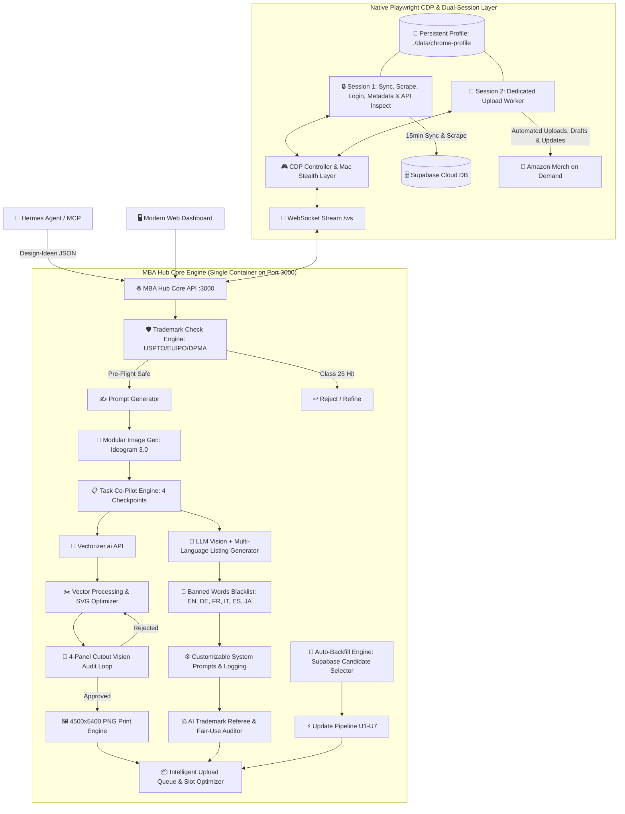

# 🧠 MBA HUB — Master-Architektur & Projekt-Brain

> **Status:** Phase 1 bis Phase 9 vollständig implementiert, verifiziert & im Produktivbetrieb 🚀  
> **Projekt:** MBA Hub (Merch By Amazon Automation & Hub Platform)  
> **Ziel-Umgebung:** TerraMaster NAS (TOS 6.0) unter Docker / Port `3000`  
> **Repository:** `https://github.com/aljan92/hub.git` (Branch: `main`)  
> **Deployment & Update:** Live-Betrieb auf dem NAS. Updates werden nach jedem Schritt automatisch per `git push origin main` auf GitHub veröffentlicht. 1-Click Update im Web-Dashboard (automatischer Tarball-Download & 10s Server-Neustart).  
> **Workflow-Regel:** Nach jedem Feature/Fix führt der AI-Agent **automatisch** `npm run build` und `git push origin main` aus!  
> **Projekt-Gedächtnis:** Diese `brain.md` dient als zentraler Master-Notizzettel und wird bei jedem Schritt fortlaufend gepflegt.  
> **Performance-Wissensbasis:** Siehe [`PERFORMANCE_AUDIT.md`](./PERFORMANCE_AUDIT.md) für Messwerte, behobene Regressionen, offene Optimierungen und Sicherheitsinvarianten.
> **Letzte Aktualisierung:** 3. September 2026

---

## 1. 🎯 Projekt-Vision & Kernziele
Der **MBA Hub** ist eine All-in-One Plattform zur vollständigen Steuerung, Generierung, Vektorisierung, Validierung, Optimierung und Veröffentlichung von Designs für **Merch by Amazon (MBA)**. Er ersetzt und fusioniert:
1. **MBA Manager** (Swift-Desktop-App: Prompt-Generator, Vectorizer.ai-Anbindung, Vektor-Editor, LLM-Listing-Erstellung, Upload-Script).
2. **mba-supabase-sync** (Chrome-Extension: 24/7 Live-Sync der MBA-Produktdaten, Sales & Royalties in Supabase).
3. **Listing Optimizer** (Chrome-Extension: Multi-Produkt Resize, Mug-Brush-Tool für schwarze Tassen, Banned-Words-Listen, Trademark-Scans).
4. **Productor Integration** (API-Schnittstellen für USPTO, EUIPO, DPMA Trademark-Checks, Ratelimiter & Tier-Abfragen).

---

## 2. 🏛️ Gesamtsystem-Architektur (Goldstandard: Native CDP Engine)



---

## 3. 🚀 Modul-Übersicht & Implementierte Phasen

### ✅ Phase 1: Core Dashboard & Health Engine
* **Interaktives Architektur-Schema (`ConnectorTopology`):** 3-Spalten-Netzwerk-Matrix mit Live-Puls, Ping und Klick-Drawer zum Verbindungstest.
* **Header & Navigation:** Feste Sidebar (`Sidebar.tsx`), `h-screen overflow-hidden` Layout, Live Tier-Level Badge (aus `ratelimiter/metadata`), 1-Click Update-Button mit automatischer GitHub-Tarball-Installation und 10s Neustart.
* **Live Kosten- & Budget-Statistik (`Header.tsx`, `costTrackingService.ts`, `SettingsView.tsx`):**
  * **Header Badges:** `Total Costs` ($ Gesamtausgaben) und `Ø/Design` ($ Kosten pro aktivem Design).
  * **Berechnungslogik:** $\text{Total Costs} = \text{OpenRouter} + (\text{Ideogram Bilder} \times \text{Kosten/Bild}) + (\text{Vectorizer} \times \text{Kosten/Vektorisierung})$.
  * **Durchschnittskosten:** $\text{Cost per Design} = \frac{\text{Total Costs}}{\text{Warteschlange} + \text{Hochgeladen}}$.
  * **Settings Card 8:** Konfiguration von `costPerImage` (z.B. `$0.08`), `costPerVectorization` (z.B. `$0.05`) und 1-Click Reset-Funktion (`POST /api/v1/stats/costs/reset`).
* **Settings:** Persistente Speicherung aller API-Keys und Parameter in `./data/settings.json`.
* **Globaler Schutzschild (`ErrorBoundary.tsx`):** Fängt alle UI- und Render-Fehler sauber ab und verhindert White/Black Screens bei defekten Daten.

---

### ✅ Phase 2: Supabase Sync & Mac Stealth Dual-Session CDP
* **Supabase Live-Sync (`syncEngine.ts`):** 
  * Amazon Coral RPC Protocol (`FindListingsRequest`, PageSize 500) im Browser-Kontext von `Session 1`.
  * HTTP 429 Resilience mit 10-fach Exponential Backoff.
  * Child-ASIN Resolution Engine für die 12 echten Variations-Produkte (Journals, Mugs, Cases, PopSockets, Hats, Pillows, Totes, Tumbler).
  * 15-Minuten Scheduler & 1-Minuten ASIN-Queue-Worker überstehen Server-Neustarts (`autoSyncEnabled: true`).
* **Mac Stealth Dual-Session Engine (`browserSessionService.ts`):**
  * 100% VNC-frei via WebSocket (`/ws`) und Canvas Stream auf Port 3000.
  * Mac-Fingerprint (macOS Intel, Apple M2 Metal WebGL, kein `navigator.webdriver`).
  * **Session 1 (Sync & Metadata):** Login, 2FA, 15min Produktsync, Ratelimiter-Abfragen, Merch-API Inspector.
  * **Session 2 (Upload Worker):** Teilt sich Session-Cookies/Tokens und ist exklusiv für Playwright-Uploads zuständig.

---

### ✅ Phase 3: Vectorizer.ai Engine
* **Vectorizer.ai API (`vectorizerService.ts`):** Umschaltung `test` vs. `production`, Farbbegrenzung (`max_colors`), Cutouts für Textildruck (`shape_stacking: cutouts`), Rauschfilterung und Speicherung unter `./data/designs/`.

---

### ✅ Phase 4: Human-in-the-Loop Task Co-Pilot & 4-Panel Cutout Audit
* **4 Checkpoints (`taskLogService.ts`, `TasksView.tsx`):**
  1. `AWAITING_DESIGN_APPROVAL`: Bildkontrolle & Quote-Prüfung.
  2. `AWAITING_DESIGN_REVIEW`: Fragenkatalog (Quote, Zielgruppe, Farbvermeidung, Hintergrund, Farbanzahl) ➔ 1-Click *„Listing generieren“*, *„Bild neu generieren“* oder *„Task abbrechen“*.
  3. `AWAITING_TM_REVIEW`: Multi-Language Listing (EN, DE, FR, IT, ES, JA) mit Live-Trademark-Scan (USPTO, EUIPO, DPMA) und Nizza-Klasse 25 Prüfung.
  4. `AWAITING_SVG_REVIEW`: Interaktiver SVG-Editor + **Automatischer 4-Panel Vision Cutout Audit Loop** (Testbild auf Weiß, Schwarz, Rot, Dunkelgrau; Vision-LLM erkennt Schnittfehler; bei `APPROVED` automatisches Rendern der finalen **4500x5400px Print-PNG**).
  5. `COMPLETED`: Automatische Übergabe an die Upload-Queue.
* **Banned Words Filter (`bannedWordsService.ts`):** Multi-Language Sperrwort-Listen (Claims, Werbesprache, Materialhinweise) mit Prompt-Injektion.
* **Prompt Log & Step-Targeted Retry (`PromptLogView.tsx`):** Re-Push Button zur erneuten Einreihung in die Upload-Queue für verifizierte Master-PNG Tasks.

---

### ✅ Phase 4.5: Dynamische MBA Produktdatenbank & DOM-Scanner
* **100% Dynamischer Live-Katalog (`productCatalogService.ts`, `./data/product_catalog.json`):**
  * Erkennt alle Produkte, Marktplätze (1 Slot pro Marktplatz = aktuell 106 Slots Basis), Fit-Types und Farb-Swatches / Color-Picker.
* **CDP DOM-Scanner in Session 1 (`productScannerService.ts`):**
  * Lädt im Hintergrund ein Mock-Design hoch, extrahiert die komplette Produkt-Matrix und schließt die Seite.
  * 12-18h Jitter-Scheduler verhindert Bot-Patterns.

---

### ✅ Phase 5: Intelligente Upload Queue, Balancing & Status-Visualisierung
* **5-Tab Lifecycle (`QueueView.tsx`, `queueService.ts`):**
  * **Tab 1: Warteschlange:** Aktive Upload-Kandidaten mit Drag & Drop Priorisierung.
  * **Tab 2: Pausiert (`Paused`):** Alle pausierten Designs (`isPaused: true`). Reaktivierung (`▶`) hängt das Design ans Ende der Warteschlange an.
  * **Tab 3: Update:** Dedizierter Bereich für Listing-Updates mit Vorhalte-Mengen-Stepper (1 bis 50 Designs), IST/SOLL Live-Badge und Sofort-Trigger.
  * **Tab 4: Hochgeladen (`COMPLETED`):** Historie mit Re-Enqueue Option.
  * **Tab 5: Fehler (`ERROR`):** Fehlgeschlagene Uploads mit 1-Click *„Wieder einreihen“* (`POST /api/v1/queue/item/:id/retry`) und Lösch-Modal.
* **Transparente Master-PNG Thumbnails & 1s Hover Zoom Popover:**
  * Backend `/api/v1/designs/image/:taskId` priorisiert automatisch die finale, hintergrundfreie **4500x5400px Master-PNG** (`_mba.png`).
  * Alle Thumbnails sind auf einem edlen dunklen **Schachbrett-/Transparenzgitter** (`object-contain`) eingebettet.
  * **1-Sekunden Hover Zoom:** Beim Verweilen mit der Maus über einem Thumbnail poppt nach exakt 1 Sekunde eine hochauflösende Großansicht mit Gitterhintergrund, Task-ID, Master-PNG Badge und Listing-Details auf.
* **Upload-Modi (Draft, Live, Draft-Hybrid):**
  * **Live Mode:** Mathematisches Slot-Balancing gegen verbleibende freie Tages-Slots. US-Marktplätze (.com) bleiben 100% geschützt; Non-US Slots werden nach Priorität gekürzt ($\mathbf{JP} \rightarrow \mathbf{ES} \rightarrow \mathbf{IT} \rightarrow \mathbf{FR} \rightarrow \mathbf{DE} \rightarrow \mathbf{GB}$). Hero-Designs (`🔒`) behalten 100% aller Slots.
  * **Draft Mode:** Draft-Uploads belasten kein tägliches Kontingent. Stepper **„Produkte pro Design“** für persistente Produktanzahl pro Design.
  * **Draft-Hybrid Mode:** Neue Designs werden als Draft hochgeladen (0 Slots), während Update-Designs live aktualisiert werden (verbrauchen nur die Netto-Slots für neu hinzugekommene Produkte/Marktplätze). Lila Badge und Rahmen zur klaren optischen Trennung.
* **Einzeldesign-Pause Button (`⏸️ / ▶`):** Pausierte Designs (`isPaused`) erhalten einen orangenen Rahmen und werden von Balancing und Upload ausgeschlossen (`0 Slots`).
* **Farbige Status-Rahmen (Glow & Border):**
  * 🟢 **Grün (`border-emerald-500`):** Heute eingeplant / zum Upload bereit.
  * 🟡 **Gelb (`border-amber-300`):** Wartend, aber heute wegen Slot-Limit nicht dran (Folgetage).
  * 🟠 **Orange (`border-amber-500`):** Pausiert (`isPaused`).
  * 🟣 **Lila (`border-purple-500`):** Aktiver Upload (`UPLOADING`) oder Update-Design im Hybrid-Modus.
  * 🟢 **Mint-Grün / Slate (`border-teal-500`):** Hochgeladen (`COMPLETED`).
  * 🔴 **Rot (`border-rose-500`):** Fehler (`ERROR`).

---

### ✅ Phase 6: Playwright Upload Worker (`uploadWorkerService.ts`)
* **Session-Trennung:** Session 1 liest Ratelimiter/Metadaten; Session 2 führt den Upload aus.
* **Automatisierter Upload-Ablauf:**
  1. Start auf `https://merch.amazon.com/designs/new` (oder `/designs/{id}/edit` für Updates) in Session 2.
  2. Master-PNG Upload & Asset-Render-Verifikation.
  3. Intelligenter Marktplatz-Abgleich im *Select Products* Modal gegen `activeProductsMap`.
  4. Sequenzielle Produktkonfiguration: Fit-Types (`Men, Women, Youth, Girls, Adult Unisex`), produktspezifische Farbausschlüsse (Soccer/Basketball Jerseys, Raglan, Trucker Hats, Visors) und Sketch Hex-Color-Picker mit Preset-Swatch-Triggering und nativer Input-Setter Simulation.
  5. Auto-Translate auf `NO` und sequenzielles Eintragen aller Sprach-Listings (EN, DE, FR, IT, ES, JA).
  6. Save Draft / Live Publish mit Formular-Validierungsprüfung.
  7. Nach erfolgreichem Upload Rücknavigation auf `https://merch.amazon.com/dashboard` und automatischer Slot-Refresh über Session 1.

---

### ✅ Phase 6.1: Hermes Agent & MCP Integration (`mcpSchemaService.ts`, `trademarkService.ts`)
* **Auth & Security:** Header `x-mba-api-key: <key>` oder `Authorization: Bearer <key>`.
* **1. Design Ingestion (`POST /api/v1/design`, `/design`, `/api/v1/hermes/design`):** Akzeptiert Nischen- & Design-Attribute oder Voll-Prompts. Startet Pre-Flight TM-Check, LLM Prompt-Generierung, Ideogram 3.0 Generation und leitet Task (`#001-H`) durch den Co-Pilot.
* **2. Live Trademark-Check (`POST /api/v1/mcp/trademark/check`, `/api/v1/trademark/check`, `/api/v1/trademark`):** Multi-Office Abfrage (USPTO, EUIPO, DPMA), strikte Filterung auf LIVE-Treffer, Nizza-Klasse 25 und lesbares `verdict`.

---

### ✅ Phase 7: Automatischer Update-Design Backfill & Pipeline (`updateBackfillService.ts`, `updatePipelineService.ts`)
* **Autoritativer Merch-API-Abruf:** 
  * Nutzt direkt `api/productconfiguration/get?id=${cleanId}` zur vollständigen Extraktion von Produkten, Swatches und Multi-Language-Listings.
  * Nicht limitiert auf die ersten 500 Einträge wie Coral RPC `FindListings`.
* **Kandidatenauswahl aus Supabase:** 
  * Filtert `mba_designs` nach `status='PUBLISHED'` und `not('published_products', 'is', null)`.
  * Überspringt leere/gelöschte Designs automatisch.
* **Vollautomatischer 7-Stufen Update-Workflow (U1–U7):**
  1. **U1:** Merch-API Datenabruf & Erstellung von Task `#xxx-U`.
  2. **U2:** Master-Artwork Download (4500x5400px Original-PNG).
  3. **U3:** Vision & Listing-Analyse (LLM prüft Farbvermeidung, Fit-Types und Listing-Qualität).
  4. **U4:** LLM Listing Rewrite (SEO & Banned Words bereinigt, falls U3 `rewriteNeeded: true`).
  5. **U5:** Live Trademark Scan (USPTO, EUIPO, DPMA).
  6. **U6:** Slot & Product Reconciliation (Erkennt bereits live geschaltete Produkte vs. neu hinzukommende Marktplatz-Slots).
  7. **U7:** Enqueue in den Update-Pool (Tab 3).
* **Exakte Slot-Berechnung pro Marktplatz:**
  * Jedes Produkt pro Marktplatz = 1 Slot (z.B. Comfort Colors auf 6 Marktplätzen = `+6 Slots`).
  * Detail-Matrix visualisiert `✓ Live (0 Slots)` vs. `✨ Neu ergänzen (+X Slots)`.
* **Live IST vs. SOLL Pool-Status & Deduplizierung:**
  * Live-Badge im UI zeigt `Pool-Bestand: IST: X / SOLL: Y`.
  * Eindeutige ID-Menge (`Set<string>`) verhindert Zwischensprünge während der Bearbeitung.
  * Hintergrund-Scheduler (10s Intervall) füllt den Pool bei `IST < SOLL` automatisch auf.


### ✅ Phase 8: Resize Step & Two-Sided Mug/Drinkware Engine mit Black Brush (`ArtworkResizeService.ts`)
* **Modularer 2-Stufen Resize-Prozess:**
  * **Stufe 1 (Trimmen):** Aus dem 4500x5400px Master-PNG (`_mba.png`) wird die exakte Motiv-Bounding-Box ermittelt und als `${taskId}_trimmed.png` (300 DPI) gespeichert als universelle Basis für alle aktuellen und zukünftigen Resizes.
  * **Stufe 2 (Produktspezifische Optimierung):**
    * **Ceramic Mug (`CERAMIC_MUG`):**
      * `${taskId}_two_sided_mug_standard.png`: 2700 × 1050 px, 300 DPI (7.5 % Margin, zentriert auf Vorder- und Rückseite bei x=59 und x=1591).
      * `${taskId}_two_sided_mug_brush.png`: 2700 × 1050 px, 300 DPI mit organischem Black Brush Konturstempel (`brush_tip.png`) und solidem schwarzem Silhouette-Backdrop für dunkle Tassen.
    * **Drinkware (`TUMBLER`, `WATER_BOTTLE`):**
      * `${taskId}_two_sided_drinkware_standard.png`: 3000 × 1400 px, 300 DPI (7.5 % Margin, zentriert bei x=31 und x=1566.67).
* **Headless Chromium Rendering (Playwright):** 100% C++ Addon-freie Ausführung auf dem TerraMaster NAS Docker-Container mit nativer 300 DPI PNG `pHYs`-Chunk Injection.
* **Orchestrierung:** Vollständig migriert in `FinalizationService` (einziger Orchestrator via sequentiellen Mutex; alte Zwischenschritte D7.5 und U6.5 wurden restlos aus den Pipelines eliminiert).
* **Playwright Upload Worker Integration (`uploadWorkerService.ts`):**
  * Erkennt Two-Sided und Custom Resize Produkte dynamisch aus dem Katalog.
  * Wählt bei `avoidColor === 'white'` automatisch die Brush-Variante für den Mug, sonst Standard.
  * Klickt im Produkt-Editor auf `.delete-button` zur Entfernung des Standard-Artworks und lädt das optimierte Two-Sided PNG via nativem Playwright `setInputFiles` hoch.
* **Automated Tests:** 16/16 Unit- & Integrationstests in `tests/resizeService.test.ts` bestanden.

---

### ✅ Phase 8.5: Product Catalog V2 & Architecture Guard (`productCatalogService.ts`, `data/product_catalog_overrides.json`)
* **Strikte Architekturgrenze:**
  * Saubere Trennung zwischen Product Catalog / Upload V2 und der geschützten `SUPABASE_SYNC_PROTECTED` Engine (`syncEngine.ts`, `settingsService.ts`, `/api/v1/sync/*`).
* **Dynamische Produktdefinitionen:**
  * 0 Produkt-IDs hartcodiert im Core-Pipeline-Code. Alle produktspezifischen Regeln (Nizza-Klassen, Fit-Types, Swatches, Resize-Verhalten) stammen ausschließlich aus dem Dynamic Catalog oder persistenten Overrides.
* **Dynamic Color Discovery V2:**
  * Robuste, CSS-gestützte Erkennung von Farb-Swatches und Color-Pickern ohne DOM-Brittle-Abhängigkeiten.
  * Farbvermeidungsregeln (`avoidColor: white/black`) werden dynamisch mit entdeckten Farben verschmolzen.
  * Volle Unterstützung für `colorMode: 'none'` (Produkte ohne Swatches wie Poster, Mousepads, Journals, PopSockets).
  * Sofortiger Upload-Stop (`colorDiscoveryStatus: FAILED`) bei unentdeckten Produktfarben.
* **Automated Architecture Guard:**
  * `tests/productCatalogArchitectureGuard.test.ts` scannt den gesamten Codebase automatisch auf verbotene statische Produkt-Sonderregeln.

---

### ✅ Phase 9: Unified Finalization Pipeline, Queue Immutability & Deterministischer Upload
* **Single Point of Finalization (`FinalizationService.finalizeForQueue`):**
  * Genau **eine** zentrale Instanz für Listing-Sanitizing, Validierung, Resize-Erzeugung und Queue-Handoff für beide Pipelines (Design & Update).
  * **Deterministisches Amazon-Sanitizing (`ListingSanitizationService.sanitizeText`):**
    * Konvertiert typografische Quotes („ “ ” « »), Apostrophe (’ ‘ ‚) und Gedankenstriche (— – −) in Standard-ASCII.
    * Entfernt unzulässige Zeichen, erhält aber 100% legitimierte Zeichen (Umlaute Ä/Ö/Ü/ß, Akzente é/è/ñ, japanische Kanji/Kana).
  * **Strikte Validierung (`ListingValidationService.validateFinalListing`):**
    * Prüft harte Amazon-Limits (Title ≤ 60, Brand ≤ 50, Bullets ≤ 256, Description ≤ 2000).
    * Keine mutierenden Textänderungen mehr nach der Trademark-Prüfung.
  * **Vollständiges 5/5 Artwork-Paket:**
    * Erzeugt für jeden Task sequentiell über einen Mutex-Lock alle 5 Varianten: `trimmedPath`, `mugStandardPath`, `mugBrushPath`, `drinkwareStandardPath`, `drinkwareBrushPath`.
    * Volle Zukunftssicherheit: Der Katalog entscheidet später nur noch, welches bereits fertig vorliegende Asset beim Upload verwendet wird.
  * **Vollständige Eliminierung von Legacy-Steps:**
    * `stepD7_5_ResizeArtworks` und `stepU6_5_ResizeArtworks` wurden restlos aus `DesignPipelineService` und `UpdatePipelineService` entfernt.
* **Queue Immutability (Read-Only Post-Handoff):**
  * Sobald ein Design in der Queue liegt, sind Listing-Texte unveränderbar (Read-Only).
  * Sämtliche mutierenden `cleanStr()`-Aufrufe aus `QueueService` und `UploadWorkerService.sanitizeListingText` wurden entfernt.
  * **Read-Only Integrity Guard im Worker:** Vor der Injektion prüft der Worker `sanitizeText(val) === val`. Bei Diskrepanz wird `FAILED_LISTING_INTEGRITY` ausgelöst und der Publish Guard stoppt die Veröffentlichung, statt Daten stillschweigend zu mutieren.
  * **Browser DOM-Injektion:** Regex-Ersetzungen im Browser (`setRootVal`, `setVal`) wurden entfernt; exakte Queue-Werte werden direkt übergeben.
* **Automatischer Produktkatalog-Abgleich & Upload-Reihenfolge:**
  * **Automatische Übernahme:** `QueueService` bindet neue Produkte aus `ProductCatalogService.getCatalog()` beim Enqueue vollautomatisch in `activeProductsMap` ein (inkl. aller Marktplätze, gefiltert nach Nizza-Klassen-Freigaben).
  * **Deterministische Upload-Reihenfolge:** `UploadWorkerService` verarbeitet Produkte strikt nach `amazonSortOrder` (natürliche DOM-Reihenfolge der Produktkarten von oben nach unten auf Amazon), was für flüssiges Scrolling ohne Re-Renders sorgt.
* **Automated Tests:**
  * 10/10 Tests in `tests/unifiedFinalizationAndCustomResize.test.ts` (Sanitizer, Validation, Variant-Registry, Custom-Resize Matrix, Immutability, Integrity-Guard, 5/5 Assets, Legacy-Step-Entfernung).

---

## 4. 🗺️ Nächste Roadmap-Phasen

### 🔜 Phase 10: Multi-Produkt-Resize Erweiterung (Mousepad, PopSockets etc.)
* Mousepad (`3600 × 3000 px`), PopSockets (`1200 × 1200 px`), Phone Cases (`1800 × 3200 px`), Throw Pillows & Tote Bags (`2925 × 2925 px`) auf Basis von `${taskId}_trimmed.png`.
* Infinite Scrolling / Virtualisierung für Prompt Log & Task-Liste zur Schonung des NAS-Arbeitsspeichers.
* Draft-Modus Slot-Rebalancing bei nachträglicher Änderung der Zielproduktanzahl.

---

## 5. 🛠️ Build-, Git- & Deployment-Workflows

### Lokale Entwicklung & Git Push (auf dem Mac)
1. Änderungen unter `src/client` oder `src/server` vornehmen.
2. Build ausführen: `npm run build`
3. Commit & Push: `git add . && git commit -m "..." && git push origin main`

### Deployment auf dem TerraMaster NAS
* **Web-Dashboard (1-Click):** Im Header oben rechts auf **`Update`** ➔ **`Jetzt aktualisieren`** klicken (~10 Sekunden Neustart).
* **Terminal / SSH:**
  ```bash
  cd /Volume1/docker/mba-hub && curl -sL https://github.com/aljan92/hub/archive/refs/heads/main.tar.gz | tar -xz --strip-components=1 && docker-compose down && docker-compose up -d --build
  ```

---

## 6. 📂 Projekt- und Datei-Struktur

```text
MBA HUB/
├── dist/                          # Vorkompilierte Produktions-Assets
│   ├── client/                    # Vite Frontend Build (HTML/CSS/JS)
│   ├── server.cjs                 # Standalone Node.js Backend Bundle (Playwright included)
│   └── browsers.json              # Playwright Browser Manifest
├── data/                          # Persistentes Docker-Volume
│   ├── product_catalog.json       # 33 MBA-Produkte mit Nizza-Klassen (25, 18, 20, 21, 9, 16) & Drop-Prioritäten
│   ├── system_prompts.json        # 8 zentrale System-Prompts für alle Workflows
│   ├── banned_words.json          # Mehrsprachige Sperrwort-Listen
│   ├── settings.json              # API-Keys, Modelle & Kosten-Konfiguration
│   ├── queue.json                 # Upload-Warteschlange (Live, Paused, Update)
│   ├── tasks_log.json             # Audit-Log und Tasks State Machine
│   ├── tasks_counter.json         # Persistenter Task-ID Zähler
│   ├── chrome-profile/            # Persistentes Chrome Profil (Cookies, 2FA, Amazon-Session)
│   ├── designs/                   # Gespeicherte PNG-Assets für Vision & Vektorisierung
│   └── uploads/                   # Temporäre Bild-, Test- & SVG-Verarbeitung
├── src/
│   ├── client/
│   │   ├── components/
│   │   │   ├── BrowserScreencast.tsx # Interaktives HTML5 Canvas Screencast UI
│   │   │   ├── ConnectorTopology.tsx # Interaktives 3-Spalten Architektur-Schema
│   │   │   ├── ErrorBoundary.tsx     # Globaler Schutzschild gegen UI/Render-Crashes
│   │   │   ├── Header.tsx            # Header mit Tier-Badge & 1-Click Update
│   │   │   ├── Sidebar.tsx           # Feste Navigation
│   │   │   ├── SvgEditor.tsx         # Interaktiver SVG Vektor-Editor & Hintergrundentfernung
│   │   │   └── SystemPromptsModal.tsx# Modal zur Bearbeitung aller System-Prompts
│   │   └── views/
│   │       ├── DashboardView.tsx     # Hauptansicht mit Topologie & schlanken Metriken
│   │       ├── DatabaseView.tsx      # MBA Supabase Live-Design Viewer & Sync Controls
│   │       ├── DesignerView.tsx      # Prompt- & Image-Generator
│   │       ├── TasksView.tsx         # 4-Stufen Human-in-the-Loop Co-Pilot & TM-Workspace (Nischen-Matrix)
│   │       ├── ProductsView.tsx      # MBA Produktdatenbank mit Nizza-Klassen Badges & Slot-Rechner
│   │       ├── PromptLogView.tsx     # Vollständiger Prompt- & LLM-Verlauf mit Re-Push Button
│   │       ├── QueueView.tsx         # Upload Queue, Slot-Optimizer, Stepper & Pause-Controls
│   │       ├── LogsView.tsx          # Dediziertes System- & Aktivitäts-Log Terminal
│   │       ├── SystemPromptsView.tsx # System-Prompts Editor mit Reset-Funktion
│   │       └── SettingsView.tsx      # API-Keys & Konfiguration
│   └── server/
│       ├── services/
│       │   ├── browserSessionService.ts # Playwright CDP Engine & Mac Stealth Controller
│       │   ├── uploadWorkerService.ts   # Playwright Session 2 Upload Engine mit doppelter Verifikation
│       │   ├── productCatalogService.ts # Dynamic Product Catalog mit Nizza-Klassen (25, 9, 18, 20, 21, 16)
│       │   ├── productScannerService.ts # Session 1 CDP DOM Scanner & 12-18h Jitter Scheduler
│       │   ├── queueService.ts          # Upload Queue Management, Pause & Mathematical Slot Balancing
│       │   ├── updateBackfillService.ts # Automatischer Supabase Update-Kandidaten-Selector & Pool-Scheduler
│       │   ├── updatePipelineService.ts # 7-Stufen Update-Workflow (U1 bis U7) mit Master-Listing & TM Loop
│       │   ├── amazonInspectService.ts  # Autoritativer Merch-API Inspector & Artwork Downloader
│       │   ├── supabaseService.ts       # Supabase REST & Query Client
│       │   ├── syncEngine.ts            # MBA Database Sync, Ratelimiter & Keep-Alive
│       │   ├── ideogramService.ts       # Ideogram 3.0 API Adapter
│       │   ├── vectorizerService.ts     # Vectorizer.ai API Adapter
│       │   ├── svgRenderService.ts      # Server-Side Headless Renderer (4500x5400 PNG & 4-Panel Testbild)
│       │   ├── taskLogService.ts        # Co-Pilot Task-Engine & State-Machine (Nischen-Hierarchie & Sanitizer)
│       │   ├── llmService.ts            # Master English Listing Generator, TM Feedback Rewriter, SEO Translator
│       │   ├── systemPromptService.ts   # System-Prompt Manager & LLM-Audit Logging
│       │   ├── trademarkService.ts      # Multi-Office TM Scans (USPTO, EUIPO, DPMA) mit Nizza-Klassen Logik
│       │   ├── bannedWordsService.ts    # Multi-Language MBA Blacklist & Hard-Stripping Sanitizer
│       │   └── settingsService.ts       # Einstellungen lesen/schreiben & Persistenz
│       └── index.ts                     # Express Server, WebSocket Server & REST Router
├── Dockerfile                     # Standalone Playwright Image (mcr.microsoft.com/playwright:v1.50.1-noble)
├── docker-compose.yml             # Single-Service Stack auf Port 3000
├── browsers.json                  # Root Playwright Browser Manifest
├── package.json                   # Dependencies & Build Scripts
├── brain.md                       # Projekt-Brain & Master-Architektur
└── Alex Todo.md                   # Aufgabenliste & Roadmap
```

---

## 9. 🛡️ Unified Listing Engine, Nischen-Hierarchie & Nizza-Klassen TM-Loop

### 9.1 Nischen-Hierarchie (`niche1`, `niche2`, `subniche`, `keywords`)
1. **Nische 1 (`niche1`):** Das primäre Nischen-Hauptthema (z. B. `Horse`, `Dog`, `Nurse`, `Camping`).
2. **Nische 2 (`niche2`):** Optionale Cross-Nische / Zweit-Thema (z. B. `Coffee`, `Wine`, `Tacos`, `Book Reading`).
3. **Subnische (`subniche`):** Spezifische Rasse, Unterart, Typ (z. B. `Shetland Pony`, `Golden Retriever`, `ICU Nurse`).
4. **Such-Keywords (`keywords`):** Hermes liefert strukturierte SEO-Begriffe, die in der Question Phase ergänzt und an das LLM übergeben werden.

### 9.2 Master English Listing Engine (100% Token-Effizient)
- **English First:** Die Generierung und bis zu 3 Trademark-Refine-Loops erfolgen ausschließlich auf Englisch. Dadurch werden **~80% der LLM-Tokens gespart**.
- **Titel-Formel (50–60 Zeichen):** Start mit Nische/Style, Mitte mit Quote/Keywords, **Ende zwingend auf Subnische (bevorzugt) oder Nische**. Keine Satzzeichen am Ende, da Amazon automatisch den Produktsuffix anhängt (z. B. `... Shetland Pony` ➔ `... Shetland Pony T-Shirt`).
- **Brand-Formel (40–50 Zeichen):** Maximale Keyword-Dichte. Relevante Suchbegriffe wie `Apparel`, `Accessories`, `Collection`. Keine leeren Fluff-Wörter (`Studio`, `Co`, `Designs`).
- **Bullet 1 (230–256 Zeichen):** Zielgruppe, Leidenschaft, Lifestyle, Motiv-Bezug.
- **Bullet 2 (230–256 Zeichen):** Anlässe, Aktivitäten, Orte zum Tragen. 0% Geschenkbegriffe (`gift`, `present`, `birthday`).
- **Description (300–600 Zeichen):** Atmosphärische Kurzzusammenfassung.

### 9.3 Nizza-Klassen Trademark-Audit (33 MBA-Produkte)
- **Klasse 25 (Bekleidung & Kopfbedeckungen - 24 Produkte):** Standard/Premium/CC T-Shirts, Hoodies, Sweatshirts, Tank Tops, Jerseys, Caps, Visors etc.
  - *Hard Reject:* Ist die Quote, `niche1`, `niche2` oder `subniche` in Klasse 25 eingetragen ➔ Design wird sofort als `REJECTED` verworfen (Account-Schutz).
  - *Brand/Title Konflikt:* LLM ersetzt das Wort im Feedback-Loop durch ein anderes Nischen-Keyword.
- **Nebenklassen (Gezieltes Produkt-Blocking statt Design-Verwerfung):**
  - **Klasse 9 (Tech-Zubehör):** PopSockets, iPhone Cases.
  - **Klasse 18 (Taschen):** Sport Backpack, Tote Bag.
  - **Klasse 20 (Home Decor):** Throw Pillows.
  - **Klasse 21 (Drinkware):** Tumbler, Ceramic Mug, Water Bottle.
  - **Klasse 16 (Stationery):** Hardcover Journal.
  - Bei TM-Hits in Nebenklassen werden ausschließlich die betroffenen Produkte gesperrt (`blockedProducts`). Die Slot-Berechnung der Queue zieht gesperrte Produkte automatisch ab.

### 9.4 Post-Approval Lokalisierung & Hard Sanitizer
1. **Übersetzung:** Erst nach bestandenem Trademark-Check wird das Listing nach DE, FR, ES, IT, JA übersetzt. Zitate auf der Grafik bleiben englisch. Übersetzte Titel enden im Nominativ auf der Nische/Subnische.
2. **Hard Sanitizer Gatekeeper:**
   - Bereinigt typografische Sonderzeichen (`“`, `”`, `’`, `–`) zu standard ASCII (`"`, `'`, `-`).
   - Entfernt trailing Satzzeichen (`.`, `-`, `,`) am Ende des Titels.
   - Letzter Pass zur sicheren Entfernung versehentlicher MBA-Sperrwörter.

---

## 10. 🛡️ Trademark Whitelist Manager, Raw Prompt Logging & Pipeline Streamlining

### 10.1 Multi-Marketplace Trademark Whitelist (`/trademark`, `trademarkWhitelistService.ts`)
- **Dedizierte Trademark-Ansicht:** Registerkarten für **Global**, **USPTO (US)**, **EUIPO (EU)** und **DPMA (DE)**.
- **Automatischer Filter-Bypass:** Wörter wie *"girl"*, *"boys"*, *"queen"*, *"mama"* lösen bei Productor-Hits in Klasse 25 keine Blockierung mehr aus, wenn sie auf der Whitelist stehen.
- **Live-Sandbox Quick-Tester:** Ermöglicht das Testen beliebiger Phrasen gegen alle Ämter in Echtzeit.

### 10.2 Vollständige Raw Prompt Transparenz (`PromptLogView.tsx`)
- **Raw Request & Response Inspektor:** Zeigt die exakten an OpenRouter gesendeten System-Prompts, User-Messages sowie die Rohantworten an.
- **1-Click Kopieren:** Schnelles Kopieren von JSON, Prompt-Texten und Listings.

### 10.3 Question Phase: KI-Vision vs. Hermes-Payload Abgleich (`TasksView.tsx`)
- **Automatische Vorausfüllung:** `niche1`, `niche2`, `subniche` und Zielgruppen werden aus der KI-Vision-QA vorausgefüllt.
- **Vergleichs-Box mit 1-Click Übernahme:** Gegenüberstellung von Hermes-Payload vs. KI-Erkennung mit Buttons *„Von KI übernehmen“* und *„Von Hermes übernehmen“*.

### 10.4 Update-Pipeline & Queue Optimierung
- **Überspringen der Vektorisierung:** Update-Tasks (#xxx-U) überspringen nach Freigabe des Listings automatisch die Vektorisierung und wandern direkt in die Upload-Queue (Step U7).
- **Transparente Master-PNG Thumbnails:** Alle Thumbnails in der Queue nutzen die echte, freigestellte `_mba.png`.
### 10.5 ⚙️ Konfigurierbare LLM-Parameter & 25-Punkte Meister-SEO-Prompt
- **LLM Settings (`SettingsView.tsx`, `settingsService.ts`):** `Temperature` (Standard: 0.35), `Max Tokens` (Standard: 3000) und `Timeout (Sek.)` (Standard: 90s) sind direkt in den Einstellungen unter *OpenRouter / OpenAI LLM* einstellbar.
- **25-Punkte MBA Master-Prompt (`systemPromptService.ts`):** Standard-Listing-Prompt für beide Pipelines (Neu & Update) mit interner Nischen-Recherche, Insider-Terminologie, Cross-Field Deduplikation, Quote-Fallback in Bullet 1 bei Platzmangel und strikter Subnischen-Suffix-Titelformel (50–60 Zeichen).
- **Single Source of Truth bei Nischen-Feldern:** Explizites Respektieren leerer/gelöschter Felder (z.B. gelöschte Subnische wird als leer an den Listing-Generator übergeben).

### 10.6 👁️ 2x2 Grid Vision Optimizer, Design-Qualitätsaudit & Exklusive Task-Autonomie
- **2x2 Grid Vision Optimizer (`visionOptimizationService.ts`):** Rendert transparente Designs für die Vision-KI als 1024x1024 4-Farben-Grid auf den 4 Merch-Standardfarben:
  - **Oben Links:** Schwarz (`#111827`) — Kontrast für weiße Schriften & Erkennung von Kanten-Halos.
  - **Oben Rechts:** Weiß (`#ffffff`) — Kontrast für dunkle Typografie.
  - **Unten Links:** Rot / Cranberry (`#c53030`) — Erkennung von Farbkonflikten.
  - **Unten Rechts:** Asphalt (`#383E42`) — Prüfung von Zwischentönen und Bildartefakten.
- **Design-Qualitätsaudit (`DEFAULT_UPDATE_VISION_SYSTEM_PROMPT`):** Die Vision-KI bewertet die visuelle Qualität mit `design_quality: { quality_verdict: "APPROVED" | "DEFECTIVE", quality_issues }`.
- **Autonomie-Sicherheitsstopp bei Mängeln (`updatePipelineService.ts`, `TasksView.tsx`):** Ergibt der Qualitätsbefund `DEFECTIVE`, stoppt der Task zwingend in `Tasks & Review` mit roter Warnbox, selbst wenn die Update-Autonomie aktiv ist.
- **Exklusive Task-Autonomie:** Die Autonomie-Schalter für Design- und Update-Pipeline befinden sich exklusiv im Header von `Tasks & Review`.
### 10.7 📋 Einheitliches Question & Audit UI (`TasksView.tsx`)
- **Update-Pipeline (`activeTask.source === 'UPDATE'`):**
  - **Linke Spalte:** 2x2 Grid vs. Master-Artwork Preview (1024x1024 / 4500x5400px) & vollständige Darstellung des bestehenden Amazon-Listings (Brand, Title, Bullet 1, Bullet 2, Description).
  - **Rechte Spalte:** 1. Design Check (Quality Verdict & Text), 2. Listing-Rewrite Befund, 3. Zielgruppe (Fit Types mit Checkmarks), 4. Zu vermeidende Produktfarbe, 5. Nischen-Hierarchie & SEO-Keywords (Hermes vs LLM Direktvergleich, 3 Nischen-Felder, 1 SEO-Keywords-Feld).
- **Design-Creation-Pipeline (`activeTask.source !== 'UPDATE'`):**
  - **Linke Spalte:** Ideogram Artwork Preview (Aspect-Ratio, 1s Hover-Zoom & Download) & editierbare Prompt-Card (Ideogram 3.0).
  - **Rechte Spalte:** 1. Quote-Prüfung (Soll vs Erkannt mit EXAKT/ABWEICHUNG Badge), 2. Zielgruppe (Fit Types mit Checkmarks), 3. Zu vermeidende Produktfarbe, 4. Hintergrund entfernen (Automatisch/Manuell mit Checkmarks), 5. Maximale Farbanzahl (1-12 Vektorisierung), 6. Nischen-Hierarchie & SEO-Keywords (Hermes vs LLM Direktvergleich, 3 Nischen-Felder, 1 SEO-Keywords-Feld).

### 10.8 🏷️ Einheitliches Pipeline-Status-System & Farb-Mapping (`TaskStatusBadge.tsx`)
- **Pipeline-sensitive Status-Auflösung:**
  - Unterscheidet dynamisch zwischen Design-Creation (`-H`, `-T`, `-D`) und Update-Pipeline (`-U`).
  - Zeigt in Review-Checkpoints zuverlässig `Wartet: Update-Review` bzw. `Wartet: Design-Review` anstelle irreführender Statustexte (`Design bereit`).
- **Farbpalette der Step-Kategorien:**
  - **System / Download:** Teal (`bg-teal-500/15 text-teal-300 border-teal-500/30`)
  - **OpenRouter / Listing / Vision:** Sky / Cyan (`bg-sky-500/15 text-sky-300` / `bg-cyan-500/15 text-cyan-300`)
  - **Ideogram:** Purple (`bg-purple-500/15 text-purple-300 border-purple-500/30`)
  - **Trademark:** Amber / Purple (`bg-amber-500/15 text-amber-300` / `bg-purple-500/15 text-purple-300`)
  - **Vectorizer / SVG:** Pink (`bg-pink-500/15 text-pink-300 border-pink-500/30`)
  - **Queue / Completed:** Emerald (`bg-emerald-500/15 text-emerald-300 border-emerald-500/30`)
  - **Error / Rejected:** Rose (`bg-rose-500/15 text-rose-300 border-rose-500/30`)
- **Aktive Pulse-Animationen & Spinner:** Laufende API-Operationen (Download, Bildgenerierung, Vision-Audit, Listing-Rewrite, Trademark-Check, Übersetzung, Vektorisierung) pulsieren dezent mit rotierendem/animiertem Icon.

### 10.9 🚨 Full Workspace Reset & Purge (`POST /api/v1/system/purge-all-data`)
- **Gefahrenzone in Settings:** Befindet sich ganz unten in [SettingsView.tsx](file:///Users/alexanderjanssen/Desktop/MBA%20HUB/src/client/views/SettingsView.tsx) mit doppelter Sicherheitsabfrage (Eingabe des Worts `LÖSCHEN`).
- **Was bereinigt wird:**
  - `data/tasks_log.json` wird geleert (`[]`).
  - `data/tasks_counter.json` wird auf 0 zurückgesetzt (nächster Task beginnt bei `#001`).
  - `data/upload_queue.json` wird vollständig geleert (`[]`).
  - `data/designs/` wird vollständig von allen PNG-, SVG-, 4-Panel- und 2x2-Grid-Dateien befreit.
  - Temporäre Test-Assets im `data/`-Stammverzeichnis werden gelöscht.
  - Sendet Realtime-WebSocket-Events (`TASK_LOGS_CLEARED`, `TASKS_UPDATED`, `QUEUE_UPDATED`) an alle geöffneten Tabs.
- **Was unberührt bleibt:** API-Keys, Modelleinstellungen, System-Prompts, Marken-Whitelist und der Amazon-Produktkatalog bleiben 100% erhalten.

### 10.10 🛡️ Upload Prüfmodus: "Vor Publish pausieren" (`QueueView.tsx` & `UploadWorkerService`)
- **Ablauf im Prüfmodus:**
  - Der Bot führt alle Schritte automatisiert aus: Öffnet die Merch Edit/Create-Seite, wählt Produkte, stellt Fit Types und Farben ein, deaktiviert Auto-Translate, befüllt alle DE/EN/FR/ES/IT/JA Listings und scrollt nach unten.
  - **Stoppt bei 92 % vor dem Klick auf `Publish`:** Der Worker pausiert und schaltet in den Zustand `⏸️ PRÜFMODUS PAUSIERT`.
- **Interaktive Steuerung:**
  - **Button in Queue-Leiste:** Schneller 1-Click-Toggle `[ ⏸️ Vor Publish pausieren ]` (mit LocalStorage-Speicherung).
  - **Live-Aktionen im Banner:** Während der Pause erscheinen die Buttons `[ 🚀 Jetzt veröffentlichen (Publish) ]` (`POST /api/v1/upload/resume-publish`), `[ 🛑 Abbrechen ]` und `[ 📺 Live ansehen ]` (Live-Screencast).

### 10.11 🎨 Granulare 3-State Farbregeln im Produktkatalog (`avoidRule: 'none' | 'white' | 'black'`)
- **3-State Farbauswahl pro Produktfarbe:**
  - Jede Farbe jedes Produkts im Produktkatalog ([ProductsView.tsx](file:///Users/alexanderjanssen/Desktop/MBA%20HUB/src/client/views/ProductsView.tsx)) kann per Klick durchgeschaltet werden:
    - **Normal (`none`):** `Immer aktiv` – wird nie ausgelassen.
    - **Weiß meiden (`white`):** `⚪ Bei Weiß meiden` – wird ausgelassen, wenn `avoidColor === 'white'`.
    - **Schwarz meiden (`black`):** `⚫ Bei Schwarz meiden` – wird ausgelassen, wenn `avoidColor === 'black'`.
- **Persistenz & Scan-Schutz:**
  - Gespeichert in `data/product_catalog.json` unter `product.colors[].avoidRule`.
  - Bei automatischer oder manueller Katalog-Aktualisierung / MBA-Scans (`ProductScannerService` / `saveCatalog`) bleiben die manuell konfigurierten `avoidRule`-Werte 100% erhalten.
- **Upload Worker Integration:**
  - Der Upload-Bot gleicht jedes Farbfeld im Amazon-DOM mit der `avoidRule` der entsprechenden Farbe im Produktkatalog ab. Ist z. B. `avoidColor === 'white'` und die Farbe hat `avoidRule: 'white'`, wird sie gezielt abgewählt, während alle anderen Farben aktiv bleiben.

### 10.12 ⚡ Single Source of Truth & Live-Synchronisation für Amazon Upload Slots
- **Hintergrund & Problemstellung:**
  - Auf dem Dashboard und in der Queue wurden zuvor unterschiedliche Slot-Zahlen angezeigt, da `QueueService` nicht bei jedem Hintergrund-Sync mit den Live-Daten aus dem Amazon Ratelimiter/Dashboard synchronisiert wurde.
- **Lösung & Architektur:**
  - **Single Source of Truth:** `SyncEngine.fetchDashboardRatelimiter` aktualisiert bei jedem Durchlauf sowohl `dailySlotStats` als auch `QueueService.setDailySlots(free, used, total)` und löst sofort ein automatisches Rebalancing der Queue aus.
  - **Erweiterter Productor- & DOM-Parser:** Erkennt sowohl native Amazon Dashboard-Werte als auch Productor-Strukturen (`.media`, `.progress-bar.bg-productor`, `Uploaded 80 / 200`, `Published`, `Tier`).
  - **Schnellerer Cache:** Cache-TTL auf 10s verkürzt für maximale Aktualität.
  - **Manueller 1-Click Refresh:** In der Queue-Card (Tages-Uploads) befindet sich nun ein Refresh-Button (`POST /api/v1/queue/refresh-slots`), der sofort live die aktuellsten Slots von Amazon abruft.

### 10.14 🔍 DOM-basierte Live-Matrix-Inspektion, Rejection-Sicherheitsprüfung & Exakte Slot-Delta-Berechnung
- **Hintergrund & Problemstellung:**
  - Die Amazon API `productconfiguration/get` liefert oft nur den initialen Entwurfs- bzw. Preset-Zustand des Designs (z. B. Standard T-Shirt mit allen Marktplätzen vorgewählt), selbst wenn auf Amazon nur wenige Marktplätze publiziert wurden oder Produkte abgelehnt wurden.
- **Lösung & DOM-Inspektion beim Artwork-Download:**
  - **Ein kombinierter Aufruf:** Beim ohnehin stattfindenden Artwork-Download auf `merch.amazon.com/designs/{designId}/edit` öffnet der Bot via Playwright das Modal `#select-marketplace-button-original` („Select Products“).
  - **100% deterministischer DOM-Scan:**
    - Liest alle `<flowcheckbox formcontrolname="shouldPublish">` mit Klassen wie `STANDARD_TSHIRT-GB` aus.
    - Ist `span.readonly` oder `input[readonly]` vorhanden, ist das Produkt auf diesem Marktplatz **garantiert live auf Amazon** (`liveProductSummary[prodKey] = [countries...]`).
    - Ist eine Checkbox markiert (`sci-check-box`), aber **nicht** `readonly`, deutet dies auf ein unpubliziertes, beanstandetes oder abgelehntes Produkt hin.
  - **Umfassende DOM-Key-Normalisierung (`AmazonInspectService.normalizeProductKey`):**
    - Wandelt alle Amazon-DOM-Klassenbezeichnungen nahtlos in die Produkt-IDs des Katalogs um (z. B. `STANDARD_LONG_SLEEVE` ➔ `LONG_SLEEVE_TSHIRT`, `STANDARD_SWEATSHIRT` ➔ `SWEATSHIRT`, `STANDARD_PULLOVER_HOODIE` ➔ `PULLOVER_HOODIE`, `POP_SOCKET` ➔ `POPSOCKET`, `PHONE_CASE_APPLE_IPHONE` ➔ `IPHONE_CASE`, `VNECK` ➔ `VNECK_TSHIRT`, `VALUE_TSHIRT` ➔ `VALUE_GRAPHIC_TSHIRT` usw.).
  - **Exakte Netto-Slot-Delta-Kalkulation ohne Falsch-Annahmen:**
    - Beseitigung alter Heuristiken: Wenn ein Produkt im DOM nicht als `readonly` markiert ist, gilt `liveMps = []` (kein fälschlicher Rückgriff auf `['US']`).
    - Dadurch ergibt sich immer die mathematisch exakte Gleichung: **Live-Slots (z. B. 29) + Fehlende Ergänzungs-Slots (z. B. 80) = Gesamt-Katalogslots (z. B. 109)**.
  - **Robuste Timeout-Steuerung:**
    - 60s Page-Load, 45s Selector-Wartezeit auf den Angular-*Select Products*-Button und 35s für das Rendern der Modal-Tabelle.
  - **Rejection-Sicherheitsprüfung & Task-Stopp:**
    - Werden auf der Seite oder im Modal Rejection-Hinweise (z. B. Policy Violations, Error Banners, Rejections) festgestellt, setzt der Bot `hasRejection = true`.
    - **Manueller Stopp:** Der Task wird zwingend in den **Manual Task Review** (`needsManualReview: true`, `status: 'AWAITING_DESIGN_REVIEW'`) geschoben – selbst wenn der Trademark-Check grün ist.
    - Im Frontend wird ein gut sichtbares Warnbanner (`⚠️ Amazon Rejection / Policy-Warnung`) eingeblendet.
  - **Standalone DOM Live Inspector Tool (`PromptLogView.tsx`):**
    - Taste **`3. 🔍 DOM Live`** im Amazon Merch API Inspector führt eine isolierte Live-Inspektion der Edit-Page aus und zeigt Live-Slots, Rejection-Warnungen, Produkt-Chips mit Marktplätzen und vollständiges DOM-JSON an.
  - **Exakte zweifarbige Queue-Darstellung:**
    - Die Queue nutzt diese reale DOM-Matrix: Bereits live-geschaltete Marktplätze werden dunkelgrau/grün mit Häkchen (`US ✓`, `DE ✓`, `GB ✓`) angezeigt (0 Slots), während neu zu uploadende Marktplätze lila hervorgehoben (`+ FR`, `+ IT`, `+ ES`) mit dem echten Mehrbedarf kalkuliert werden.

### 10.15 🎯 Taxonomische Nischen- & Subnischen-Hierarchie (Strikter Buyer-Market & Keywords)
- **Hintergrund & Problemstellung:**
  - Bei Motiven mit Feiertagen oder mehreren Elementen (z. B. Weihnachtstruck mit Baum) neigte die Vision-KI dazu, `subniche = "Vintage Pickup Truck"` oder bei Backmotiven `subniche = "Christmas Baking"` zu erfinden.
  - Dadurch endete der generierte Titel fälschlicherweise auf die Subnische des sekundären Elements (z. B. `... Vintage Pickup Truck T-Shirt`) statt auf den primären Buyer-Market (`... Christmas T-Shirt`).
- **Lösung & Klassifikations-Architektur:**
  - **`niche1` (Primäre Hauptnische):** Bildet zwingend den primären Zielmarkt / Buyer Market ab (z. B. `Christmas`, `Dog`, `Nurse`, `Fishing`).
  - **`niche2` (Cross-Nische):** Sekundäres visuelles Element oder Cross-Thema (z. B. `Truck`, `Baking`, `Coffee`, `Cat`, sonst `none`).
  - **`subniche` (Strikte Taxonomie von `niche1`):**
    - Darf ausschließlich eine echte taxonomische / biologische / fachliche Unterart von `niche1` sein (z. B. `Dog -> Golden Retriever`, `Horse -> Shetland Pony`, `Nurse -> ICU Nurse`, `Fishing -> Bass Fishing`).
    - **Strikte Verbote:** Bei Events/Feiertagen (`Christmas`, `Halloween`, `Birthday` etc.) ist `subniche` zwingend `none`.
    - Verbot von Wortkombinationen (`Christmas Baking` ❌).
    - Verbot von Ableitungen aus `niche2` (`Vintage Pickup Truck` ❌).
  - **`keywords` (SEO & Motiv-Keywords):**
    - Beschreibende Begriffe und visuelle Details wandern in das `keywords`-Array (z. B. `["vintage pickup", "farmhouse christmas", "red truck", "christmas tree"]`).
  - **Frontend UI & Übernahme:**
    - Beide Audit-Sektionen in `TasksView.tsx` zeigen die Keywords im Vergleich an.
    - Der Button **„Von LLM übernehmen“** befüllt automatisch auch das Feld `editKeywords`.

### 10.16 📜 39-Punkte MBA Master-Listing-Generator (Single Source of Truth)
- **Hintergrund & Architektur-Bereinigung:**
  - Zuvor existierten im System Prompts unter zwei getrennten Bezeichnungen (`listingGenerator` für Step D5 und `updateListingRewriter` für Step U4), obwohl beide Pipelines dieselbe Listing-Generierungs-Engine (`LLMService.generateMasterEnglishListing`) nutzen.
  - Das System wurde vollständig bereinigt: Es existiert nur noch ein zentraler Master-Prompt (`listingGenerator`), der als `SHARED` (Step D5 / U4) geführt wird.
- **39-Punkte Master-Prompt Architektur:**
  1. **Priority Hierarchy (Hard Constraints First):** Exakte Zeichenlimits, Locked Title Suffix, dynamische Banned Words, Nizza-Klassen-Compliance, valides JSON vor Stilistik.
  2. **Locked Title Suffix:** `TITLE_SUFFIX` wird vor der Titel-Generierung unveränderlich fest arretiert (`Subniche` falls vorhanden > sonst `Niche 2` > sonst `Niche 1`). Der Titel endet zwingend buchstabengetreu darauf (ermöglicht Amazon automatisches "T-Shirt" Suffix als Long-Tail Keyphrase).
  3. **Space Reservation:** Zeichenplatz (`MAX_PREFIX_LENGTH = 60 - length(" " + TITLE_SUFFIX)`) wird vorab reserviert; optimiert wird ausschließlich das Prefix.
  4. **Two-Stage Keyword Allocation & Relevance Tiers (Tier A, B, C):** Stärkste Tier A Nischen- und Buyer-Terms wandern zuerst in Brand (40-50 Zeichen) und Title-Prefix (50-60 Zeichen), verbleibende in Bullets 1 & 2 (230-256 Zeichen) und Description (300-600 Zeichen).
  5. **Dynamic Blacklist Injection:** Banned Words werden dynamisch am Ende des Prompts angehängt und strikt erzwungen.
- **UI & Dashboard:**
  - `SystemPromptsView.tsx` führt 7 eindeutige Prompts (Shared Prompts sind unter Creation, Update und Alle sichtbar).
  - Reset auf Standard lädt deterministisch die neue 39-Punkte Mastervorlage.
### 10.17 🛡️ TM Loop & Nebenklassen-Sperre (Exklusion in Queue & Uploader)
- **Problem & Ursache:**
  - Treffer in Nebenklassen (z. B. Klasse 9 PopSockets/Cases, Klasse 21 Mugs/Tumbler, Klasse 20 Kissen, Klasse 18 Taschen) wurden im TM-Audit zwar erkannt, aber beim Enqueue-Aufruf in `updatePipelineService.ts` und `taskLogService.ts` nicht an `QueueService` übergeben (`tmBlockedProductIds` war leer).
  - Dadurch wurden die Produkte in der Queue wieder reaktiviert und für den Upload eingeplant.
- **Lösung & Architektur:**
  1. **Lückenloser Pipeline-Handoff:** Übergabe von `tmBlockedProductIds: task.blockedProducts || []` in `updatePipelineService.ts` (Step U7) und `taskLogService.ts` (`completeTaskAndEnqueue` & `submitTmReview`).
  2. **Auto-Enrichment & Normalisierung:** `QueueService.loadQueue()` / `enrichListingsFromTasksLog()` pflegt fehlende `tmBlockedProductIds` automatisch aus `tasks_log.json` nach.
  3. **Dynamische Nizza-Klassen:** `ProductCatalogService.getBlockedProductIdsForNiceClasses` sperrt Produkte dynamisch basierend auf der im Katalog hinterlegten `niceClass` jedes Produkts.
  4. **Slot-Kalkulation & Balancing:** Geblockte Produkte werden aus `activeProductsMap` ausgeschlossen und verbrauchen 0 Slots (`allocatedSlots` spiegelt exakt die uploadbaren Produkte wider).
### 10.19 🛡️ Trademark-Workflow V2 (USPTO Live Batch, Dual-LLM Referee & Verifier, Multi-Round Loop & Zero Auto-Abandon)
- **Problem & Ursache:**
  - Frühere TM-Prüfungen blockierten normale beschreibende Wörter in Klasse 25 (z. B. *western, angel, teacher, vintage, mountain*) pauschal, führten zu False-Positives und blockierten wertvolle SEO-Keywords.
  - Mehrfache Re-Scans bei Rewrites fehlten oder führten zu Endlosschleifen zwischen geschützten Begriffen.
  - Core-Design-Konflikte wurden nicht sofort sauber erkannt oder führten zu riskanten Teillösungen.
- **Lösung & Architektur (100% Umsetzung aus `Trademark-Workflow V2.md`):**
  1. **USPTO-Fokus für English Master Listings:** Da Master Listings rein englisch verfasst werden, scannt die Pipeline gezielt `classes=25,9,18,20,35,16,24,41,40,21` via Productor USPTO Live Batch API.
  2. **1–5 Grams & N-Gramm Match-Klassifizierung (`TrademarkService.extractTermsFromTextV2` & `normalizeAndClassifyMatches`):**
     - Extrahiert 1-5 Grams unter Stopword-Schutz in Phrasen sowie den vollständigen Design-Spruch (`quote`).
     - Klassifiziert Treffer deterministisch in `FULL_EXACT`, `EXACT_NGRAM`, `SINGLE_WORD_EXACT`, `CONTAINS_REGISTERED_MARK`, `QUERY_INSIDE_LONGER_MARK` und `FUZZY_OR_SIMILAR`.
  3. **Pass 1 – Trademark Referee (`LLMService.evaluateTrademarkReferee` mit GPT-5.6 Sol):**
     - Unterscheidet `ORDINARY_DESCRIPTIVE` von `FANCIFUL_OR_ARBITRARY`.
     - Gibt normale beschreibende Wörter als `KEEP` frei und schützt SEO-Keywords.
     - Bewertet das tatsächliche Amazon-Rejection-Risiko (`LOW`, `MEDIUM`, `HIGH`, `VERY_HIGH`).
  4. **Pass 2 – Adversarial Amazon Verifier (`LLMService.evaluateTrademarkVerifier` mit GPT-5.6 Sol):**
     - Agiert streng und unnachgiebig wie der Amazon Compliance Bot und unterzieht freigegebene Listings einer finalen Sicherheitsprüfung (`SAFE` vs. `HIGH_RISK`).
  5. **Multi-Round Rewrite Loop (max. 3 Runden):**
     - Verwendet `forbiddenTermsForTask`, um zuvor identifizierte Marken für diesen Task dauerhaft zu sperren.
     - Jeder Rewrite (`rewriteListingForTrademarkV2`) durchläuft einen **100% neuen USPTO-Live-Scan**.
  6. **Zero Auto-Abandon & Eskalation:**
     - Designs werden **niemals automatisch gelöscht, abandonet oder übersprungen**.
     - Echte Core-Design-Konflikte (`CORE_QUOTE_CLASS25_CONFLICT`) oder Reached Limit (`REWRITE_LIMIT_REACHED`) eskalieren direkt zu `AWAITING_TM_REVIEW` (Checkpoint 3).
  7. **UI & Checkpoint 3:**
     - `TasksView.tsx` visualisiert Treffer nach Match-Typ, Referee/Verifier Verdicts, verbotene Begriffe und bietet einen Live USPTO Recheck.
  8. **Unit & Acceptance Tests:**
     - `tests/trademarkV2.test.ts` verifiziert alle 9 Tests (§41) mit 15/15 bestandenen Assertions.

### 10.20 🎒 Best-Fit Knapsack Slot-Optimierer für Update-Queue
- **Problem & Ursache:**
  - Update-Designs haben feste Netto-Slot-Größen (z. B. 43, 35, 16, 12, 3, 0 Slots) und dürfen nicht beschnitten werden.
  - Ein rein sequentielles Durchgehen (Greedy First-Fit) führt oft dazu, dass freie Rest-Slots am Tagesende (z. B. 94 Slots nach neuen Designs) nicht optimal genutzt werden, wenn ein großes Update an vorderer Stelle steht und blockiert.
- **Lösung & Architektur:**
  1. **Feste Slot-Größe für Updates:** `QueueService.dropOneSlotFromItem` wird ausschließlich für neue Designs angewendet. Updates behalten stets 100% ihrer berechneten `totalBaseSlots`.
  2. **0-Slot Updates immer aktiv:** Designs mit 0 Netto-Slots (bereits alle Katalog-Produkte online) werden sofort ausgewählt und verbrauchen 0 Slots vom Tageslimit.
  3. **Mathematischer 0/1 Knapsack / Subset-Sum Solver (`QueueService.solveBestFitUpdateKnapsack`):**
     - Berechnet via Dynamic Programming in $< 1$ ms aus bis zu 50–100 Pool-Designs die perfekte Teilmenge, die die verbleibende Slot-Kapazität maximal auslastet.
     - Tie-Breaking bevorzugt Kombinationen mit mehr aktualisierten Designs und ältere Pool-Designs.
  4. **Integration in Queue-Modi:**
     - **Live-Modus:** Füllt nach Abzug der neuen Designs die verbleibenden Rest-Slots punktgenau mit Pool-Updates auf.
     - **Draft-Hybrid-Modus:** Ermittelt die optimale Kombination aus dem Update-Pool für die vollen 200 Tages-Slots.
  5. **UI-Kennzeichnung (`QueueView.tsx`):**
     - Update-Tab: `🟢 X Slots (Heute Live)` vs `🟣 X Slots (Im Pool)`.
     - Warteschlange: `🟣 X Slots • Heute Live` vs `🟡 X Slots • Im Pool`.
  6. **Unit-Tests:**
     - `tests/knapsackOptimizer.test.ts` (16/16 Tests bestanden).

### 10.21 👕 Dynamischer Fit-Type & Color Upload-Worker (Produktiv-Validiert)
- **Problem & Ursache:**
  - In früheren Upload-Durchläufen wurden Checkboxen (`<flowcheckbox>`) fälschlicherweise zweifach getriggert (sowohl der Host als auch der innere `<span>` wurden im selben Schritt geklickt). Dies führte zu einem sofortigen Ein- und Ausschalten (`outline-blank`).
  - Neue und spezielle Produkte wie Soccer Jerseys, Baseball Jerseys, Basketball Jerseys oder Sport Sun Visors nutzen `Adult Unisex` + `Youth` anstelle klassischer `Men/Women`-Labels.
- **Lösung & Architektur:**
  1. **Single-Target Klick (`uploadWorkerService.ts`):** `clickTargetElement` dispatchet Events (`mousedown`, `mouseup`, `click`) exakt einmal auf das primäre Klickziel (`span` wenn vorhanden, sonst das Host-Element) analog zur bewährten Listing-Optimizer-Logik.
  2. **Vollständige Fit-Type Palette:** Unterstützt bedingungslos `Men`, `Women`, `Youth`, `Girls` (Standard T-Shirt) sowie `Adult Unisex` + `Youth` (Jerseys, Visor). `Adult Unisex` ist standardmäßig immer aktiv.
  3. **Generische DOM-Filterung (`rect.height > 0 && rect.width > 0`):** Der Upload-Worker agiert 100% dynamisch auf sichtbare DOM-Elemente des gerade geöffneten Produkt-Editors und unterstützt zukünftige neue Amazon-Produkte ohne Code-Anpassung.
  4. **4-Pass Farb-Engine:** Farbvermeidungsregeln (`avoidColor: white/black`) mit Minimum-1-Farbe-Garantie und 10-Farben-Limit laufen zuverlässig durch.

### 10.22 📐 Two-Sided Mug/Drinkware Engine & Black Brush Layering
- **Problem & Motivation:**
  - Standard-Uploads verwenden das 4500x5400px Master-PNG, das für T-Shirts optimiert ist.
  - Auf Tassen (`CERAMIC_MUG`), Tumblern (`TUMBLER`) und Trinkflaschen (`WATER_BOTTLE`) führt dies zu einer einseitigen, suboptimal platzierten Darstellung.
  - Auf schwarzen Tassen (`avoidColor: white`) gehen dunkle Kanten und Motive im schwarzen Hintergrund unter, weshalb aus dem *Listing Optimizer* der organische Pinsel-Backdrop-Effekt ("Black Brush") benötigt wird.
- **Lösung & Architektur:**
  1. **2-Stufen Resize-Prozess:**
     - **Stufe 1 (Trimmen):** Aus dem Master-PNG (`_mba.png`) wird die exakte Motiv-Bounding-Box ohne transparenten Rand errechnet und als `${taskId}_trimmed.png` (300 DPI) gespeichert. Dies dient als universelle Basis für alle Resizes.
     - **Stufe 2 (Produktspezifisch):**
       - **Ceramic Mug (`CERAMIC_MUG`):** Standard (2700 × 1050 px, zentriert auf Vorder- und Rückseite bei x=59 und x=1591) und Brush (organischer Black-Brush Konturstempel aus `brush_tip.png` mit 10-Pass Dilation und solidem schwarzem Kern).
       - **Drinkware (`TUMBLER`, `WATER_BOTTLE`):** Standard (3000 × 1400 px, zentriert bei x=31 und x=1566.67).
  2. **100% Native Playwright Chromium Engine (`ArtworkResizeService.ts`):** Keine nativen C++ Dependencies (`sharp`/`node-canvas`), daher reibungsloser Betrieb im Docker-Container auf TerraMaster NAS.
  3. **Native 300 DPI PNG Injektion:** Robuster `pHYs`-Chunk Builder (11811 Pixel pro Meter = 300 DPI) mit standardkonformem CRC32-Header.
  4. **Workflow-Hooks:** Automatische Generierung in der Design-Pipeline (Step D7.5) und in der Update-Pipeline (Step U6.5 vor Enqueue).
  5. **Upload-Worker Artwork-Ersetzung:**
     - Erkennt `CERAMIC_MUG`, `TUMBLER` und `WATER_BOTTLE` in der sequenziellen Produktschleife.
     - Löscht das vererbte Standard-Design per Klick auf `.delete-button`.
     - Weist das optimierte Two-Sided PNG via nativem Playwright `fileInput.setInputFiles` zu (Brush-Variante bei `avoidColor === 'white'`, sonst Standard).
  6. **Unit- & Integrationstests:**
     - `tests/resizeService.test.ts` (16/16 Tests bestanden).

### 10.23 🛠️ Upload-Worker & Resize Feinabstimmung (Travel Tumbler, Hex-Color & Polling Fixes)
- **Problem & Ursachen:**
  1. **Hex-Eingabe ("Automatic"):** `taskLogService.ts` und `queueService.ts` übergaben fälschlicherweise `task.customAnswers?.reuseBackground` (Hintergrund-Freistellungsmodus: "Automatisch"/"AUTOMATIC") als `customBackgroundColor`, was dazu führte, dass der String "AUTOMATIC" in das Amazon Hex-Feld getippt wurde.
  2. **Verzögerung nach Tumbler:** `page.waitForFunction` suchte den wiederkehrenden `.delete-button` nur im unteren `.product-editor` Panel statt auf der Produktkarte (`#TUMBLER-card`), wodurch der Worker in den vollen 60s Timeout lief, obwohl der Upload nach 2 Sekunden abgeschlossen war.
  3. **Ceramic Mug Fehler:** Amazon nennt die Tasse im DOM `#MUG-card` und `#MUG-DESIGN-wizzy`. Die Suche nach `#CERAMIC_MUG-card` scheiterte daher.
  4. **Neues Produkt Travel Tumbler:** Amazon rollte `TRAVEL_TUMBLER` aus, welcher analog zum Mug mit Two-Sided Artworks (Brush bei `avoidColor: white`) versorgt werden soll.
- **Lösung & Architektur:**
  1. **Strikte Hex-Validierung & Popover-Steuerung:** `reuseBackground` Zuweisung entfernt. Nur valide 6-stellige Hex-Strings (`/^#?[0-9A-Fa-f]{6}$/`) werden akzeptiert; Fallback nach Regel (`#FFFFFF` bei `avoidColor: black`, sonst `#000000`). Eingabe und Schließen des Popovers spiegeln 1:1 die bewährte *Listing Optimizer* Logik.
  2. **Multi-Target Delete-Button Polling:** Prüft synchron `card.querySelector('.delete-button')`, `#${alias}-card .delete-button` und den Container mit sichtbarem Offset. Sobald der Upload verarbeitet ist (1-2s), geht es nach 1000ms Puffer sofort weiter.
  3. **Vollständiges Alias-Mapping:** `CERAMIC_MUG` mappt im DOM auf `MUG`, `SPORT_SUN_VISOR` auf `VISOR`, `TRAVEL_TUMBLER` auf `TRAVEL_TUMBLER`/`TRAVEL-TUMBLER`/`TRAVEL_MUG`.
  4. **Travel Tumbler Support:** `TRAVEL_TUMBLER` in `product_catalog.json` (Klasse 21) und in `uploadWorkerService.ts` integriert.
### 10.24 📐 Drinkware Brush (Travel Tumbler) & Schnelles Upload-Polling
- **Problem & Ursachen:**
  1. **Travel Tumbler Format:** Der `TRAVEL_TUMBLER` benötigt bei `avoidColor === 'white'` eine Brush-Variante, jedoch im Drinkware-Format (3000x1400 px, Two-Sided), da das Mug-Format (2700x1050 px) zu schmal ist.
  2. **Pause nach Tumbler:** Nach dem Artwork-Upload von Tumbler wartete der Worker bis zu 35 Sekunden in einem passiven `waitForFunction`, weil der Delete-Button bzw. dessen SVG/Icon-Kindelemente teilweise `offsetParent === null` zurückgaben.
  3. **Mug Upload übersprungen:** Durch die vorherige Prüfung auf `.sci-lock` (welches Amazon standardmäßig auch an deaktivierten Fit-Type Labels Men/Women/Youth rendert) wurde `isLocked: true` gesetzt und die Artwork-Ersetzung für den Mug irrtümlich übersprungen.
- **Lösung & Architektur:**
  1. **5. Resize-Variante (`drinkwareBrushPath`):** `ArtworkResizeService` generiert nun automatisch `${cleanId}_two_sided_drinkware_brush.png` (3000x1400 px, 300 DPI, Black Brush Kontur) in der Design- und Update-Pipeline.
  2. **Präzise Artwork-Zuweisung:**
     - `CERAMIC_MUG`: Brush (2700x1050) bei `avoidColor === 'white'`, sonst Standard Mug (2700x1050).
     - `TRAVEL_TUMBLER`: Drinkware Brush (3000x1400) bei `avoidColor === 'white'`, sonst Standard Drinkware (3000x1400).
     - `TUMBLER` & `WATER_BOTTLE`: Standard Drinkware (3000x1400).
  3. **Aktives, schnelles Polling (max 10s):** Pollt alle 500ms unter Prüfung von `getBoundingClientRect().width > 0` (SVG-sicher) und Ladebalken-Abschluss. Schließt sofort nach Amazon-Verarbeitung (typisch 1.5–2.5s) ohne Verzögerung ab.
  4. **Entkopplung von `isLocked`:** Die Sperrenprüfung bezieht sich ausschließlich auf `.locked-container` für die Farbauswahl. Die Two-Sided Artwork-Ersetzung prüft eigenständig auf `.delete-button` und führt den Upload beim Ceramic Mug zuverlässig aus.
  5. **Unit-Tests:**
     - `tests/resizeService.test.ts` (20/20 Tests bestanden).

### 10.25 🛑 OpenRouter Circuit Breaker & Low-Balance Schutz (Option B: Komfort-Schutz)
- **Problem & Ursache:**
  - Bei aufgebrauchtem OpenRouter-Guthaben beantwortete die OpenRouter-API Anfragen mit `402 Payment Required`.
  - Die Update-Automatik (`UpdateBackfillService`) geriet in eine Endlosschleife: Sie versuchte nacheinander bis zu 30 Kandidaten-Designs von Supabase abzurufen und auf Amazon zu scrapen, scheiterte jedes Mal bei der LLM-Übersetzung mit 402 und wiederholte diesen Zyklus alle 10 Sekunden.
- **Lösung & Architektur:**
  1. **Konfigurierbarer Schwellenwert (`openRouterMinBalanceThreshold`):**
     - In `AppSettings` hinterlegt mit Standardwert `$1.00`.
     - Über `SettingsView.tsx` im OpenRouter-Parameterblock intuitiv einstellbar (`$0.10` bis `$50.00`).
  2. **In-Memory Circuit Breaker & Cached Balance Guard (`LLMService`):**
     - `executeFetch(url, init)`: Fängt zentral HTTP 402 ab und löst unverzüglich den Circuit Breaker aus (`tripCircuitBreaker`). Alle nachfolgenden LLM-Anfragen werden sofort an der Pforte abgewiesen.
     - `getAvailableBalance(forceFresh)`: Prüft das Restguthaben mit 60-Sekunden-Cache. Fällt das Guthaben unter den Schwellenwert, wird der Circuit Breaker aktiviert.
     - **Auto-Resume:** Sobald das Guthaben wieder aufgeladen ist ($\ge \text{Schwellenwert}$), entriegelt sich das System vollautomatisch (`resetCircuitBreaker`).
  3. **Pre-Flight Guard in Update-Automatik & Pipelines:**
     - `UpdateBackfillService.startScheduler()` & `runBackfillCycle()`: Prüfen vor dem Supabase-Abruf und vor dem Start des Amazon-Scrapes, ob Circuit Breaker oder Low Balance aktiv sind. Falls ja, wird der Zyklus sofort ohne Amazon-Aufrufe übersprungen (Warnung gedrosselt auf max. 1x alle 5 Minuten).
     - Bricht die 30-Kandidaten-Schleife beim ersten Auftreten eines 402/Circuit-Breaker-Events sofort ab.
     - `DesignPipelineService`: Blockiert Step D2 (Ideogram Prompt Generation) vorab, um teure Bildgenerierungen bei fehlendem LLM-Guthaben zu verhindern.
  4. **Live UI-Transparenz & Instant Reload (`Header.tsx`):**
     - Zeigt im Header bei niedrigem/erschöpftem Guthaben ein rot pulsierendes Warn-Badge: `OR: $0.xx • ⏸️ PAUSIERT`.
     - Tooltip erklärt präzise den Grund und die Pausierung der Update-Automatik.
     - Klick auf das Badge erzwingt einen Live-Abruf (`?forceFresh=true`), wodurch nach dem Aufladen die Sperre sofort ohne 30s-Wartezeit aufgehoben wird.
  5. **Unit-Tests:**
     - `tests/circuitBreaker.test.ts` (11/11 Tests bestanden, 100%).

### 10.26 🎨 Drinkware Brush Kontur-Fix & Asynchroner Ceramic Mug Upload-Fix
- **Problem 1 (Travel Tumbler Brush Effekt):**
  - Beim Travel Tumbler sah das Bild aus wie ein massiver schwarzer Kasten statt eines organischen Brush-Effekts um das Design.
  - *Ursache:* `ArtworkResizeService` wandte fälschlicherweise `applyBlackBrush` auf ein bereits auf 1400x1400 vor-skaliertes Canvas an und skalierte das Ergebnis anschließend mit `margin = 0`. Dadurch wurde der Brush-Stempel über die gesamte 1400x1400 Begrenzung ausgedehnt und füllte den Raum vollständig mit Schwarz.
  - *Lösung:* Verwendet nun exakt das gleiche organische `brushCanvas` (welches direkt aus `trimmedCanvas` berechnet wird) wie der Mug und skaliert es mit standardmäßigen 7.5% Margins in den 1400x1400 Drinkware-Bereich. Das Ergebnis ist ein sauberer, konturierter Brush-Effekt mit transparentem Rand ohne abgeschnittene Kanten.
- **Problem 2 (Ceramic Mug Upload):**
  - Beim Ceramic Mug wurde das Two-Sided Brush Artwork nicht hochgeladen.
  - *Ursache (durch Referenzprüfung im Listing Optimizer identifiziert):* Wenn ein Produkt bereits ein geerbtes Design hat, muss der `.delete-button` geklickt werden. Im vorherigen Code wurde im selben synchronen Aufruf direkt nach dem Delete-Klick nach dem Upload-Feld gesucht. Da Amazon/Angular bis zu 500–1000ms benötigt, um das alte Bild zu entfernen und die Dropzone neu zu rendern, war `inputId` noch leer.
  - *Lösung (analog Listing Optimizer `fix_bugs.js`):*
    1. Trennung in zwei asynchrone Phasen: Erst Delete-Klick mit nativen Mouse-Events (`mousedown`, `mouseup`, `click`), danach 800ms Pause.
    2. Aktives Polling (bis zu 15 Retries alle 200ms) nach dem `label.file-upload-input` oder `<input type="file">`.
    3. Zuweisung einer eindeutigen ID auf das reale `HTMLInputElement`, Setzen der Datei via Playwright `setInputFiles` und anschließendes Dispatchen von `input` und `change` Events im Browserkontext.
    4. Schnelles Polling (max 10s) bis der Upload von Amazon bestätigt ist.
- **Unit-Tests & Validierung:**
  - `tests/resizeService.test.ts` (20/20 bestanden).
  - `tests/circuitBreaker.test.ts` (11/11 bestanden).
  - Gesamtsuite: 64/64 Tests grün (100%).

### 10.27 🛡️ Trademark V2 – Token- und Kostenoptimierung (80–85% Einsparung)
- **Problem & Ursachen:**
  - Der V2 Trademark-Workflow mit `openai/gpt-5.6-sol` auf OpenRouter kostete ~$0.60 pro Durchlauf.
  - *Ursache 1 (Input-Tokens):* 300–450 N-Grams erzeugten bis zu 100 Treffer über verschiedene Felder. Vollständige USPTO-Metadaten (`serialNumber`, `filingDate`, formatierte JSON-Einrückung) blähten den Prompt auf 10.000–12.000 Input-Tokens auf.
  - *Ursache 2 (Output-Tokens):* Der Referee forderte eine Klassifikation für *jeden einzelnen* Treffer (auch 80 völlig harmlose Wörter), was 2.000–3.500 Completion-Tokens bei $10/M Sol-Preisen verbrauchte.
  - *Ursache 3 (Rewrite-Prompt):* Der Rewrite-Call lud den vollständigen 30 KB Master-Listing-Prompt.
  - *Ursache 4 (Routing & Caching):* Fehlende `session_id` verhinderte OpenRouter Prompt-Caching.
  - *Ursache 5 (Verifier Gate):* Der Verifier wurde in jedem Zwischenzyklus vor Rewrites aufgerufen, obwohl der Referee ohnehin bereits Nachbesserungsbedarf festgestellt hatte.
- **Lösung & Architektur:**
  1. **Kompakte Trademark-Hits (`buildCompactTrademarkHits`):**
     - Aggregation nach registrierter Marke, Zusammenfassung aller Klassen (`classes: [9, 25]`) und Ämter (`offices: ['USPTO', 'EUIPO']`).
     - Ermittlung des dominanten Match-Typs nach Priorität (`FULL_EXACT` > `EXACT_NGRAM` > `SINGLE_WORD_EXACT` > `CONTAINS_REGISTERED_MARK` > `QUERY_INSIDE_LONGER_MARK` > `FUZZY_OR_SIMILAR`).
     - Extraktion konkreter Feldvorkommnisse (`occurrences: [{ field: 'brand', text: '...' }]`) unter Wegfall von internen IDs, Serial Numbers und Anmeldedaten für das LLM.
     - Kompaktes JSON ohne Einrückung (`JSON.stringify(compactHits)`).
     - Vollständige USPTO-Rohdaten bleiben in `normalizedHits` für Dashboard, Events und Audit unverändert erhalten.
  2. **Kompakter Referee-Prompt & Output-Schema:**
     - Unbedenkliche, generische und beschreibende Wörter sind implizit KEEP und dürfen nicht mehr im JSON ausgegeben werden.
     - Ausgabe beschränkt sich strikt auf `problematicHits` (nur Treffer mit Handlungsbedarf wie REWRITE, BLOCK_PRODUCTS oder ESCALATE).
     - Spart bis zu 90% der teuren Completion-Tokens.
  3. **Dedizierter kompakter Rewrite-System-Prompt (`trademarkRewrite`):**
     - Neuer Prompt (~2.500 Zeichen / ~600 Tokens statt 30 KB) in `SystemPromptService`.
     - Enthält alle verbindlichen MBA-Listing-Regeln (Brand 40-50, Title 50-60 mit locked Suffix, Bullets 230-256, Description 300-600, 0% Gifts, minimal-invasive Reparatur).
  4. **Stabile `session_id` & OpenRouter Sticky Routing:**
     - Ableitung aus Task-ID (`tm:<taskId>`).
     - Mitsenden im Request-Body (`session_id`) und als HTTP-Header (`X-Session-Id`) in allen 3 LLM-Aufrufen (`evaluateTrademarkReferee`, `evaluateTrademarkVerifier`, `rewriteListingForTrademarkV2`).
  5. **Hit-Re-Use über Zyklen (`approvedHitContexts`):**
     - Einmal freigegebene KEEP-Hits werden mit ihrem Feld- und Textkontext gespeichert.
     - In Folgezyklen werden unveränderte Treffer nicht erneut an den Referee übermittelt; sind alle Treffer unverändert, wird der Referee-Call komplett übersprungen.
  6. **Verifier als striktes Final Gate:**
     - Bei `refereeRes.decision === 'REWRITE'` wird der Verifier übersprungen und sofort die minimale Nachbesserung durchgeführt.
     - Der Verifier läuft ausschließlich als finale Qualitätskontrolle, wenn der Referee `APPROVE` oder `APPROVE_WITH_BLOCKED_PRODUCTS` meldet.
- **Unit-Tests & Validierung:**
  - `tests/trademarkV2.test.ts`: 38/38 Tests bestanden (100%).
  - Vollständiger Build `npm run build` fehlerfrei abgeschlossen.

### 10.28 🌐 Optionale Deaktivierung der LLM-Übersetzung & Amazon Auto-Translate Steuerung
- **Hintergrund:**
  - Die LLM-Übersetzung in DE, FR, ES, IT, JA verbraucht ~1.200 Input- und ~2.000 Completion-Tokens pro Listing.
  - Um Testläufe zu beschleunigen und Kosten zu senken, soll die Übersetzung optional deaktiviert werden können.
  - Im Upload-Prozess auf Amazon Merch übernimmt bei deaktivierter Übersetzung Amazons hauseigenes Auto-Translate (`#translation-request-yes`).
- **Architektur & Komponenten:**
  1. **Settings & UI (`AppSettings`, `SettingsView`):**
     - Zwei getrennte Schalter: `translationDesignEnabled` (Design-Pipeline) und `translationUpdateEnabled` (Update-Pipeline).
     - Standardwert: `true` (Aktiv), um bestehendes Verhalten nicht ungefragt zu brechen.
     - Im UI mit reaktiven Toggle-Buttons und klaren Statustexten hinterlegt.
  2. **Design-Pipeline (`taskLogService.ts`):**
     - Bei `translationDesignEnabled === false`:
       - LLM-Call `LLMService.translateApprovedListing` wird übersprungen.
       - Listing wird als reines englisches Master-Listing `{ en: auditV2.finalListing }` übergeben.
       - Event `TRANSLATION_SKIPPED` wird geloggt.
       - Task wechselt sofort zur Vektorisierung bzw. Übergabe an Queue.
  3. **Update-Pipeline (`updatePipelineService.ts`):**
     - In Step U6 (`stepU6_TranslateListing`):
       - Bei `translationUpdateEnabled === false` wird der LLM-Call übersprungen.
       - ListingResult wird auf `{ en: enListing }` gesetzt und Event `TRANSLATION_SKIPPED` erzeugt.
       - Nahtloser Übergang zu Step U6.5 (Resize) und Step U7 (Queue).
  4. **Upload Worker (`uploadWorkerService.ts`):**
     - Erkennt dynamisch via `hasLocalizedListings`, ob fremdsprachige Listings (`de`, `fr`, `es`, `it`, `ja`/`jp`) vorhanden sind:
       - **Nur Englisch (`hasLocalizedListings === false`):** Klickt `#translation-request-yes` (Amazon Auto-Translate aktiviert) und befüllt ausschließlich den `en`-Tab. Spart DOM-Interaktionen und Zeit.
       - **Mehrsprachig (`hasLocalizedListings === true`):** Klickt `#translation-request-no` und befüllt alle 6 Sprach-Tabs wie gehabt.
- **Tests & Validierung:**
  - Acceptance-Tests in `tests/trademarkV2.test.ts` um Test N1–N8 erweitert (38/38 Tests erfolgreich).
  - Production Build (`npm run build`) fehlerfrei.

### 10.29 🛡️ Modellunabhängige Fail-Safe Validierung für Trademark Referee & Verifier
- **Problem & Sicherheitsrisiko:**
  - Bei leeren AI-Antworten oder `{}` (z. B. wenn Thinking-Modelle wie DeepSeek Tokens aufbrauchten oder OpenRouter leere Payloads lieferte) führte `parsed.verdict === 'HIGH_RISK' ? 'HIGH_RISK' : 'SAFE'` dazu, dass ein leeres Objekt als `verdict = 'SAFE'` und `recommendation = 'SAFE_TO_PUBLISH'` durchgewinkt wurde.
  - Im Referee existierte dieselbe Gefahr durch `parsed.decision || 'APPROVE'`.
- **Lösung & Fail-Safe Architektur:**
  1. **Trademark Referee (`evaluateTrademarkReferee`):**
     - `parsed.decision || 'APPROVE'` entfernt.
     - Strikte Prüfung auf gültige Enums (`APPROVE`, `REWRITE`, `APPROVE_WITH_BLOCKED_PRODUCTS`, `ESCALATE`).
     - Bei `{}` leere Antwort, Parsing-Fehler, fehlender oder unbekannter Decision:
       ➔ `decision = 'ESCALATE'`, `reasonCode = 'INVALID_AI_RESPONSE'`, `canBeFixedByListingRewrite = false`.
  2. **Trademark Verifier (`evaluateTrademarkVerifier`):**
     - Niemals implizit `SAFE`.
     - `SAFE` wird **ausschließlich** akzeptiert, wenn `verdict === 'SAFE'`, `identifiedRisks` ein gültiges Array ist und `!isTruncated`.
     - Bei `{}` leere Antwort, Parsing-Fehler, fehlendem oder unbekanntem Verdict:
       ➔ `verdict = 'HIGH_RISK'`, `riskType = 'INVALID_AI_RESPONSE'`, `canBeFixedByListingRewrite = false`, `recommendation = 'ESCALATE_TO_HUMAN'`.
  3. **Generische Truncation-Prüfung (`finish_reason === "length"`):**
     - Wenn ein Modell aufgrund des Token-Limits abgeschnitten wird, darf die unvollständige Antwort niemals als APPROVE oder SAFE gelten.
     - Wird sofort modellunabhängig als `INVALID_AI_RESPONSE` behandelt.
  4. **Workflow-Eskalation (`executeTrademarkAuditV2`):**
     - Bei `INVALID_AI_RESPONSE` wird kein sinnloser automatischer Listing-Rewrite versucht.
     - Der Workflow eskaliert direkt fail-safe in den bestehenden Human-Review-Pfad:
       `status = 'AWAITING_TM_REVIEW'`, `reasonCode = 'INVALID_AI_RESPONSE'`.
- **Tests & Validierung:**
  - `tests/trademarkV2.test.ts`: Testblöcke `Test O1–O7` (Referee) und `Test P1–P7` (Verifier) hinzugefügt.
  - Gesamtergebnis: **52/52 Tests bestanden (100% Pass Rate)**.
  - Production Build (`npm run build`) fehlerfrei abgeschlossen.

### 10.30 🛡️ Placeholder-Normalisierung & Deterministische Listing-Validierung (`ListingValidationService`)
- **Problem & Ursachen:**
  - In seltenen Fällen tauchten Dummy-Platzhalter wie `"none"`, `"n/a"`, `"undefined"` oder `"-"` in den Nischen-Feldern auf und wanderten bis in den Titel (z. B. `... 111 Numerology none`).
  - Wenn ein Rewrite durch das LLM erfolgte, konnten Zeichenlimits geringfügig verletzt werden oder trailing Satzzeichen verbleiben.
- **Lösung & Architektur:**
  1. **Zentraler Validierungs- & Reparaturservice (`listingValidationService.ts`):**
     - `normalizeOptionalText`: Filtert Platzhalter (`none`, `n/a`, `na`, `null`, `undefined`, `-`) deterministisch zu `undefined`.
     - `resolveExpectedTitleSuffix`: Priorisiert strikt: validierte `subniche` > validierte `niche2` > `niche1` (Fallback: `'Graphic Art'`).
     - `cleanTrailingPlaceholders`: Entfernt trailing Platzhalter-Tokens und trailing Interpunktion aus dem Titel.
     - `validateAndRepairListing`: Erzwingt MBA-Regeln (Title 50–60 Zeichen mit Locked Suffix, Brand 40–50 Zeichen, Bullets 230–256 Zeichen, Description 300–600 Zeichen, Banned Words & TM-Verbotsbegriffe automatisch bereinigt).
  2. **Zentrale Verankerung in der Pipeline:**
     - Direkt nach LLM-Listing-Generierung (D5 / U4).
     - Nach jedem Trademark-Rewrite-Zyklus (V2 Loop).
     - Bei Eingabeübernahme und Task-Initialisierung in `taskLogService.ts` und `updatePipelineService.ts`.
- **Tests & Validierung:**
  - `tests/trademarkV2.test.ts`: Test Suite E (E1 bis E13) erfolgreich integriert.
  - Gesamtergebnis: **115/115 Tests bestanden (100% Pass Rate)**.
  - Production Build (`npm run build`) fehlerfrei abgeschlossen.

### 10.31 🛡️ Resize Concurrency Guard & NAS Memory Optimierung (`ArtworkResizeService`)
- **Problem & NAS-Stabilitätsanalyse:**
  - Bei gleichzeitiger Ausführung von Resize (z.B. Hintergrund-Update U6.5 + manuelles Freigeben im UI) erzeugten parallele Chromium Canvas-Operationen 1GB+ RAM-Spitzen, was auf 2GB/4GB NAS-Servern zum Hängen oder OOM-Crash führte.
  - Das speicherhungrige `removeSpecks` in Chromium erzeugte Millionen von Array-Objekten (`[nx, ny]`) im V8-Heap für nicht-isolierte Hauptmotive.
  - `tasks_log.json` wurde bei jedem Statuswechsel synchron mit Einrückungen (`null, 2`) auf die NAS-Platte geschrieben.
- **Lösung & Architektur:**
  1. **Strikter Concurrency Lock (Mutex = 1) in `ArtworkResizeService`:**
     - Alle Resize-Jobs laufen sequentiell hinter einem Promise-Lock ab. Kein gleichzeitiges Rendern mehrerer 4500x5400 Artworks mehr möglich.
  2. **Zero-Allocation `removeSpecks`:**
     - Feste `Int32Array`-Puffer und Early-Cutoff: Sobald eine Komponente $\ge 25$ Pixel erreicht, stoppt die Erfassung sofort. Keine Millionen Heap-Objekte mehr.
  3. **Kompakte Persistenz & Neuer Single-Task Endpunkt:**
     - `taskLogService.saveLogs` speichert nun kompaktes JSON ohne Leerzeilen/Indents (halbiert Dateigröße und I/O-Blockadezeit).
     - Neuer REST-Endpunkt `GET /api/v1/tasks/:taskId` für gezieltes Nachladen vollständiger Task-Details.
- **Tests & Validierung:**
  - `tests/resizeService.test.ts`: 20/20 Tests bestanden (100%).
  - `tests/circuitBreaker.test.ts`: 11/11 Tests bestanden (100%).
  - Production Build (`npm run build`) fehlerfrei abgeschlossen.

### 10.32 🚀 Product Catalog & Upload V2 Architektur (`ProductCatalogService`, `ProductScannerService`, `UploadWorkerService`)
- **Problem & Bisherige Schwachstellen (V1):**
  - Amazon-spezifische Eigenschaften (wie DOM-Keys, Checkboxen, Swatches) und benutzerdefinierte Hub-Regeln (Nice Classes, Avoid-Rules, Droppability, Artwork-Mappings) waren in einer einzelnen Datei vermischt. Ein erneuter Amazon-Scan drohte Hub-Metadaten zu überschreiben.
  - Der UploadWorker verarbeitete Produkte nach Hub-`sortOrder` anstatt nach der tatsächlichen Amazon-DOM-Reihenfolge (`amazonSortOrder`), was zu unnötigen Scroll-Sprüngen und Race Conditions beim Card-Öffnen führte.
  - Veraltete, hartcodierte Alias-Listen (`getAliases`) und fehlerhafte Fallback-Selbstheilungen (z.B. zufälliges Auswählen der ersten Checkbox bei 0 aktiven Farben) maskierten Fehler und führten zu unbemerkten Fehlkonfigurationen auf Amazon.
- **Lösung & V2 Architektur:**
  1. **Klare Trennung: Amazon-Dynamik vs. Persistente Hub-Overrides:**
     - `data/product_catalog.json`: Dynamische Amazon-Wahrheit (beobachtete DOM-Keys, Card-IDs, Checkbox-Klassen, Swatches, Marktplatz-Verfügbarkeiten).
     - `data/product_catalog_overrides.json`: Persistente Hub-Metadaten (`niceClass`, `isDropAllowed`, `dropPriorityOrder`, `uiSortOrder`, `colors[id].avoidRule`, `artwork`).
     - Crash-sichere Persistenz: Beide Dateien werden strikt atomar via `.tmp` -> `JSON.parse` Validierung -> `renameSync` geschrieben.
  2. **Soft-Delete & Verfügbarkeits-Management:**
     - Verschwindet ein Produkt temporär aus dem Amazon-Scan, wird es mit `available: false` markiert. Produkte und deren Overrides werden niemals stillschweigend gelöscht.
  3. **Dynamische Amazon-Sortierung (`amazonSortOrder`):**
     - Der Scanner erfasst Zeilen im Modal in strikter DOM-Reihenfolge (0, 1, 2, ...).
     - Der UploadWorker sortiert Produkte vor der Abarbeitung nach `amazonSortOrder ASC`, sodass der Bot cards von oben nach unten ohne sprunghaftes Scrolling bedient.
  4. **Kein verdeckter Legacy-Fallback & Strikte DOM-Verifikation:**
     - Swatches und Custom Picker (Hex) werden anhand der beim Scan erfassten echten DOM-Identifier angesprochen.
     - Wenn keine Farben nach `avoidRules` aktiv bleiben oder ein Fit/Hex-Wert nicht gesetzt werden kann: Strikter Abbruch mit `FAILED_COLOR_CONFIGURATION` bzw. `FAILED_FIT_TYPE`. Keine zufällige Selbstheilung mehr!
  5. **Dynamische Artwork-Zuordnung via `ProductArtworkConfig`:**
     - Spezielle Two-Sided Artworks (`CERAMIC_MUG`, `TRAVEL_TUMBLER`, `TUMBLER`, `WATER_BOTTLE`) werden über `artifactKey` (`mugStandardPath`, `mugBrushPath`, `drinkwareStandardPath`, `drinkwareBrushPath`) dynamisch aus `QueueItem.resizedAssets` geladen. Fehlt die Datei, wird `FAILED_ARTWORK_UPLOAD` erfasst.
  6. **Publish Guard V2:**
     - Vor dem finalen Klick auf "Publish" oder "Save Draft" prüft der Worker alle Einzelergebnisse (`productUploadResults`).
     - Mindestens ein technischer Fehler (`FAILED_*`) blockiert den Upload sofort, verhindert das Veröffentlichen unfertiger Produkte und markiert das QueueItem als `ERROR` mit vollständiger `uploadResultSummary`.
  7. **Slot-Kalkulation & Kürzungs-Kapazität (100% intakt):**
     - 148 Total Base Slots (34 Produkte).
     - 91 Max Droppable Non-US Slots über 30 droppbare Produkte.
     - 4 garantierte Non-Droppable Basis-Produkte (`STANDARD_TSHIRT`, `COMFORT_COLORS_HEAVYWEIGHT_TSHIRT`, `SWEATSHIRT`, `PULLOVER_HOODIE`).
- **Tests & Validierung:**
  - `tests/productCatalogV2.test.ts`: Alle 12 Regressionstests bestanden (100%).
  - `tests/resizeService.test.ts`: 20/20 Tests bestanden (100%).
  - `tests/circuitBreaker.test.ts`: 11/11 Tests bestanden (100%).
  - `tests/trademarkV2.test.ts`: 115/115 Tests bestanden (100%).
  - Production Build (`npm run build:client && npm run build:server`) fehlerfrei abgeschlossen.

### 10.33 🔬 Product Catalog V2 – Color Discovery Live-DOM & Picker Lifecycle Fix
- **Problem & Ursachenanalyse:**
  - *Ursache 1 (Falscher Container & Lifecycle):* Der `<product-editor>` existiert **nicht** innerhalb der Produktkarte (`[id$="-card"]`), sondern wird zeilenweise als Geschwister-Zeile (`form-row mb-base`) darunter gerendert. Bei geschlossener Karte hat der Editor `height: 1px` und enthält keine Swatches.
  - *Ursache 2 (Color-Picker Lifecycle & Artwork-Hydration):* Der `#color-btn` (Palette-Icon `icon_palette.svg` mit Klasse `btn btn-secondary icon`) für freie Hex-Wahl bei Accessoires (`POP_SOCKET`, `PHONE_CASE_APPLE_IPHONE`, `THROW_PILLOW`, `TOTE_BAG`) wird von Amazon erst dann in den DOM gerendert, **wenn ein Artwork auf die Karte geladen und aktiv ist**. Ohne Artwork-Hydration war `#color-btn` nicht im DOM.
  - *Ursache 3 (Schema-Mismatch & 4 Kanonische Zustände):* Es muss ein einheitlicher, kanonischer Vertrag über die gesamte Kette (Scanner ➔ Catalog JSON ➔ ProductCatalogService ➔ API ➔ ProductsView ➔ UploadWorker) herrschen.
- **Implementierte Lösung:**
  1. **Artwork-Hydration & Sequentielles Card-Opening (`productScannerService.ts`):**
     - Scanner lädt ein 500x500px Mock-Artwork hoch und wartet auf vollständige Hydration der Toolbar.
     - Scrollt jede Karte ins Blickfeld, öffnet `button.btn-edit`, wartet auf tatsächliche DOM-Expansion des Editors (`offsetHeight > 50`), liest Swatches & Picker aus und schließt den Editor wieder.
  2. **Kanonische 4-State Farbdefinition (`ColorMode`):**
     - `predefined`: Amazon stellt feste Swatches bereit (`<colorcheckbox>`). Tatsächliche Amazon-IDs (`asphalt`, `baby_blue`, `black_white`, etc.) werden extrahiert.
     - `customPicker`: Amazon stellt freie Hex-Farbkonfiguration bereit (`#color-btn`). `colors = []` (keine Beschränkung auf feste Farben); 16 Standard-Hex-Werte dienen rein als UI-Presets. Beliebiger Hex-Code wird beim Upload via Popover gesetzt und validiert (`FAILED_COLOR_CONFIGURATION` bei Fehler).
     - `none`: Produkt benötigt keine Farbkonfiguration (Direkt-Upload / Vollflächiger Druck).
     - `failed`: Color Discovery technisch unvollständig. Upload für dieses Produkt wird gesperrt.
  3. **Persistenz & NAS Deployment:**
     - `data/product_catalog.json` und `data/product_catalog_overrides.json` bleiben strikt in `.gitignore` und werden NICHT über Git übertragen.
     - Persistenz auf dem NAS erfolgt ausschließlich über den Host-Volume-Bind `./data:/app/data` in `docker-compose.yml`.
     - Bei fehlschlagendem Scan (z.B. Session nicht eingeloggt) bricht der Scan transaktionssicher ab; bestehende Daten, Farben und Verfügbarkeiten bleiben 100% geschützt.
  4. **100% Erhalt der 54 Avoid Rules + 2 Pepper-Ergänzungen:**
     - Alle 54 historischen Avoid Rules in `product_catalog_overrides.json` bleiben unberührt erhalten (39 EXACT_MATCH, 15 NO_CURRENT_COLOR als historische Overrides).
     - Ergänzung von 2 bewusst bestätigten Mappings für Comfort Colors: `COMFORT_COLORS_SWEATSHIRT` (`pepper` ➔ `black`) und `COMFORT_COLORS_CROP_SWEATSHIRT` (`pepper` ➔ `black`), während `black` ➔ `black` erhalten bleibt.
     - Stand in Overrides: 56 Regeln gesamt. Auf aktuelle Live-Amazon-Swatches anwendbar: von 39 auf 41 gestiegen.
     - **UI-Transparenz & End-to-End-Anwendung:** In `ProductsView` zeigen die Swatches nun eindeutige Pill-Badges (`⚪ Meide Weiß`, `⚫ Meide Schwarz`, `Aktiv`) und die Produktliste zeigt einen Counter (`X Farbregeln`). `ProductCatalogService` synchronisiert `product_catalog.json` bei jedem UI-Klick atomar auf Disk. Im `UploadWorkerService` werden Swatches mit aktiver Regel basierend auf `avoidColor` des Auftrags (`white` / `black`) zuverlässig deselektiert.
- **Verifikation:**
  - `tests/productCatalogV2.test.ts`: 12/12 Tests bestanden (56 Overrides validiert).
  - `tests/colorDiscoveryV2.test.ts`: 7/7 Tests bestanden.
  - Live-Katalog: 41 Avoid Rules aktiv angewendet, alle Nice Classes (34) und Droppables (30) unverändert.

### 10.34 Verbindliche Architektur-Regel: Product Catalog Data Ownership

# Product Catalog Data Ownership
Product-specific runtime knowledge MUST originate from exactly one of:
1. Dynamic Product Catalog (`data/product_catalog.json`)
2. Persistent Product Overrides (`data/product_catalog_overrides.json`)

Do NOT introduce hardcoded product mappings in services, workers or UI.
- Amazon-observable information belongs to the dynamic catalog.
- Hub/user-owned information belongs to product overrides.
- Generic strategies and algorithms may be implemented in code, but Product→Strategy assignment belongs to overrides.

**Clean Architecture Invariants:**
- Keine hardcodierten Produkt-Arrays, Alias-Listen oder `normalizeProductKey` `if`-Kaskaden im Runtime-Code.
- Normalisierung erfolgt ausschließlich dynamisch über `ProductCatalogService.findProductByAmazonKey()`.
- Keine `KNOWN_COLORS` im Upload-Worker; Farb-IDs werden live aus den DOM-Klassen (`extractDomColorId`) extrahiert und gegen `params.catalogColors` gematcht.
- Keine automatische Nice-Class-Inferenz; neue Produkte erhalten `niceClass: null` bis zur manuellen Konfiguration im UI.
- Keine `knownAmazonKeys`-Listen mehr in Overrides; Zuordnungen erfolgen dynamisch über den aktuellen Katalog.

### 10.35 🛡️ Phase P0: Task Persistenz Härtung, Crash Safety & Data-Loss-Prevention
- **Hintergrund & Ursachen:**
  - Im Deep Audit wurde festgestellt, dass `tasks_log.json` und `tasks_counter.json` synchron mit direktem `fs.writeFileSync` (ohne Temp-File, ohne `fsync`, ohne atomaren Rename) geschrieben wurden. Bei Prozess-Crashes oder Reboots drohten 0-Byte-Dateien und totaler Datenverlust, da `loadLogs()` bei Parse-Fehlern still auf `inMemoryLogs = []` zurückfiel.
  - Ein realer Test-Task (`test_success_task_1788377257818`) hatte über 5.169 Events angesammelt (1,27 MB Dateigröße!), verursacht durch eine unbegrenzte Endlosschleife zwischen `updateTaskStatus` (welches `completeTaskAndEnqueue` bei `task.status === 'COMPLETED'` bedingungslos wieder auslöste) und `finalizationService.ts` (welches bei Validierungsfehlern erneut `updateTaskStatus` aufrief).
  - Das bisherige `logs.slice(0, 2000)` entfernte ältere persistente Tasks still von Disk.
- **Implementierte Lösungen (`src/server/utils/atomicFileStorage.ts`, `taskLogService.ts`, `finalizationService.ts`):**
  1. **Atomic File Write Engine (`atomicWriteFile`, `atomicWriteJson`):**
     - Schreibt Snapshots in `.tmp.<nonce>` im selben Ordner (`data/`).
     - Erzwingt physischen Disk-Flush via `fs.fsyncSync(fd)`.
     - Führt crash-sichere Backup-Rotation durch (`.bak.tmp` ➔ `fsync` ➔ `.bak`), bevor das Hauptfile atomar via `fs.renameSync` überschrieben wird.
     - Bereinigt verwaiste `.tmp`-Dateien bei Serverstart (`cleanupOrphanedTmpFiles`).
  2. **Startup Corruption Shield & Fail-Safe Mode (`loadJsonWithBackupRecovery`):**
     - Bei beschädigter oder leerer Hauptdatei (`tasks_log.json`) wird automatisch das gesicherte Backup (`tasks_log.json.bak`) geladen und die Hauptdatei auf Disk sofort repariert.
     - Wenn sowohl Hauptdatei als auch Backup beschädigt sind, schaltet der Task-Storage in den `FAIL-SAFE`-Modus: Schreibvorgänge (`saveLogs`) werden **strikt blockiert**, um ein destruktives Überschreiben mit leeren Arrays (`[]`) zu verhindern.
  3. **Task Counter Härtung & ID-Kollisionsschutz:**
     - `tasks_counter.json` wird ebenfalls atomar mit Backup-Rotation geschrieben.
     - Bei beschädigtem oder fehlendem Counter wird dieser automatisch aus dem Backup oder aus dem höchsten in den Tasks vorhandenen Zähler (`maxInLogs`) abgeleitet.
  4. **Beseitigung der 5.169-Event-Endlosschleife & Deterministischer Retry-Guard:**
     - `finalizationService.ts`: Zählt `validationAttempts` pro Task. Nach maximal 3 Versuchen wird die automatische Korrektur deterministisch gestoppt, der Status auf `'ERROR'` gesetzt und ein finales Event mit Reason `LISTING_VALIDATION_RETRY_LIMIT_REACHED` geloggt.
     - `taskLogService.ts`: `updateTaskStatus` triggert `completeTaskAndEnqueue` NUR noch bei explizitem Statuswechsel (`updates.status === 'COMPLETED'`), nicht mehr bei jedem Update eines bereits fertigen Tasks. Bei Fehlschlag wird `task.inQueue = false` sauber zurückgesetzt.
     - `addEvent`: Kompaktiert direkt aufeinanderfolgende, identische Events über `repeatCount`, falls ein Prozess dieselbe Meldung mehrfach triggert.
  5. **Beseitigung des stillen 2.000-Task-Drops:**
     - `logs.slice(0, 2000)` auf Disk wurde entfernt. Alle Tasks bleiben persistent erhalten. Ab 2.000 Tasks erfolgt ein sauberer Logging-Hinweis.
- **Verifikation:**
  - `tests/taskPersistenceP0Hardening.test.ts`: Alle 9 Unit- & Regressionstests bestanden (100%).
  - `tests/unifiedFinalizationAndCustomResize.test.ts`: 10/10 Tests bestanden.
  - Production Build (`npm run build`) fehlerfrei abgeschlossen.

### 10.36 ⚡ Phase P1: Task UI, API Performance & Real-time WebSocket Sync
- **Hintergrund & Ursachen:**
  - Im Deep Audit wurde festgestellt, dass `PromptLogView` alle 3 Sekunden und `TasksView` alle 8 Sekunden die gesamte Task-Historie per HTTP übertrugen (`GET /api/v1/tasks/log` und `GET /api/v1/tasks`).
  - Bei wachsender Task-Historie (z. B. 1.000+ Tasks mit großen Events, SVG-Inhalten und Listing-Bäumen) entstanden JSON-Payloads von mehreren Megabytes pro Request, hoher RAM-Druck und UI-Lags.
  - Das Suchen und Filtern lief clientseitig nur über die aktuell geladenen Tasks.
- **Implementierte Lösungen:**
  1. **P0-Nacharbeiten (Compact JSON & Directory fsync):**
     - `atomicWriteJson` nutzt nun standardmäßig kompakte maschinelle JSON-Serialisierung (ohne `space: 2`), was Dateigröße, Disk-I/O und fsync-Zeiten minimiert.
     - Nach atomarem `fs.renameSync` wird auf Linux/NAS-Dateisystemen ein `fsync` auf den übergeordneten Ordner (`dirFd`) ausgeführt, um dentry-Metadaten crash-sicher festzuschreiben.
  2. **Zentrale `TaskSummary`-Architektur (`src/types/tasks.ts`):**
     - Zentraler Typ `TaskSummary` enthält nur die tatsächlich für UI-Cards benötigten Felder (`id`, `counter`, `source`, `suffix`, `status`, `checkpoint`, `receivedAt`, `updatedAt`, `quote`, `niche1`, `niche2`, `subniche`, `imageUrl`, `hasError`, `errorDetails`, `eventsCount`, `clientIp`, `designId`, `inQueue`).
     - Schwere Felder (`events`, `svgContent`, `listingResult`, `trademarkCheckResult`, `analysisResult`, `auditV2`) sind strikt ausgeschlossen.
     - Zentraler Mapper `toTaskSummary(task: DesignTaskLog): TaskSummary`.
  3. **Cursor-basierte Pagination (`GET /api/v1/tasks/log`):**
     - Standardmäßig liefert der Endpunkt exakt die neuesten **20 Task Summaries** (`limit=20`).
     - Unterstützt stabile Cursor-Pagination (`cursor=<taskId>`). Wenn während des Scrollens neue Tasks ankommen, verschiebt sich der Cursor nicht und es entstehen weder Duplikate noch Lücken.
     - Server-seitige Filterung (`source`, `status`, `checkpoint`) und Suche (`search`) über die **gesamte persistente Historie**, nicht nur über geladene Items.
     - Response-Shape: `{ success: true, tasks: TaskSummary[], totalCount: number, hasMore: boolean, nextCursor: string | null }`.
  4. **Lazy Detail Loading (`GET /api/v1/tasks/:taskId`):**
     - Das vollständige `DesignTaskLog`-Objekt wird erst beim Anklicken/Auswählen eines Tasks lazy geladen.
     - `AbortController` im Frontend verhindert Race Conditions bei schnellem Wechsel zwischen Tasks.
     - Sleeker Ladeindikator (`Lade Task-Details...`) während des Abrufs.
  5. **Beseitigung des 3s/8s Full-History-Pollings:**
     - `setInterval(fetchTasks, 3000)` in `PromptLogView` und `setInterval(fetchTasks, 8000)` in `TasksView` wurden vollständig entfernt.
     - Stattdessen wird der native WebSocket-Stream (`/ws`) via `useTaskWebSocket` genutzt.
     - WebSocket sendet bei `TASK_UPDATED` und `TASK_LOG_CREATED` ausschließlich leichtgewichtige `TaskSummary`-Payloads (~300 Bytes statt hunderter KB).
     - Bei Reconnect wird automatisch Seite 1 (die neuesten 20 Tasks) synchronisiert.
     - Leichtes Fallback-Polling (alle 25s nur für die ersten 20 Summaries) greift nur dann, wenn der WebSocket getrennt ist.
  6. **UI-Optimierungen:**
     - Infinite Scroll / "Mehr Tasks laden"-Button für 20er-Schritte.
     - Image Lazy Loading (`loading="lazy"`) auf Task-Thumbnails.
- **Performance-Vergleich (Benchmark):**
  - Vorher (Full History Payload): ~1.064 KB pro Request, ~0,92 ms Serialisierung.
  - Nachher (P1 20-Summary): ~5,9 KB pro Request, ~0,04 ms Serialisierung.
  - **Payload-Reduktion: 99,4%** | **Speedup: 22,6x**.
- **Verifikation:**
  - `tests/taskPaginationAndPerformanceP1.test.ts`: Alle 7 Tests bestanden (100%).
  - `tests/taskPersistenceP0Hardening.test.ts`: Alle 9 Tests bestanden.
  - `tests/unifiedFinalizationAndCustomResize.test.ts`: 10/10 Tests bestanden.
  - Production Build (`npm run build`) fehlerfrei abgeschlossen.

### 10.37 🏛️ Phase P2: SQLite Task Storage Migration & O(1) Performance
- **Hintergrund & Motivation:**
  - In Phase P0 wurde die JSON-Persistenz gehärtet (Atomic Write, Backup Recovery, Corruption Shield).
  - In Phase P1 wurden UI-Pagination (20er-Chunks), Lazy Detail Loading und WebSockets entkoppelt.
  - Dennoch verblieb `tasks_log.json` als monolithische Datei: Jeder Schreibvorgang (Status-Update, neues Event) erforderte ein Re-Serialisieren der gesamten Historie auf Disk. Mit 2.000+ Tasks verursachte dies unnötige Disk-I/O und CPU-Zyklen auf dem NAS.
  - `costTrackingService.ts`, `queueService.ts` und `updateBackfillService.ts` luden bei verschiedenen Abfragen die vollständige Task-Historie.
- **Implementierte Architektur & Lösungen:**
  1. **SQLite Storage Engine (`src/server/storage/taskRepository.ts`):**
     - Basiert auf `node:sqlite` (`DatabaseSync`), integriert in Node.js >= 22.5.0 (Container nutzt Node 22.16.0).
     - Engine-Version-Guard prüft beim Start: `major > 22 || (major === 22 && minor >= 5)` (saubere Zukunftsfähigkeit für Node 23+, 24+).
     - Zero Native Dependency: Keine C++ Bindings via `node-gyp` erforderlich, reibungsloser `esbuild`-Build für Linux-Docker-Container.
  2. **Durability & Crash Safety (NAS-Power-Cut-Proof):**
     - `PRAGMA journal_mode = WAL;` (Concurrent reads + single sequential writer).
     - `PRAGMA synchronous = FULL;` (Fsync bei jedem Transaktions-Commit – Datensicherheit vor maximaler Schreibrate).
     - `PRAGMA busy_timeout = 5000;` (Keine Deadlocks bei kurzzeitigen Locks).
     - `PRAGMA foreign_keys = ON;`.
  3. **Hybrid-Schema & Kanonische `payload_json`:**
     - Tabelle `tasks`: Enthält sowohl indexierte Projektionsspalten (`id`, `counter`, `source`, `suffix`, `status`, `checkpoint`, `received_at`, `updated_at`, `quote`, `niche1`, `niche2`, `subniche`, `image_url`, `has_error`, `error_details`, `design_id`, `in_queue`, `events_count`, `client_ip`, `image_generations_count`, `vectorizations_count`, `openrouter_cost_usd`) als auch `payload_json` für den vollständigen kanonischen `DesignTaskLog`.
     - Tabelle `metadata`: Speichert Key-Value-Metadaten wie den atomaren `task_counter`.
     - Strikte Invariante: Spalten und `payload_json` werden immer atomar in derselben Transaktion synchronisiert.
  4. **Atomare Migration via `.migrating` & Expliziter WAL TRUNCATE Checkpoint:**
     - Bestehende `tasks_log.json` wird über eine temporäre Datenbank (`mba_hub.sqlite.migrating`) importiert.
     - Nach vollständigem Import in einer Transaktion werden Zeilenanzahl und IDs 1:1 validiert.
     - **Expliziter WAL-Checkpoint:** Vor dem Integrity Check wird `PRAGMA wal_checkpoint(TRUNCATE);` ausgeführt und dessen Status (`busy === 0`) verifiziert.
     - `PRAGMA integrity_check` prüft anschließend die vollständig geflushte Datenbank.
     - Nach dem Schließen der DB wird sichergestellt, dass keine temporären WAL-/SHM-Dateien verbleiben, bevor `mba_hub.sqlite.migrating` atomar zu `mba_hub.sqlite` umbenannt wird. 100% der Daten befinden sich garantiert in der Hauptdatei.
     - Archivierung der JSON-Datei zu `tasks_log.pre-sqlite-backup.json`.
     - Fail-Closed: Bei Fehler Rollback, Löschen der `.migrating`-Datei, `tasks_log.json` bleibt unangetastet.
  5. **Beseitigung von `inMemoryLogs` & O(1) Startup:**
     - `inMemoryLogs` im `TaskLogService` wurde vollständig eliminiert.
     - Serverstart lädt keine historischen Tasks mehr in den RAM (Startup-Zeit < 2 ms statt ~50 MB JSON-Parsing).
  6. **Keyset-Pagination & Composite Indexes:**
     - Keyset Pagination direkt per SQL auf Basis des monotonen `counter`: `WHERE counter < ? ORDER BY counter DESC LIMIT 21`.
     - Composite Indexes (`(counter DESC)`, `(source, counter DESC)`, `(status, counter DESC)`, `(checkpoint, counter DESC)`, `design_id`, `received_at`).
     - Verifiziert mit `EXPLAIN QUERY PLAN` für 100% Index-Scan statt Table-Scan.
  7. **O(1) CostTracking & Service-Entkopplung:**
     - `TaskRepository.getTaskUsageMetrics()` aggregiert Image-Generierungen, Vektorisierungen und Token-Kosten per `SUM(...)` direkt in SQLite in < 0,5 ms.
     - `QueueService`, `UpdatePipelineService`, `DesignPipelineService` und `UpdateBackfillService` greifen nur noch über zielgerichtete Abfragen (`getTaskById`, `cancelTasksByTarget`, `getActiveReviewUpdateTasks`) auf Tasks zu.
  8. **Graceful Shutdown & WAL-Checkpoint:**
     - `SIGINT`/`SIGTERM`-Hooks in `src/server/index.ts` führen `wal_checkpoint(TRUNCATE)` und `close()` aus.
- **Benchmark & Performance-Ergebnisse:**
  - Batch Insert (2.000 Tasks): **29,3 ms** (0,015 ms pro Task).
  - Single Task Update: **0,20 ms** (vorher vollständiger JSON-Disk-Write).
  - 20-Summary Keyset Query: **0,15 ms**.
  - Single Detail Query: **0,05 ms**.
  - Startup RAM-Footprint: Keine Historie mehr im Speicher.
- **Verifikation:**
  - `tests/taskSqliteMigrationP2.test.ts`: Alle 7 Tests bestanden (Migration, Integrity, Konsistenz, Keyset-Pagination, Restart, CostTracking, Benchmark).
  - `tests/taskPersistenceP0Hardening.test.ts`: Alle 9 Tests bestanden.
  - `tests/taskPaginationAndPerformanceP1.test.ts`: Alle 7 Tests bestanden.
  - `tests/unifiedFinalizationAndCustomResize.test.ts`: Alle 10 Tests bestanden.
  - `npm run build`: Production Build fehlerfrei abgeschlossen.

### 10.38 Phase P3.1 – Recovery Foundation, Queue Durability & Upload Crash Safety
- **Problemstellung & Audit-Erkenntnisse:**
  - `upload_queue.json` wurde bisher ungeschützt via einfachem `fs.writeFileSync` ohne `fsync`, ohne Backup-Rotation (`.bak`) und ohne atomares Rename geschrieben.
  - Ein Crash während des Queue-Schreibens konnte zur Zerstörung der Datei führen; `loadQueue` setzte `this.items = []` bei Lesefehlern zurück (gefährlicher Datenverlust).
  - Ein persistiertes `status = UPLOADING` unterschied nicht, ob der Worker noch vor dem Remote-Submit war (sicher wiederholbar) oder ob der Submit-Request bereits an Amazon gesendet wurde (Gefahr doppelter Uploads / Account-Banns).
  - `QueueItem` und `DesignTaskLog` fehlte eine persistente Phasen-Zustandsmaschine mit Write-Ahead Intent.
  - Serverstart startete Background-Scheduler, bevor DB- und Queue-Zustände abgeglichen waren.
- **Implementierte Architektur & Lösungen:**
  1. **Upload Phase State Machine & Write-Ahead Remote Intent:**
     - `QueueItem` um `uploadRecovery` erweitert (`phase`, `action`, `attempt`, `startedAt`, `lastHeartbeatAt`, `remoteActionIntentAt`, `amazonConfirmedAt`, `recoveryReason`).
     - Phasen: `STARTING` → `NAVIGATING` → `CONFIGURING` → `VALIDATING` → `READY_TO_SUBMIT` → **`REMOTE_ACTION_INTENT`** → `AWAITING_AMAZON_CONFIRMATION` → `AMAZON_CONFIRMED`.
     - **Strikte Write-Ahead Intent Boundary:** Unmittelbar vor dem Klick auf `submitBtn` (Publish) bzw. `draftBtn` (Save Draft) wird `REMOTE_ACTION_INTENT` mit `action: 'PUBLISH' | 'SAVE_DRAFT'` atomar auf die Festplatte geflusht. Schlägt der Festplatten-Write fehl, bricht der Worker sofort mit Exception ab – der Amazon-Button wird **niemals** geklickt!
     - Erst nach Amazon-Bestätigung (`#redirect-manage` bzw. Draft Saved Toast) wird `AMAZON_CONFIRMED` persistiert und der Task auf `COMPLETED` gesetzt.
  2. **Queue Persistence Hardening & Fail-Closed Storage:**
     - `QueueService.loadQueue()` und `saveQueue()` nutzen jetzt `atomicWriteJson` und `loadJsonWithBackupRecovery` aus `atomicFileStorage.ts` (fsync, Parent-Dir-Sync, `.bak`-Rotation).
     - Wenn sowohl `upload_queue.json` als auch `.bak` beschädigt sind: `isStorageCorrupted = true`. Die Queue wird **nicht** geleert. Writes werden blockiert und `UploadWorkerService.startUpload()` wird sofort abgewiesen (Fail-Closed).
  3. **Deterministische Reconciliation via `TaskRecoveryService` (`src/server/services/taskRecoveryService.ts`):**
     - Wird beim Systemstart ausgeführt, bevor Scheduler oder mutating APIs aktiv werden.
     - Hängende `UPLOADING`-Items:
       - Phase `STARTING` bis `READY_TO_SUBMIT` (Pre-Remote): Sicher wiederholbar → automatisch auf `WAITING` zurückgesetzt, `attempt` inkrementiert.
       - Phase `REMOTE_ACTION_INTENT` oder `AWAITING_AMAZON_CONFIRMATION` (Post-Intent): Nicht idempotent → Eskalation auf `ERROR` in Queue und `AWAITING_RECOVERY_REVIEW` / Checkpoint `RECOVERY_REVIEW` im SQLite-Task (kein automatischer Retry).
       - Phase `AMAZON_CONFIRMED`: Amazon hatte bereits bestätigt → deterministisch auf `COMPLETED` gesetzt.
       - Legacy `UPLOADING` ohne Phase: Konservatives Fail-Closed → Eskalation auf `AWAITING_RECOVERY_REVIEW`.
     - Cross-Storage Reconciliation:
       - Existiert ein Queue-Item, aber `task.inQueue === false`: Task-Projektion wird auf `inQueue = true` und `status = 'COMPLETED'` korrigiert.
       - Waisen-Queue-Items werden sicher erkannt; `UPLOADING`-Waisen werden niemals gelöscht.
     - Zombie-Task Scan: Erkennt und zählt Tasks in Zwischenzuständen (`PROCESSING`, `GENERATING_LISTING`, etc.) im Recovery-Report (Auto-Resume folgt in Phase P3.2).
  4. **Startup-Reihenfolge & Readiness Gate (`src/server/index.ts`):**
     - Strikte Reihenfolge: `TaskRepository.init()` → `QueueService.ensureLoaded()` → `TaskRecoveryService.initAndReconcile()` → erst danach `isSystemReady = true` und Start von `SyncEngine`, `ProductScannerService`, `UpdateBackfillService` und Browser-Prewarming.
     - Readiness Gate Middleware: Während der Recovery antworten mutierende API-Endpunkte unter `/api/v1/` mit HTTP 503 `SYSTEM_RECOVERY_IN_PROGRESS`.
  5. **UI & Metadata:**
     - `TaskStatus`: `'AWAITING_RECOVERY_REVIEW'` und `CheckpointType`: `'RECOVERY_REVIEW'` hinzugefügt.
     - `DesignTaskLog`: Feld `recovery` für Wiederherstellungsversuche und Gründe.
     - `TaskStatusBadge.tsx`: Rotes animiertes Status-Badge `Wartet: Recovery-Review` integriert.
- **Verifikation:**
  - `tests/taskRecoveryP3_1.test.ts`: Alle 10 Tests (A bis J) erfolgreich bestanden.
  - `tests/taskSqliteMigrationP2.test.ts`: Alle Tests bestanden.
  - `npm run build`: Client- und Server-Builds fehlerfrei kompiliert.

### 10.39 Phase P3.2 – Safe DESIGN & UPDATE Task Resume & Pipeline Recovery
- **Architektur & Recovery-Prinzipien:**
  1. **Logische Klassifikation über `(source, status)`:**
     - Statuswerte wie `ANALYZING_DESIGN`, `GENERATING_LISTING` und `CHECKING_TRADEMARKS` werden von `CREATION` und `UPDATE` Pipelines getrennt geroutet:
       - `CREATION + GENERATING_LISTING` ➔ D5/D6 Pipeline Flow.
       - `UPDATE + GENERATING_LISTING` ➔ U4 ➔ `UPDATE_REWRITTEN` ➔ U5 Pipeline Flow.
       - `CREATION + CHECKING_TRADEMARKS` ➔ D6 ➔ Vectorization.
       - `UPDATE + CHECKING_TRADEMARKS` ➔ U5 ➔ `UPDATE_TM_CHECKED` ➔ U6/U7 Flow.
     - Review- und Terminal-Zustände (`COMPLETED`, `UPDATE_QUEUED`, `REJECTED`, `ERROR`, `AWAITING_*`) sind 100% immun gegen automatische Wiederaufnahme.
  2. **Review- & Decision-Gates bleiben bei Asset-Reuse strikt gewahrt:**
     - *Invariante:* `reuse expensive artifact !== skip business validation`.
     - Wiederverwendetes `analysisResult` führt Post-Analysis Decision Code aus: Bei fehlerhafter Design-Qualität (`DEFECTIVE`) wird sofort bei `AWAITING_DESIGN_REVIEW` pausiert.
     - Vorhandenes valides SVG überspringt den Vectorizer-API-Call, führt jedoch zwingend den 4-Panel Cutout-Audit via `LLMService.auditSvgCutout` aus. Bei Mängeln pausiert der Task bei `AWAITING_SVG_REVIEW`.
     - Vorhandenes PNG Master Artwork in Update U2 wird per Magic Bytes (`0x89504E47`) validiert und wiederverwendet.
     - Vollständige Übersetzungen (DE, FR, ES, IT, JA) in U6 werden wiederverwendet.
  3. **Trademark Continuity & Rewrite-Semantik V2:**
     - `TrademarkWorkflowState` persistiert Phase (`INITIAL_SCAN`, `REFEREE`, `REWRITE`, `VERIFY`, `COMPLETED`, `ESCALATED`), `rewriteAttemptsCompleted`, verbotene Begriffe und Iterations-Details.
     - Mid-Cycle Resume: Bei Crash nach Rewrite #2 vor dem Verifier wird direkt in Phase `VERIFY` fortgesetzt, ohne Rewrite #2 redundant zu wiederholen.
     - Strikte Grenze: Maximal 3 tatsächliche Rewrites (`rewriteAttemptsCompleted >= 3`). Ein weiterer Rewrite-Versuch wird blockiert und der Task eskaliert mit `REWRITE_LIMIT_REACHED` zu `AWAITING_TM_REVIEW`.
  4. **Attempt-Counting & Escalation Guard:**
     - `recoveryAttempts` wird erst beim tatsächlichen Start durch den Recovery-Worker inkrementiert, nicht während der Registrierung/Enqueue.
     - Tasks mit mehr als 2 Recovery-Versuchen eskalieren deterministisch zu `AWAITING_RECOVERY_REVIEW`.
  5. **Reservierung vor Readiness & Backfill-Schutz:**
     - Recovery-Jobs werden vor Freigabe von `isSystemReady = true` synchron reserviert.
     - `UpdateBackfillService` prüft `TaskRecoveryService.getReservedDesignIds()`, wodurch doppelte Update-Erstellungen für in Wiederherstellung befindliche Designs ausgeschlossen sind.
  6. **Prozessweiter `TaskExecutionLock` (`src/server/services/taskExecutionLock.ts`):**
     - Einheitlicher Lock-Guard für `NORMAL`, `RECOVERY` und `USER_ACTION` mit Reentrancy-Support für denselben Owner.
  7. **O(1) Indexed Zombie Query (`src/server/storage/taskRepository.ts`):**
     - Gezielte Abfrage über `WHERE status IN (...)` scannt nur aktive Zwischenzustände. 10.000 historische Tasks werden ignoriert (Scan-Dauer < 2ms).
- **Verifikation:**
  - `tests/taskRecoveryP3_2.test.ts`: Alle 12 Tests bestanden (Immunität, Attempt-Limit, S1 Shared Status, S2 Analysis Gate, S3 SVG Gate, S4 Queued Crash Attempt Invariante, S5 TM Mid-Cycle, S6 TM Rewrite Boundary Max 3, S7 10.000 Historical Tasks Benchmark in 1ms, H1 Asset Heuristics, H2 TaskExecutionLock, H3 Backfill Protection).
  - Regression: `tests/taskRecoveryP3_1.test.ts` (10/10 PASS), `tests/trademarkV2.test.ts` (115/115 PASS), `tests/unifiedFinalizationAndCustomResize.test.ts` (10/10 PASS), `tests/productCatalogArchitectureGuard.test.ts` (PASS).
  - `npm run build`: Vollständiger Client- und Server-Build fehlerfrei.

### 10.40 Phase P3.3 – Deterministic Amazon Remote Verification & Recovery
- **Architektur & Recovery-Prinzipien:**
  1. **Kritische Remote-Side-Effect-Grenze (`REMOTE_REQUEST_INTENT`):**
     - `PUBLISH`: Der Klick auf `#submit-button` öffnet lediglich ein modales Bestätigungsfenster und sendet keinen HTTP-Request. Erst vor dem Klick auf `.modal-footer .btn-primary.btn-submit` (Confirm-Button) wird `REMOTE_REQUEST_INTENT` atomar auf die Festplatte geflusht.
     - `SAVE_DRAFT`: Der Klick auf `#draft-button` löst unmittelbar den Remote-Request aus. `REMOTE_REQUEST_INTENT` wird direkt vor diesem Klick persistiert.
     - Legacy Migration: Ältere Items mit `phase: 'REMOTE_ACTION_INTENT'` und `action: 'PUBLISH'` ohne `remoteRequestIntentAt` werden sicher auf `WAITING` (Attempt + 1) zurückgesetzt. Für `SAVE_DRAFT` wird hingegen niemals blind neu versucht, sondern auf Verifikation / Human Review eskaliert.
  2. **Network Response Capture & Sofortige ID-Sicherung:**
     - Vor dem Auslösen des Remote-Requests wird ein Playwright `page.waitForResponse(...)` registriert, der spezifisch auf Amazon POST Requests (`/api/productconfiguration/` oder `/api/ng-amazon/coral/`) lauscht.
     - Sobald der Response eingeht, wird die neu generierte `amazonDesignId` (UUID) sofort atomar in `QueueItem.uploadRecovery.amazonDesignId` und im SQLite-Task gesichert – noch bevor auf DOM-Redirects (`#redirect-manage`) oder Toasts gewartet wird.
     - Crash-Fenster-Minimierung: Sollte ein Crash vor Empfang der Response-ID erfolgen, existiert keine deterministische Remote-ID. Das Item wird ausnahmslos zu `AWAITING_RECOVERY_REVIEW` eskaliert (kein Auto-Retry, kein Auto-Complete).
  3. **Deterministisches Fingerprinting & Baseline-Vergleich:**
     - `AmazonRecoveryVerificationService`:
       - `canonicalizeRemoteState`: Übersetzt sowohl Live-Amazon-Inspections (`productconfiguration/get?id=`) als auch MBA-Hub-Upload-Payloads in eine identische, normalisierte Datenstruktur (Listingtexte, Locales, Produkte, Fits, Farben, Preise).
       - `computeRemoteFingerprint`: Rekursiv sortiertes JSON-Hashing via SHA-256 erzeugt einen mathematisch deterministischen Fingerprint.
     - Für UPDATE Tasks wird vor dem Submit ein kompakter `remoteBaseline`-Snapshot persistiert.
     - Verifikationsregeln:
       - `currentRemoteFingerprint === intendedRemoteFingerprint` ➔ `CONFIRMED_SUCCESS` (Exakter Zielzustand nachgewiesen).
       - Statusübergang zu `UNDER_REVIEW` / `PROCESSING` / `TRANSLATING` (wenn Baseline nicht bereits diesen Status hatte) ➔ `CONFIRMED_SUCCESS` (Amazon hat den Submit angenommen).
       - `currentRemoteFingerprint === baselineFingerprint` ➔ `VERIFY_PENDING` (Amazon verarbeitet eventuell noch; kein Auto-Retry!).
       - Remote-Zustand weicht von Baseline und Ziel ab ➔ `AMBIGUOUS` (Human Review).
  4. **Eventual Consistency & Asynchroner Verification Worker:**
     - `VERIFY_PENDING` prüft mit gestaffeltem Backoff (0m, 2m, 6m, 12m) asynchron im Hintergrund über Session 1 (`AmazonInspectService`).
     - Nach maximal 4 Versuchen ohne Bestätigung eskaliert der Task zu `AWAITING_RECOVERY_REVIEW`. Zeitablauf führt niemals zu automatischem Neu-Upload.
     - `AUTH_REQUIRED` (401 / Login-Redirect), `RATE_LIMITED` (429) und `NETWORK_ERROR` werden strikt isoliert und führen niemals zu `NOT_FOUND`.
  5. **Idempotente Cross-Storage Saga:**
     - `finalizeConfirmedRemoteAction(queueItemId, amazonDesignId, ...)` synchronisiert Queue JSON und SQLite Task in einer idempotent wiederholbaren Abfolge (Queue `AMAZON_CONFIRMED` ➔ SQLite Task `COMPLETED` ➔ Queue `COMPLETED`).
     - Sollte der Server zwischen diesen Schritten abstürzen, schließt die Startup-Reconciliation die verbleibenden Schritte ab, ohne einen Remote-Request erneut abzusenden.
  6. **Human Review Actions (`/api/v1/tasks/:taskId/submit-recovery-review`):**
     - `REVERIFY_REMOTE`: Triggert sofortige Live-Prüfung in Session 1.
     - `MARK_CONFIRMED`: Manuelle Benutzer-Bestätigung schließt Task und Queue via Saga ab.
     - `FORCE_RETRY`: Bewusster Benutzer-Override archiviert den vorherigen Versuch in `history` (mit Zeitstempel und Begründung) und setzt das Queue-Item sauber auf `WAITING` (Attempt + 1).
     - `CANCEL`: Bricht den Upload ab, behält aber die gesamte Recovery-Historie persistent bei.
- **Verifikation:**
  - `tests/taskRecoveryP3_3.test.ts`: Alle 12 Tests bestanden (R0A Publish Pre-Remote Reset, R0B Draft Unknown State, R0C Unified Intent Boundary, R1/R2 Response ID Capture & Exact Recovery, R3 Missing ID Review Escalation, R4 UPDATE Fingerprint Match, R5 Baseline Unchanged Pending, R6 Ambiguous State, R7 Pre-existing Under Review Guard, R8/R9 Cross-Storage Saga, R10 Human Review Actions, R11 Auth/Rate Limits).
  - Regression: `tests/taskRecoveryP3_1.test.ts` (10/10 PASS), `tests/taskRecoveryP3_2.test.ts` (12/12 PASS), `tests/taskSqliteMigrationP2.test.ts` (PASS).
  - `npm run build`: Vollständiger Client- und Server-Build fehlerfrei.

### 10.41 Performance Regression Fix P0.1 – Prompt Log Live Refresh
- **Ursache:** Seit P1 löste jedes `TASK_UPDATED` für den geöffneten Task sofort einen Full-Detail-Request aus. `loadingDetail=true` ersetzte dabei die gesamte Timeline durch einen Loader, wodurch der Scroll-Container seinen Inhalt und seine Position verlor. Schnelle Events brachen laufende Requests wiederholt ab.
- **Umsetzung:**
  - WebSocket-Updates werden für 150 ms gebündelt.
  - Pro Task ist maximal ein Detail-Request aktiv; währenddessen eintreffende Updates erzeugen genau einen nachlaufenden Refresh.
  - Requests werden nur noch bei einem echten Taskwechsel abgebrochen.
  - Der Full-Page-Loader erscheint nur beim initialen Laden beziehungsweise Taskwechsel. Bei Background-Refresh bleibt die Timeline gemountet und die Scrollposition erhalten.
  - Status, Checkpoint, Fehlerzustand und Queue-Flag werden sofort aus der aktuellen `TaskSummary` in das sichtbare Detail gepatcht.
  - HTTP-Detailantworten, deren `updatedAt` älter als die zuletzt empfangene WebSocket-Summary ist, werden verworfen und erneut angefordert.
- **Verifikation:**
  - `tests/taskPaginationAndPerformanceP1.test.ts`: Alle 7 Tests bestanden.
  - `npm run build`: Client- und Server-Build erfolgreich.
  - Die globale `tsc --noEmit`-Prüfung bleibt wegen zahlreicher bereits bestehender, unabhängiger Typfehler rot; für diese Änderung erschien kein neuer Fehler.

### 10.42 Performance Regression Fix P0.2 – Status-Synchronisation
- **Ursache:** Die Tasks-View pflegte eine eigene unvollständige Awaiting-Liste. `AWAITING_RECOVERY_REVIEW` wurde bei WebSocket-Updates deshalb aus dem Review-Inbox-State entfernt; `UPDATE_ANALYZED` war zwar im UI-Filter, fehlte aber in der initialen SQLite-Abfrage. Full-Task-HTTP-Antworten konnten außerdem neuere Summary-Statuswerte wieder überschreiben.
- **Umsetzung:**
  - Zentrale Projektion `TASK_STATUSES_AWAITING_USER_ACTION` und Helper `isTaskAwaitingUserAction` in `src/types/tasks.ts` eingeführt.
  - SQLite-Awaiting-Abfrage und Tasks-WebSocket-Handler verwenden dieselbe Statusliste.
  - Recovery Review und Update Design Review erscheinen damit sowohl beim initialen Laden als auch bei Realtime-Updates zuverlässig.
  - Status, Checkpoint, Fehlerzustand und Queue-Flag werden im sichtbaren Full Task sofort aus der WebSocket-Summary aktualisiert.
  - Detail-Requests sind abbrechbar und sequenziert; Responses für einen alten Task beziehungsweise mit älterem `updatedAt` werden nicht angewendet.
  - Background-Statusupdates ersetzen den bestehenden Review-Inhalt nicht mehr durch den Full-Page-Loader.
- **Verifikation:**
  - Neuer Test `tests/taskAwaitingStatusProjection.test.ts`: zentrale Statusklassifikation und SQLite-Projektion vollständig bestanden.
  - `tests/taskPaginationAndPerformanceP1.test.ts`: 7/7 bestanden.
  - `tests/taskRecoveryP3_1.test.ts`: 10/10 bestanden.
  - `npm run build`: Client- und Server-Build erfolgreich.

### 10.43 Performance Regression Fix P0.3 – Optimistischer Queue-Modusschalter
- **Ursache:** Der Klick setzte zwar `globalMode`, die Darstellung priorisierte jedoch weiterhin `queueState.uploadMode`. Der Modus wurde daher erst nach `PATCH /api/v1/queue/settings`, vollständigem Rebalancing und crash-sicherem Queue-fsync sichtbar. Auf langsamer NAS-Persistenz wirkte die UI blockiert.
- **Umsetzung:**
  - Ein expliziter `pendingMode` besitzt während der Speicherung Darstellungspriorität. Button, Modus-Hinweise und Draft/Hybrid-abhängige Inhalte reagieren sofort.
  - Modusänderungen werden seriell gespeichert; während eines laufenden Requests eintreffende Klicks werden nach dem Prinzip "latest intent wins" zu genau dem letzten gewünschten Folgemodus zusammengefasst.
  - Ein sichtbarer `Speichert…`-Indikator trennt sofortige UI-Reaktion von der noch laufenden durable Bestätigung.
  - Bei Fehler erfolgt Rollback auf den letzten bestätigten Servermodus mit sichtbarer Fehlermeldung.
  - Queue-Poll-Antworten, die während eines Mode-Saves eintreffen, werden nicht angewendet und können damit die neuere Mutation nicht überschreiben.
  - Backend-Rebalancing sowie P3.1 Atomic Write, Backup-Rotation und fsync bleiben unverändert.
- **Verifikation:**
  - `tests/taskRecoveryP3_1.test.ts`: 10/10 bestanden.
  - `tests/taskRecoveryP3_2.test.ts`: 12/12 bestanden.
  - `tests/taskRecoveryP3_3.test.ts`: vollständig bestanden.
  - `npm run build`: Client- und Server-Build erfolgreich.

### 10.44 Upload Reliability P0 – Fail-Closed Product Selection & Editor Binding
- **Select-Products DOM Contract:**
  - Ein nicht eindeutig geöffnetes Modal ist ein harter Fehler (`FAILED_PRODUCT_SELECTION`) und kein Warnhinweis mehr.
  - Jede gewünschte Produkt-/Marktplatz-Checkbox muss sichtbar vorhanden sein.
  - Nach jeder Zustandsänderung wird bis zu 3 Sekunden auf den tatsächlichen Sollzustand gepollt; Abweichungen stoppen den Upload.
  - Ein deaktivierter oder fehlender Continue-Button sowie ein nicht geschlossenes Modal stoppen den Upload ebenfalls.
- **Produkteindeutige Editor-Bindung:**
  - Produktkarten werden nur noch über eindeutige IDs beziehungsweise genau einen passenden Card-Kandidaten akzeptiert; breite globale Button-Fallbacks wurden entfernt.
  - Der Worker akzeptiert ausschließlich einen sichtbaren Editor, der geometrisch beziehungsweise strukturell eindeutig zur aktuellen Produktkarte gehört.
  - Der frühere False-Positive `proceed_anyway` wurde entfernt. Bis zu drei Öffnungsversuche mit je 5 Sekunden DOM-Polling sind erlaubt; danach entsteht `FAILED_EDITOR_OPEN`.
  - Fit- und Farb-Controls werden ausschließlich innerhalb des verifizierten Editors abgefragt. Fit-Sollzustände werden abschließend verglichen; fehlende erwartete Fit-Controls erzeugen `FAILED_FIT_TYPE`.
- **Sicherheitsprinzip:** Bei einem unklaren DOM-Zustand wird nicht publiziert. Die bestehende Publish-Guard- sowie P3.3-Recovery-/Write-Ahead-Logik bleibt unverändert.
- **Verifikation:** `npm run build` und `tests/productCatalogArchitectureGuard.test.ts` erfolgreich. `tests/productCatalogV2.test.ts` besitzt bereits vor dieser Änderung eine veraltete Erwartung von 4 statt aktuell 8 Special-Artwork-Konfigurationen und bricht deshalb in Test 2 ab.
